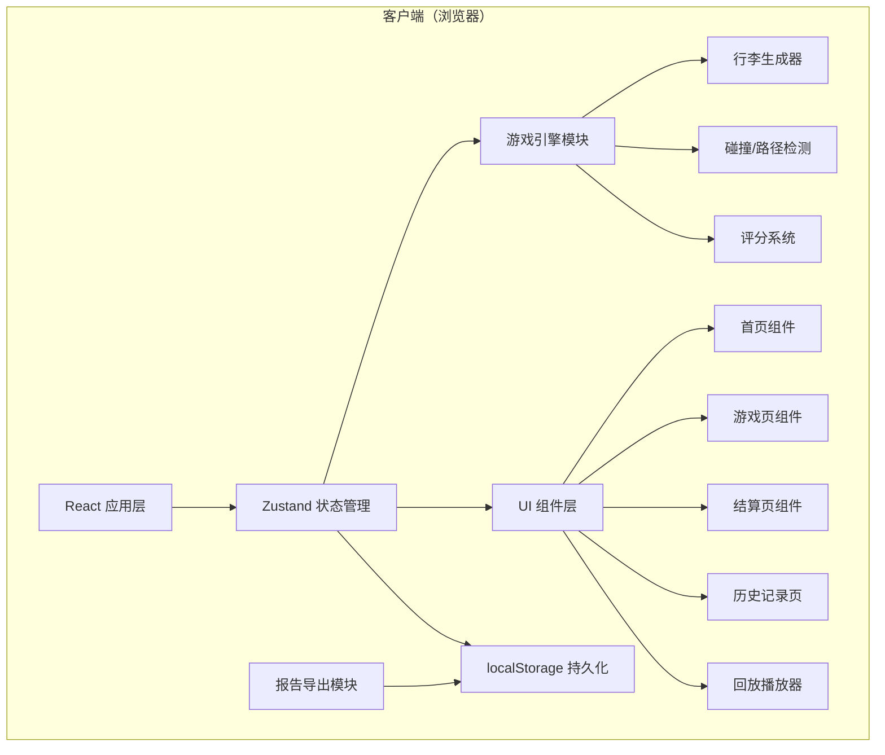

# 航班行李分拣快线 - 技术架构文档

## 1. 架构设计



---

## 2. 技术栈说明

| 层级 | 技术选型 | 版本 | 用途 |
|------|----------|------|------|
| 前端框架 | React | 18.x | UI 构建 |
| 语言 | TypeScript | 5.x | 类型安全 |
| 构建工具 | Vite | 5.x | 开发构建 |
| 状态管理 | Zustand | 4.x | 全局状态管理 |
| 路由 | react-router-dom | 6.x | 页面路由 |
| 样式 | Tailwind CSS | 3.x | 原子化样式 |
| 图标 | lucide-react | 0.344.x | 图标库 |
| 动画 | framer-motion | 11.x | 复杂动画效果 |
| 导出 | xlsx + jspdf | 最新 | CSV/PDF 报告导出 |

---

## 3. 目录结构

```
src/
├── components/           # 公共组件
│   ├── BaggageTag.tsx   # 行李牌组件
│   ├── ConveyorBelt.tsx # 传送带组件
│   ├── Gate.tsx         # 登机口组件
│   ├── ScorePanel.tsx   # 计分面板
│   ├── Timer.tsx        # 计时器
│   ├── ErrorToast.tsx   # 错误提示
│   └── StarRating.tsx   # 星级评分
├── pages/                # 页面组件
│   ├── Home.tsx         # 首页/关卡选择
│   ├── Game.tsx         # 游戏主页面
│   ├── Result.tsx       # 结算页面
│   ├── History.tsx      # 历史记录
│   └── Replay.tsx       # 回放页面
├── store/                # 状态管理
│   └── useGameStore.ts  # 游戏全局状态
├── types/                # 类型定义
│   └── index.ts         # 所有类型定义
├── utils/                # 工具函数
│   ├── baggageGenerator.ts  # 行李生成器
│   ├── scoring.ts       # 评分逻辑
│   ├── rules.ts         # 分拣规则
│   ├── export.ts        # 报告导出
│   └── replay.ts        # 回放控制
├── data/                 # 静态数据
│   ├── levels.ts        # 关卡配置
│   └── flights.ts       # 航班数据
├── hooks/                # 自定义 Hooks
│   ├── useGameLoop.ts   # 游戏循环
│   ├── useTimer.ts      # 计时器
│   └── useReplay.ts     # 回放控制
├── App.tsx              # 应用入口
├── main.tsx             # 渲染入口
└── index.css            # 全局样式
```

---

## 4. 核心数据模型

### 4.1 TypeScript 类型定义

```typescript
// 行李类型
interface Baggage {
  id: string;
  flightNo: string;          // 航班号
  destination: string;       // 目的地
  weight: number;            // 重量(kg)
  isOversized: boolean;      // 是否超规
  isTransfer: boolean;       // 是否转机
  transferTime?: number;     // 转机时间(分钟)
  isDelayed: boolean;        // 是否延误
  gate: string;              // 目标登机口
  priority: 'normal' | 'urgent';  // 优先级
  generatedAt: number;       // 生成时间戳
  status: 'waiting' | 'moving' | 'delivered' | 'error';
}

// 传送带类型
interface ConveyorBelt {
  id: number;
  name: string;
  targetGate: string | null; // 当前目标出口
  isActive: boolean;
  speed: number;             // 传送速度
}

// 出口类型
type ExitType = 'gate_A' | 'gate_B' | 'gate_C' | 'gate_D' | 'oversized' | 'transfer_urgent' | 'transfer_normal' | 'delayed';

// 操作记录
interface ActionRecord {
  timestamp: number;         // 操作时间
  baggageId: string;         // 行李ID
  selectedExit: ExitType;    // 玩家选择
  correctExit: ExitType;     // 正确出口
  errorType?: ErrorType;     // 错误类型
  scoreChange: number;       // 分数变化
  responseTime: number;      // 响应时间(ms)
}

// 错误类型
type ErrorType = 'transfer_timeout' | 'oversized_wrong' | 'gate_wrong' | 'gate_congested' | 'delayed_wrong' | 'none';

// 游戏记录
interface GameRecord {
  id: string;
  levelId: number;
  levelName: string;
  startTime: number;
  endTime: number;
  totalScore: number;
  accuracy: number;          // 准确率
  totalBaggage: number;
  correctCount: number;
  errorCount: number;
  maxCombo: number;
  avgResponseTime: number;
  actions: ActionRecord[];
  errors: ActionRecord[];
  starRating: number;        // 1-3星
}

// 关卡配置
interface LevelConfig {
  id: number;
  name: string;
  description: string;
  difficulty: 1 | 2 | 3 | 4 | 5;
  duration: number;          // 时长(秒)
  baggageCount: number;
  spawnInterval: number;     // 生成间隔(ms)
  focusAreas: string[];      // 训练重点
  unlocked: boolean;
}
```

### 4.2 状态管理（Zustand Store）

```typescript
interface GameState {
  // 游戏状态
  currentPage: 'home' | 'game' | 'result' | 'history' | 'replay';
  gameStatus: 'idle' | 'playing' | 'paused' | 'finished';
  currentLevel: LevelConfig | null;
  
  // 游戏数据
  timeRemaining: number;
  score: number;
  combo: number;
  maxCombo: number;
  currentBaggage: Baggage[];
  conveyorBelts: ConveyorBelt[];
  actions: ActionRecord[];
  currentErrors: ActionRecord[];
  
  // 历史记录
  gameHistory: GameRecord[];
  
  // 回放状态
  isReplaying: boolean;
  replayData: GameRecord | null;
  replayTime: number;
  
  // Actions
  setPage: (page: GameState['currentPage']) => void;
  startGame: (levelId: number) => void;
  pauseGame: () => void;
  resumeGame: () => void;
  endGame: () => void;
  assignBaggage: (baggageId: string, exitType: ExitType) => void;
  switchConveyor: (beltId: number, target: ExitType) => void;
  clearHistory: () => void;
  exportReport: (recordId: string) => void;
  startReplay: (recordId: string) => void;
}
```

---

## 5. 核心模块说明

### 5.1 游戏引擎模块

**文件**：`src/utils/gameEngine.ts`

```typescript
// 游戏主循环，处理行李生成、移动、碰撞检测
class GameEngine {
  private lastSpawnTime: number = 0;
  
  update(deltaTime: number): void {
    this.spawnBaggageIfNeeded();
    this.moveBaggage(deltaTime);
    this.checkCollisions();
    this.checkDeliveries();
  }
  
  private spawnBaggageIfNeeded(): void {
    // 根据关卡配置的生成间隔创建新行李
  }
  
  private moveBaggage(deltaTime: number): void {
    // 更新所有行李在传送带上的位置
  }
  
  private checkCollisions(): void {
    // 检测行李是否到达分叉点
  }
  
  private checkDeliveries(): void {
    // 检测行李是否到达出口并计分
  }
}
```

### 5.2 评分系统

**文件**：`src/utils/scoring.ts`

```typescript
function calculateScore(
  baggage: Baggage,
  selectedExit: ExitType,
  responseTime: number,
  currentCombo: number
): { score: number; errorType: ErrorType; correctExit: ExitType } {
  const correctExit = determineCorrectExit(baggage);
  
  if (selectedExit === correctExit) {
    let score = 10; // 基础分
    // 速度奖励
    if (responseTime < 3000) score += 2;
    // 连击奖励
    if (currentCombo >= 5) score += 5;
    if (currentCombo >= 10) score += 15;
    if (currentCombo >= 20) score += 30;
    return { score, errorType: 'none', correctExit };
  } else {
    const errorType = determineErrorType(baggage, selectedExit, correctExit);
    const score = getErrorPenalty(errorType);
    return { score, errorType, correctExit };
  }
}

function determineCorrectExit(baggage: Baggage): ExitType {
  if (baggage.isOversized) return 'oversized';
  if (baggage.isDelayed) return 'delayed';
  if (baggage.isTransfer) {
    return baggage.transferTime && baggage.transferTime < 30 ? 'transfer_urgent' : 'transfer_normal';
  }
  return `gate_${baggage.gate}` as ExitType;
}
```

### 5.3 报告导出模块

**文件**：`src/utils/export.ts`

```typescript
// 导出 CSV 报告
export function exportToCSV(record: GameRecord): void {
  const headers = ['时间', '行李ID', '航班号', '操作', '正确路径', '错误类型', '得分变化', '响应时间(ms)'];
  const rows = record.actions.map(action => [
    new Date(action.timestamp).toLocaleTimeString(),
    action.baggageId,
    getBaggageFlight(action.baggageId),
    action.selectedExit,
    action.correctExit,
    action.errorType || '无',
    action.scoreChange,
    action.responseTime
  ]);
  
  const csvContent = [headers, ...rows].map(row => row.join(',')).join('\n');
  downloadFile(csvContent, `分拣报告_${record.levelName}_${Date.now()}.csv`, 'text/csv');
}

// 导出 PDF 报告
export function exportToPDF(record: GameRecord): void {
  // 使用 jspdf 生成 PDF 报告
  // 包含：总分、准确率、错误统计、改进建议
}
```

### 5.4 回放系统

**文件**：`src/utils/replay.ts`

```typescript
class ReplayPlayer {
  private record: GameRecord;
  private currentTime: number = 0;
  private isPlaying: boolean = false;
  private speed: number = 1;
  
  constructor(record: GameRecord) {
    this.record = record;
  }
  
  play(): void {
    this.isPlaying = true;
    this.tick();
  }
  
  pause(): void {
    this.isPlaying = false;
  }
  
  seekTo(timestamp: number): void {
    this.currentTime = timestamp;
    // 重建到该时间点的游戏状态
  }
  
  private tick(): void {
    if (!this.isPlaying) return;
    this.currentTime += 16 * this.speed;
    // 查找当前时间点应显示的操作
    const currentActions = this.record.actions.filter(a => a.timestamp <= this.currentTime);
    // 更新 UI
    requestAnimationFrame(() => this.tick());
  }
  
  jumpToError(errorIndex: number): void {
    const error = this.record.errors[errorIndex];
    if (error) {
      this.seekTo(error.timestamp - 2000); // 提前2秒开始
    }
  }
}
```

---

## 6. 路由定义

| 路径 | 页面 | 说明 |
|------|------|------|
| `/` | Home | 首页，关卡选择 |
| `/game/:levelId` | Game | 游戏页面 |
| `/result/:recordId` | Result | 结算页面 |
| `/history` | History | 历史记录 |
| `/replay/:recordId` | Replay | 回放页面 |

---

## 7. 本地存储设计

使用 localStorage 存储游戏数据，key 命名空间：

| Key | 数据结构 | 说明 |
|-----|----------|------|
| `baggage_trainer_history` | `GameRecord[]` | 所有游戏记录 |
| `baggage_trainer_unlocked_levels` | `number[]` | 已解锁关卡 ID |
| `baggage_trainer_best_scores` | `Record<number, number>` | 各关卡最高分 |
| `baggage_trainer_settings` | `object` | 用户设置（音量、难度等） |

---

## 8. 性能优化

1. **游戏循环优化**：使用 `requestAnimationFrame` 实现流畅动画，固定时间步长更新
2. **组件拆分**：将大型游戏页面拆分为多个小组件，避免不必要的重渲染
3. **状态隔离**：使用 Zustand 的 selector 只订阅必要的状态片段
4. **动画优化**：使用 CSS transform 进行动画，避免触发重排
5. **虚拟列表**：历史记录多时使用虚拟滚动
6. **Web Worker**：复杂计算（如回放状态重建）移至 Worker 线程

---

## 9. 开发规范

1. **组件命名**：PascalCase，与文件名称一致
2. **TypeScript**：禁止使用 `any`，所有类型必须明确定义
3. **样式**：优先使用 Tailwind 类，复杂样式写在 CSS module 中
4. **Hook 规则**：遵循 React Hook 规则，自定义 Hook 以 `use` 开头
5. **状态更新**：使用 Zustand 的 immutable 更新方式
6. **注释**：复杂逻辑必须添加注释，说明设计意图
7. **错误处理**：所有异步操作必须有 try-catch，错误需提示用户
