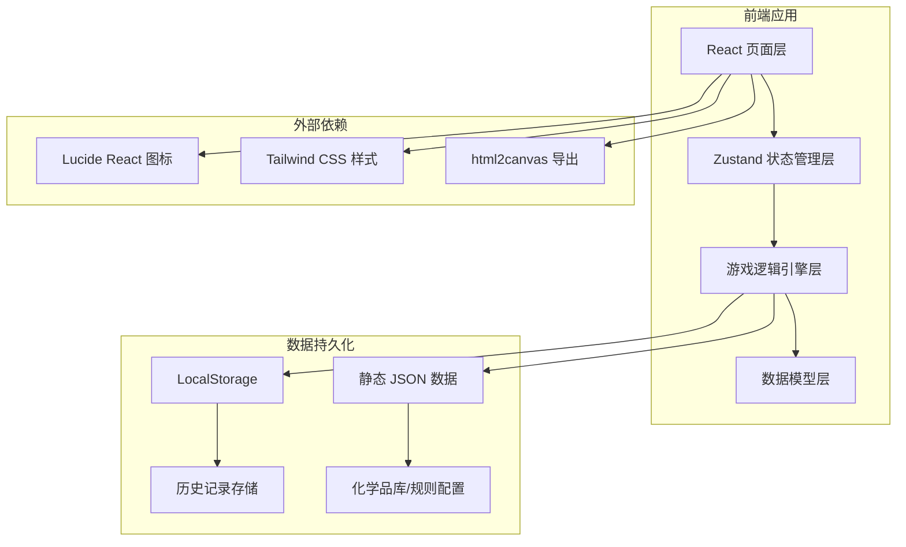

## 1. 架构设计



## 2. 技术栈说明

- **前端框架**：React 18 + TypeScript 5
- **构建工具**：Vite 5
- **状态管理**：Zustand 4（轻量级状态管理）
- **样式方案**：Tailwind CSS 3
- **图标库**：Lucide React
- **数据持久化**：LocalStorage（历史记录）+ 静态 JSON（配置数据）
- **导出功能**：html2canvas（截图报告）

## 3. 路由定义

| 路由 | 页面组件 | 功能说明 |
|-------|----------|----------|
| `/` | `HomePage` | 首页/关卡选择页面 |
| `/game/:levelId` | `GamePage` | 游戏主界面 |
| `/result/:gameId` | `ResultPage` | 结算报告页面 |
| `/history` | `HistoryPage` | 历史记录页面 |

## 4. 数据模型

### 4.1 核心数据实体

```typescript
// 化学品
interface Chemical {
  id: string;
  name: string;
  formula: string;
  category: ChemicalCategory;
  hazardLevel: HazardLevel;
  minTemp: number;
  maxTemp: number;
  minHumidity: number;
  maxHumidity: number;
  incompatibleWith: string[]; // 禁忌化学品ID列表
  isolationDistance: number; // 最小隔离距离（格数）
  storageRequirements: string;
  icon: string;
  color: string;
}

// 货架格位
interface ShelfSlot {
  id: string;
  row: number;
  col: number;
  chemicalId: string | null;
  temperature: number;
  humidity: number;
  restrictedCategories: ChemicalCategory[]; // 禁止存放的类别
}

// 货架
interface Shelf {
  id: string;
  name: string;
  rows: number;
  cols: number;
  slots: ShelfSlot[];
  baseTemperature: number;
  baseHumidity: number;
}

// 风险事件
interface RiskEvent {
  id: string;
  type: RiskType;
  severity: Severity;
  description: string;
  chemicalIds: string[];
  slotIds: string[];
  timestamp: number;
  penalty: number;
}

// 操作记录
interface OperationLog {
  id: string;
  type: 'place' | 'remove' | 'swap';
  chemicalId: string;
  fromSlotId?: string;
  toSlotId: string;
  timestamp: number;
  scoreChange: number;
  risks: RiskEvent[];
}

// 关卡配置
interface Level {
  id: string;
  name: string;
  difficulty: 'easy' | 'medium' | 'hard';
  description: string;
  targetScore: number;
  timeLimit: number; // 秒
  shelf: Shelf;
  availableChemicals: string[]; // 化学品ID列表
  requiredPlacements: number;
}

// 游戏状态
interface GameState {
  id: string;
  levelId: string;
  startTime: number;
  endTime?: number;
  currentScore: number;
  shelf: Shelf;
  placedChemicals: Map<string, string>; // slotId -> chemicalId
  remainingChemicals: string[]; // 化学品ID列表
  operationLogs: OperationLog[];
  riskEvents: RiskEvent[];
  isCompleted: boolean;
  isPaused: boolean;
}

// 历史记录
interface GameHistory {
  id: string;
  levelId: string;
  levelName: string;
  startTime: number;
  endTime: number;
  finalScore: number;
  maxScore: number;
  riskCount: number;
  operations: OperationLog[];
  risks: RiskEvent[];
  reportExported: boolean;
}
```

### 4.2 枚举定义

```typescript
enum ChemicalCategory {
  FLAMMABLE = 'flammable',      // 易燃物
  EXPLOSIVE = 'explosive',      // 爆炸物
  CORROSIVE = 'corrosive',      // 腐蚀性
  TOXIC = 'toxic',              // 有毒物
  OXIDIZER = 'oxidizer',        // 氧化剂
  RADIOACTIVE = 'radioactive',  // 放射性
  COMPRESSED = 'compressed',    // 压缩气体
  REFRIGERATED = 'refrigerated' // 冷藏品
}

enum HazardLevel {
  LOW = 'low',
  MEDIUM = 'medium',
  HIGH = 'high',
  EXTREME = 'extreme'
}

enum RiskType {
  INCOMPATIBLE_NEIGHBOR = 'incompatible_neighbor', // 禁忌相邻
  TEMPERATURE_EXCEED = 'temperature_exceed',       // 温度超限
  HUMIDITY_EXCEED = 'humidity_exceed',             // 湿度超限
  INSUFFICIENT_DISTANCE = 'insufficient_distance', // 距离不足
  RESTRICTED_CATEGORY = 'restricted_category'      // 禁止类别
}

enum Severity {
  WARNING = 'warning',
  DANGER = 'danger',
  CRITICAL = 'critical'
}
```

## 5. 核心模块设计

### 5.1 风险判定引擎

核心文件：`src/engine/RiskEngine.ts`

- **禁忌相邻检测**：检查相邻格位是否存在禁忌化学品
- **温度超限检测**：检查化学品是否在允许温度范围内
- **湿度超限检测**：检查化学品是否在允许湿度范围内
- **隔离距离检测**：检查需隔离化学品是否满足最小距离要求
- **类别限制检测**：检查格位是否禁止该类别化学品

### 5.2 评分系统

核心文件：`src/engine/ScoringEngine.ts`

- 基础摆放分：每次成功合法摆放 +100
- 类别匹配加分：摆放到正确类别区域 +50
- 风险扣分：根据严重程度扣 50-200 分
- 时间奖励：提前完成按剩余时间比例加分
- 完美奖励：零风险完成 +500

### 5.3 状态管理

核心文件：`src/store/gameStore.ts`

使用 Zustand 管理全局游戏状态，支持：
- 游戏开始/暂停/结束
- 化学品摆放/移除/交换
- 撤销操作
- 状态快照与回溯

### 5.4 数据配置

静态数据文件：`src/data/`

- `chemicals.json`：化学品库
- `levels.json`：关卡配置
- `incompatibility-rules.json`：禁忌规则
- `categories.json`：类别定义

## 6. 组件结构

```
src/
├── components/
│   ├── game/
│   │   ├── ShelfGrid.tsx        # 货架网格
│   │   ├── ShelfSlot.tsx        # 单个格位
│   │   ├── ChemicalCard.tsx     # 化学品卡片
│   │   ├── ChemicalLibrary.tsx  # 化学品库
│   │   ├── RiskIndicator.tsx    # 风险指示器
│   │   └── ControlPanel.tsx     # 控制面板
│   ├── common/
│   │   ├── ScoreDisplay.tsx     # 分数显示
│   │   ├── Timer.tsx            # 计时器
│   │   └── Modal.tsx            # 弹窗组件
│   └── report/
│       ├── ScoreSummary.tsx     # 成绩汇总
│       ├── RiskTimeline.tsx     # 风险时间线
│       └── ExportButton.tsx     # 导出按钮
├── pages/
│   ├── HomePage.tsx
│   ├── GamePage.tsx
│   ├── ResultPage.tsx
│   └── HistoryPage.tsx
├── engine/
│   ├── RiskEngine.ts
│   └── ScoringEngine.ts
├── store/
│   └── gameStore.ts
├── data/
│   ├── chemicals.json
│   ├── levels.json
│   └── rules.json
├── types/
│   └── index.ts
└── utils/
    ├── storage.ts
    ├── export.ts
    └── helpers.ts
```
