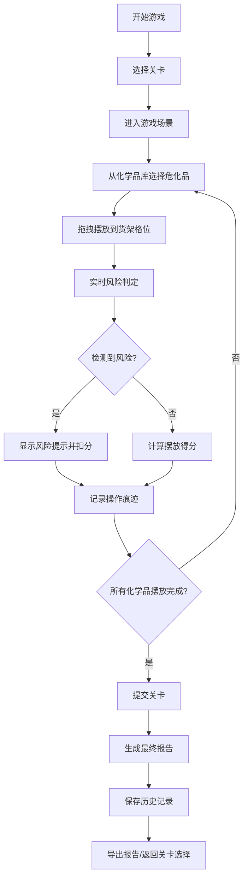

## 1. 产品概述

"化学品仓库配伍赛"是一款面向企业安全培训的互动式游戏原型，旨在通过模拟危化品仓储摆放场景，让员工在游戏中学习危化品安全管理知识，避免因禁忌相邻、温度超限、距离不足等问题导致的安全事故。

- **核心目标**：将枯燥的安全制度转化为可操作的游戏体验，提升培训效果
- **目标用户**：企业安全员、一线仓储管理人员、新入职员工
- **产品价值**：可视化呈现风险、即时反馈错误、可追溯操作历史、支持考核评估

## 2. 核心特征

### 2.1 用户角色

| 角色 | 注册方式 | 核心权限 |
|------|----------|----------|
| 学员 | 无需注册，直接使用 | 进行游戏、查看历史报告、导出成绩 |
| 管理员 | 无需注册，直接使用 | 配置关卡参数、查看多人历史记录 |

### 2.2 功能模块

1. **游戏主界面**：货架布局、化学品库、控制面板、实时风险提示
2. **风险判定引擎**：禁忌相邻检测、温度超限检测、隔离距离检测
3. **关卡系统**：多难度关卡、目标设定、评分机制
4. **报告系统**：操作历史回放、风险事件记录、成绩导出
5. **数据管理**：化学品库维护、规则配置、历史记录存储

### 2.3 页面详情

| 页面名称 | 模块名称 | 功能描述 |
|-----------|-------------|---------------------|
| 首页/关卡选择 | 关卡列表 | 展示可用关卡、难度、历史最佳成绩 |
| 游戏界面 | 货架区域 | 可视化展示货架格子、已摆放化学品、风险高亮 |
| 游戏界面 | 化学品库 | 分类展示可用化学品、拖拽选择 |
| 游戏界面 | 信息面板 | 显示当前分数、已用时间、温湿度、风险提示 |
| 游戏界面 | 操作控制 | 确认摆放、撤销、重置、提交关卡 |
| 结算界面 | 成绩展示 | 最终得分、风险事件统计、错误详情 |
| 历史记录 | 历史列表 | 查看历史游戏记录、回放操作、导出报告 |

## 3. 核心流程

## 4. 用户界面设计

### 4.1 设计风格

- **主色调**：工业安全配色 - 深灰 (#1a1a2e) 为底，警示黄 (#f39c12)、危险红 (#e74c3c)、安全绿 (#27ae60) 为状态色
- **辅助色**：钢蓝 (#3498db) 用于信息展示，紫 (#9b59b6) 用于特殊类别化学品
- **设计风格**：工业风、网格化、高对比度、清晰的状态指示
- **字体**：标题使用 Orbitron（科技感），正文使用 JetBrains Mono（等宽易读）
- **图标**：使用 Lucide React 图标库，配合安全警示类图标

### 4.2 页面设计概述

| 页面名称 | 模块名称 | UI 元素 |
|-----------|-------------|----------|
| 游戏界面 | 货架区域 | 网格布局卡片、化学品图标、风险高亮边框、悬浮信息气泡 |
| 游戏界面 | 化学品库 | 分类标签、可拖拽卡片、化学品属性标签、危险标识 |
| 游戏界面 | 信息面板 | 分数显示条、倒计时、温湿度仪表盘、风险事件列表 |
| 结算界面 | 成绩展示 | 大数字分数、环形进度图、风险分类统计卡片、操作时间线 |
| 历史记录 | 历史列表 | 卡片式记录、筛选栏、详情展开面板、导出按钮 |

### 4.3 响应式设计

- 桌面端优先（1280px 以上），完整展示三栏布局
- 平板端（768px-1280px）：化学品库改为底部抽屉
- 移动端（<768px）：简化布局，支持触控拖拽操作

### 4.4 交互细节

- **拖拽反馈**：拖拽时显示半透明预览，合法区域高亮绿色，非法区域红色
- **风险提示**：检测到风险时，相关格子脉冲动画 + 弹出提示气泡
- **操作痕迹**：每次操作记录时间戳，支持悬停查看操作历史
- **状态变化**：分数变化时数字滚动动画，风险事件从右侧滑入
