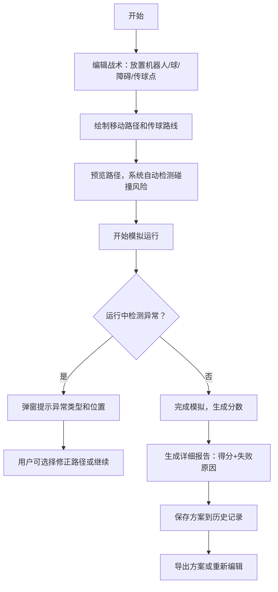

# 机器人足球战术板 - 产品需求文档

## 1. 产品概述
青少年机器人队策略训练工具，通过可视化拖拽方式设计机器人传球和避障路线，模拟比赛过程并评分，帮助队员理解战术协作。
- 核心用户：机器人足球竞赛队员、教练
- 核心价值：降低战术设计门槛，可视化路径规划，通过回放和评分快速优化策略

## 2. 核心特性

### 2.1 用户角色
| 角色 | 注册方式 | 核心权限 |
|------|----------|----------|
| 队员/教练 | 无需注册，本地使用 | 编辑战术、运行模拟、查看历史、导出方案 |

### 2.2 功能模块
1. **战术编辑页**：场地画布、元素面板、属性编辑、路径预览
2. **模拟运行页**：实时动画回放、状态监控、异常提示
3. **结果报告页**：得分详情、失败原因分析、时间线回放
4. **历史记录页**：方案列表、版本对比、一键加载

### 2.3 页面详情
| 页面名称 | 模块名称 | 功能描述 |
|----------|----------|----------|
| 战术编辑页 | 场地画布 | 可拖拽放置机器人、球、障碍区、传球点，支持路径绘制 |
| 战术编辑页 | 元素工具栏 | 选择工具类型，设置能量值，调整元素属性 |
| 战术编辑页 | 路径预览 | 实时显示机器人移动路径，标注碰撞风险点 |
| 模拟运行页 | 动画播放器 | 控制播放/暂停/速度，显示实时位置和能量消耗 |
| 模拟运行页 | 异常提示层 | 路径相撞、能量不足、传球越界时醒目弹窗提示 |
| 结果报告页 | 评分面板 | 按避障、传球精度、能量效率分项评分 |
| 结果报告页 | 失败分析 | 逐条列出失败事件、发生时间、具体原因 |
| 历史记录页 | 方案管理 | 保存/加载/删除方案，显示修改时间和得分 |

## 3. 核心流程

## 4. 用户界面设计

### 4.1 设计风格
- **主色调**：科技蓝 #0EA5E9 搭配 荧光绿 #22C55E（代表机器人和能量）
- **辅助色**：警示红 #EF4444（异常提示）、警戒黄 #F59E0B（预警）
- **按钮风格**：圆角8px，微立体阴影，hover状态轻微上浮
- **字体**：JetBrains Mono（等宽字体，科技感）+ Noto Sans SC（中文）
- **布局风格**：左侧工具栏 + 中央画布 + 右侧属性面板，三栏式专业工具布局
- **图标风格**：Lucide 线性图标，科技简约风

### 4.2 页面设计概览
| 页面名称 | 模块名称 | UI 元素 |
|----------|----------|----------|
| 战术编辑页 | 场地画布 | 网格背景、绿色足球场纹理、坐标标尺 |
| 战术编辑页 | 工具栏 | 图标按钮组、工具选择高亮、能量滑块 |
| 战术编辑页 | 属性面板 | 表单输入、数值调节器、颜色选择器 |
| 模拟运行页 | 播放器 | 播放控制条、时间轴、速度调节 |
| 模拟运行页 | 异常提示 | 顶部悬浮警示条、红色边框闪烁、具体原因文字 |
| 结果报告页 | 评分卡片 | 环形进度图、分项得分条、总分大字展示 |
| 历史记录页 | 方案列表 | 卡片式布局、缩略图预览、操作按钮组 |

### 4.3 响应式
- 桌面端优先设计（1280px+），三栏布局
- 平板端（768-1280px）：左右面板可折叠
- 移动端：简化为单栏，画布优先，工具折叠为底部抽屉

## 5. 异常处理规则

### 5.1 路径相撞
- 检测时机：路径预览阶段 + 模拟运行阶段
- 提示方式：红色高亮碰撞点 + 弹窗显示"路径相撞！机器人A与机器人B将在第2.3秒于坐标(45, 60)处相撞"
- 处理：允许用户修正路径，不记录为正常得分

### 5.2 能量不足
- 检测时机：模拟运行中能量耗尽时
- 提示方式：黄色预警 + 机器人图标闪烁 + "能量不足！机器人A在移动3.2米后耗尽能量"
- 处理：机器人停止移动，该任务标记为失败

### 5.3 传球越界
- 检测时机：传球路径超出场地边界
- 提示方式：红色边界闪烁 + "传球越界！传球点B距离边界0.5米，传球路线将在(95, 30)处越界"
- 处理：传球失败，球停在边界处

## 6. 评分规则
- **避障得分（30%）**：成功避开所有障碍得满分，每碰撞一次扣10分
- **传球精度（30%）**：传球到达目标位置误差<0.5米得满分，误差越大扣分越多
- **能量效率（20%）**：能量剩余>30%得满分，不足扣分项
- **完成度（20%）**：完成所有规划任务得满分，中途失败按比例得分
