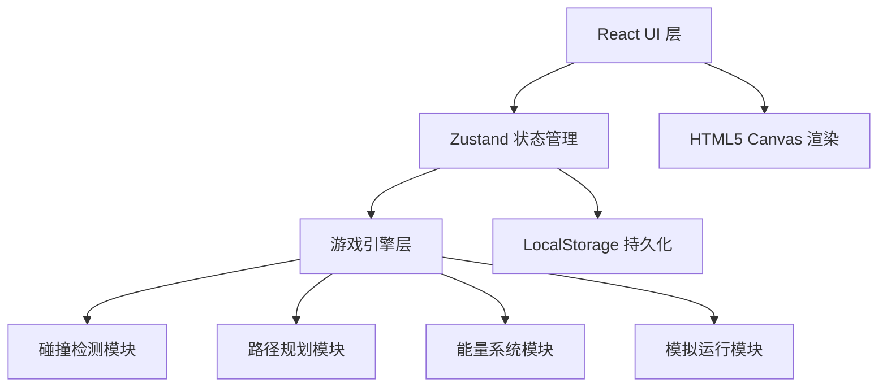

# 机器人足球战术板 - 技术架构文档

## 1. 架构设计



## 2. 技术描述

- **前端框架**：React@18 + TypeScript + Vite@5
- **样式方案**：TailwindCSS@3
- **状态管理**：Zustand@4
- **图标库**：Lucide React
- **画布渲染**：HTML5 Canvas API
- **数据持久化**：LocalStorage
- **无后端**：纯前端应用，所有数据本地存储

## 3. 路由定义

| 路由 | 页面 | 用途 |
|------|------|------|
| / | 战术编辑页 | 主编辑界面，放置元素和绘制路径 |
| /simulation | 模拟运行页 | 运行战术模拟，实时动画播放 |
| /report | 结果报告页 | 显示得分和失败分析 |
| /history | 历史记录页 | 管理保存的战术方案 |

## 4. 数据模型

### 4.1 核心类型定义

```typescript
// 坐标点
interface Point {
  x: number;
  y: number;
}

// 元素类型
type ElementType = 'robot' | 'ball' | 'obstacle' | 'passPoint';

// 基础元素
interface TacticsElement {
  id: string;
  type: ElementType;
  position: Point;
  label: string;
  color: string;
}

// 机器人
interface Robot extends TacticsElement {
  type: 'robot';
  energy: number;
  maxEnergy: number;
  speed: number;
  path: Point[];
}

// 球
interface Ball extends TacticsElement {
  type: 'ball';
  passPath: Point[];
  ownerId?: string;
}

// 障碍区
interface Obstacle extends TacticsElement {
  type: 'obstacle';
  width: number;
  height: number;
}

// 传球点
interface PassPoint extends TacticsElement {
  type: 'passPoint';
  targetId?: string;
}

// 路径
interface Path {
  id: string;
  elementId: string;
  points: Point[];
  color: string;
}

// 战术方案
interface TacticsScheme {
  id: string;
  name: string;
  createdAt: number;
  updatedAt: number;
  elements: TacticsElement[];
  paths: Path[];
  fieldSize: { width: number; height: number };
}

// 模拟事件
interface SimulationEvent {
  time: number;
  type: 'collision' | 'energy_empty' | 'out_of_bounds' | 'pass_complete' | 'pass_fail';
  message: string;
  position: Point;
  elementIds: string[];
}

// 模拟结果
interface SimulationResult {
  schemeId: string;
  startTime: number;
  endTime: number;
  events: SimulationEvent[];
  score: {
    obstacle: number;
    pass: number;
    energy: number;
    completion: number;
    total: number;
  };
  frames: SimulationFrame[];
}

// 模拟帧
interface SimulationFrame {
  time: number;
  elementStates: {
    elementId: string;
    position: Point;
    energy?: number;
  }[];
}
```

## 5. 模块划分

```
src/
├── components/          # React 组件
│   ├── canvas/         # 画布相关组件
│   │   ├── FieldCanvas.tsx
│   │   ├── ElementRenderer.tsx
│   │   └── PathRenderer.tsx
│   ├── toolbar/        # 工具栏组件
│   │   ├── ElementToolbar.tsx
│   │   └── PropertyPanel.tsx
│   ├── simulation/     # 模拟播放组件
│   │   ├── SimulationPlayer.tsx
│   │   └── EventToast.tsx
│   ├── report/         # 报告组件
│   │   ├── ScoreCard.tsx
│   │   └── EventTimeline.tsx
│   └── history/        # 历史记录组件
│       └── SchemeCard.tsx
├── store/              # Zustand 状态
│   ├── useTacticsStore.ts
│   ├── useSimulationStore.ts
│   └── useHistoryStore.ts
├── engine/             # 游戏引擎
│   ├── types.ts
│   ├── collision.ts
│   ├── pathfinding.ts
│   ├── energy.ts
│   └── simulation.ts
├── pages/              # 页面
│   ├── EditorPage.tsx
│   ├── SimulationPage.tsx
│   ├── ReportPage.tsx
│   └── HistoryPage.tsx
├── utils/              # 工具函数
│   ├── geometry.ts
│   ├── storage.ts
│   └── export.ts
└── App.tsx
```

## 6. 核心算法

### 6.1 碰撞检测
- 线段与矩形相交检测（障碍碰撞）
- 线段与线段相交检测（路径相撞）
- 圆形与矩形碰撞检测（机器人与障碍）

### 6.2 路径插值
- 根据速度计算每帧位置
- 贝塞尔曲线平滑路径

### 6.3 能量计算
- 能量消耗 = 移动距离 × 单位能耗
- 能量不足时触发停止事件

### 6.4 评分算法
- 避障分：30 - 碰撞次数 × 10
- 传球分：30 × (1 - 距离误差/最大误差)
- 能量分：20 × (剩余能量/初始能量)
- 完成分：20 × (完成任务数/总任务数)
