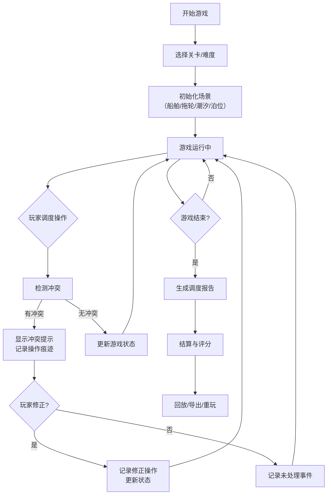

# 港口拖轮潮汐局 - 产品需求文档

## 1. 产品概述

"港口拖轮潮汐局"是一款基于浏览器的港口调度模拟游戏，旨在培训港口教员和调度人员掌握拖轮调度、潮汐窗口管理和泊位资源分配的核心技能。游戏通过真实港口业务场景模拟，让玩家在互动中学习处理复杂调度冲突。

- **核心目标**：通过游戏化方式理清港口调度全流程，培训人员识别和处理拖轮冲突、潮汐错过、燃油不足等异常情况
- **目标用户**：港口教员、调度培训生、港口运营管理人员
- **核心价值**：将抽象的调度规则转化为可视化互动体验，保留操作痕迹便于复盘和教学

---

## 2. 核心功能

### 2.1 用户角色

| 角色 | 注册方式 | 核心权限 |
|------|----------|----------|
| 学员玩家 | 无需注册，浏览器直接访问 | 进行游戏、查看个人历史记录 |
| 港口教员 | 无需注册 | 使用教学模式、导出调度报告、查看学员操作痕迹 |

### 2.2 功能模块

1. **游戏主界面**：港口地图调度区、时间轴控制面板、资源状态面板、实时提示区
2. **游戏控制系统**：开始、暂停、重开、倍速调节
3. **调度系统**：拖轮拖拽调度、船舶分配、泊位预约
4. **冲突检测系统**：拖轮冲突、潮汐窗口错过、燃油不足实时检测与提示
5. **报告系统**：详细调度报告（未处理/已修正/待人工确认分类）
6. **回放与导出**：游戏过程回放、操作日志导出、调度报告导出
7. **结算系统**：得分计算、失败原因分析、历史记录

### 2.3 页面详情

| 页面名称 | 模块名称 | 功能描述 |
|---------|----------|----------|
| 游戏主页 | 开始界面 | 游戏标题、关卡选择、难度设置、开始按钮 |
| 游戏主界面 | 港口地图区 | SVG港口地图、泊位、航道、拖轮位置、船舶位置可视化 |
| 游戏主界面 | 时间轴面板 | 时间刻度、潮汐窗口标记、任务时间线、播放控制按钮 |
| 游戏主界面 | 资源状态面板 | 拖轮状态列表、燃油余量、泊位占用情况 |
| 游戏主界面 | 实时提示区 | 冲突警告、操作提示、修正建议弹窗 |
| 结算页面 | 结算面板 | 最终得分、失败原因、关键事件时间线 |
| 报告页面 | 调度报告 | 未处理事件、已修正操作、待人工确认事项分类展示 |
| 回放页面 | 回放控制 | 进度条、倍速控制、关键节点跳转 |

---

## 3. 核心流程

### 3.1 游戏主流程

### 3.2 调度操作流程

1. 玩家在地图上拖拽拖轮到目标船舶
2. 系统检查拖轮燃油是否充足、是否与其他拖轮路径冲突
3. 系统检查目标泊位是否在潮汐窗口内可用
4. 如通过检查，执行调度；如失败，显示具体冲突原因
5. 所有操作（包括失败尝试）均被记录用于后续复盘

---

## 4. 用户界面设计

### 4.1 设计风格

**整体风格**：海事工业风 + 现代数据可视化

- **主色调**：深海蓝 (#0A2463) 作为主色，代表海洋和专业性
- **辅助色**：警示橙 (#F75C03) 用于冲突提示，潮汐绿 (#3E885B) 用于正常状态，燃油黄 (#D4A017) 用于燃油指示
- **中性色**：深灰 (#1A1A2E) 背景，浅灰 (#E8E8E8) 文字
- **按钮风格**：工业风圆角矩形，带微妙边框和按压效果
- **字体**：标题使用 Rajdhani（现代工业感），正文使用 Inter（清晰易读）
- **布局风格**：模块化卡片布局，左侧地图区为主，右侧信息面板为辅
- **图标风格**：线性图标配合emoji，拖轮🚢、潮汐🌊、泊位⚓、燃油⛽

### 4.2 页面设计概览

| 页面名称 | 模块名称 | UI元素 |
|---------|----------|--------|
| 游戏主页 | 开始界面 | 大标题渐变效果、关卡卡片悬停动画、海浪背景装饰 |
| 游戏主界面 | 港口地图区 | SVG交互式地图、拖轮/船舶可拖拽元素、路径动画、冲突高亮闪烁 |
| 游戏主界面 | 时间轴面板 | 横向时间轴、潮汐窗口色块、任务节点标记、播放控制按钮组 |
| 游戏主界面 | 资源状态面板 | 卡片式状态列表、进度条、颜色编码状态指示 |
| 游戏主界面 | 实时提示区 | 滑入式通知、红色闪烁警告、操作建议按钮 |
| 结算页面 | 结算面板 | 大字号分数、环形得分图表、时间线事件列表 |
| 报告页面 | 调度报告 | 三栏布局（未处理/已修正/待确认）、可展开详情、导出按钮 |

### 4.3 响应式设计

- **桌面优先**：以1920x1080为基准设计，地图区域占主要视觉空间
- **平板适配**：右侧面板改为底部面板，地图区域自适应
- **触控优化**：可拖拽元素增大触控区域，按钮最小44x44px

### 4.4 动效设计

- **页面加载**：海浪波浪式元素入场动画
- **拖轮移动**：平滑贝塞尔曲线路径动画
- **冲突提示**：红色脉冲闪烁 + 轻微震动效果
- **潮汐变化**：水位渐变动画，潮汐窗口颜色渐变提示
- **操作反馈**：拖拽时阴影变化，释放时弹性动画

---

## 5. 数据材料来源

游戏场景数据基于真实港口业务材料构建，包括：

| 材料类型 | 内容说明 | 游戏中的体现 |
|---------|----------|-------------|
| 船舶数据 | 船舶类型、尺寸、到港时间、离港时间、所需拖轮数量 | 任务列表中的船舶卡片 |
| 拖轮数据 | 拖轮型号、功率、燃油容量、油耗速率、当前位置 | 拖轮状态面板 |
| 潮汐窗口 | 高潮/低潮时间、可用水深、对应可用泊位 | 时间轴上的潮汐色块 |
| 泊位数据 | 泊位位置、尺寸限制、占用状态 | 地图上的泊位标记 |
| 燃油数据 | 油价、加油点位置、燃油消耗规则 | 燃油余量指示器 |
| 调度报告 | 历史调度记录、异常处理案例 | 结算报告模板 |

---

## 6. 异常情况处理

游戏必须明确提示以下异常情况，禁止静默处理：

| 异常类型 | 触发条件 | 提示方式 | 处理选项 |
|---------|----------|----------|---------|
| 拖轮冲突 | 两艘拖轮路径交叉或同时作业同一区域 | 红色高亮闪烁 + 语音提示 + 弹窗说明 | 重新规划路径、等待、取消 |
| 潮汐错过 | 船舶无法在潮汐窗口内完成靠离泊 | 橙色警告 + 时间轴标记 | 加速调度、更换泊位、等待下一个潮汐 |
| 燃油不足 | 拖轮燃油不足以完成当前任务 | 黄色预警 + 燃油条闪烁 | 中途加油、更换拖轮、缩短任务 |
| 泊位占用 | 目标泊位已被其他船舶占用 | 蓝色提示 + 泊位高亮 | 等待泊位释放、更换其他泊位 |

---

## 7. 评分与报告体系

### 7.1 评分维度

- **调度效率**：30% - 任务完成时间与标准时间的比率
- **冲突避免**：25% - 无冲突完成的任务比例
- **燃油管理**：20% - 燃油使用效率
- **潮汐利用**：15% - 潮汐窗口内完成的任务比例
- **操作规范性**：10% - 按照标准流程操作的比例

### 7.2 报告分类

调度报告必须包含以下分类：

| 分类 | 内容说明 | 示例 |
|-----|----------|------|
| 未处理事件 | 玩家未响应的冲突和警告 | 10:30 拖轮A与拖轮B路径冲突（未处理） |
| 已修正操作 | 玩家发现并修正的错误 | 09:15 燃油不足 → 更换拖轮C（已修正） |
| 待人工确认 | 系统无法自动判断的边缘情况 | 14:20 潮汐窗口边缘完成作业，建议人工确认是否合规 |
