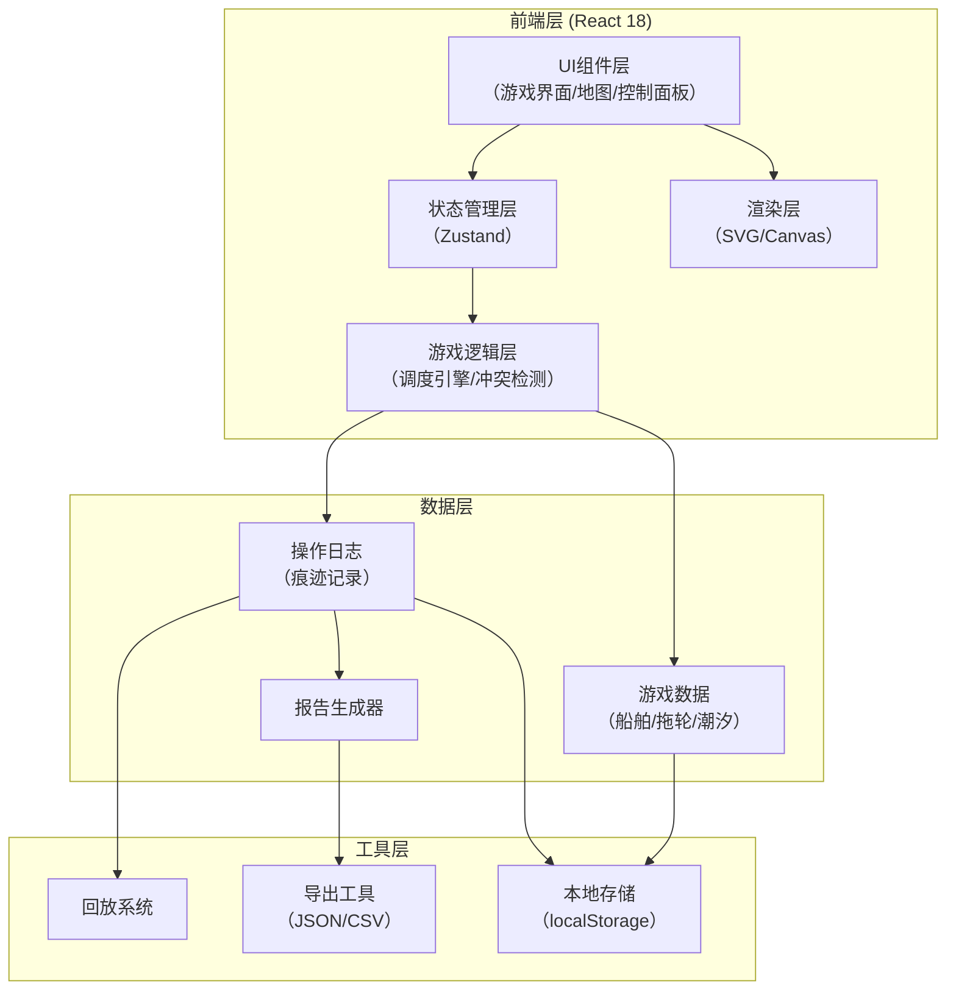
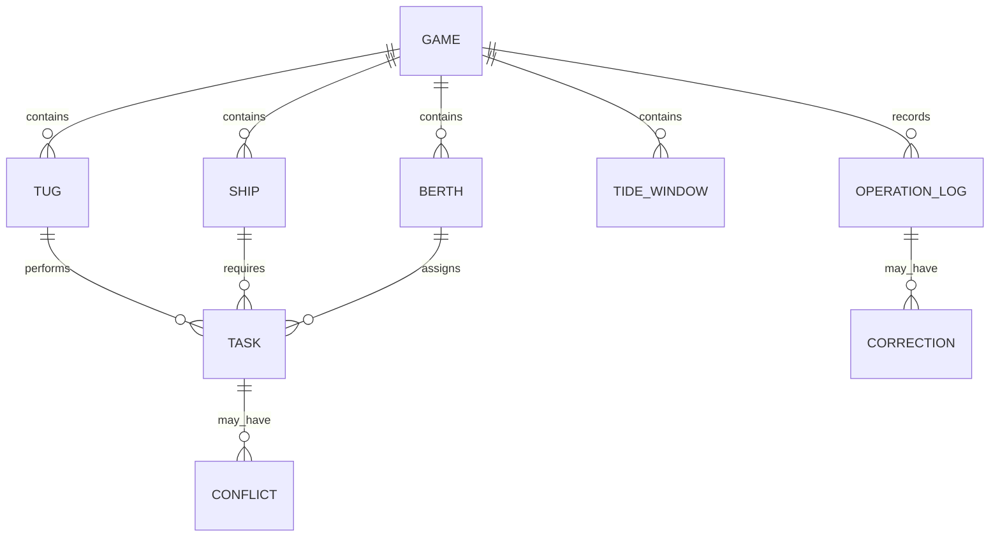

# 港口拖轮潮汐局 - 技术架构文档

## 1. 架构设计



---

## 2. 技术选型说明

| 层级 | 技术栈 | 选型理由 |
|-----|--------|---------|
| **前端框架** | React 18 + TypeScript | 组件化开发，类型安全，适合复杂交互游戏 |
| **构建工具** | Vite | 开发速度快，热更新即时，构建产物优化 |
| **样式方案** | Tailwind CSS 3 | 原子化CSS，快速构建海事工业风UI |
| **状态管理** | Zustand | 轻量级，API简洁，适合游戏状态管理 |
| **地图渲染** | SVG + React | 交互式港口地图，支持拖拽、动画 |
| **动画库** | Framer Motion | 流畅的拖轮移动动画、冲突提示动效 |
| **时间处理** | date-fns | 潮汐时间计算、任务时间线管理 |
| **图表** | Recharts | 调度报告可视化、得分图表 |

---

## 3. 路由定义

| 路由 | 页面组件 | 功能说明 |
|-----|----------|---------|
| `/` | HomePage | 游戏主页，关卡选择 |
| `/game` | GamePage | 游戏主界面，核心调度玩法 |
| `/result` | ResultPage | 结算页面，得分展示 |
| `/report` | ReportPage | 调度报告详情 |
| `/replay` | ReplayPage | 游戏回放界面 |

---

## 4. 数据模型

### 4.1 实体关系图



### 4.2 TypeScript 类型定义

```typescript
// 拖轮
interface Tug {
  id: string;
  name: string;
  type: 'harbor' | 'ocean';
  power: number;
  fuelCapacity: number;
  currentFuel: number;
  fuelConsumption: number;
  position: Position;
  status: 'idle' | 'moving' | 'working' | 'refueling';
  currentTaskId?: string;
}

// 船舶
interface Ship {
  id: string;
  name: string;
  type: 'container' | 'bulk' | 'tanker' | 'passenger';
  length: number;
  draft: number;
  requiredTugs: number;
  arrivalTime: number;
  departureTime: number;
  status: 'waiting' | 'docking' | 'docked' | 'undocking' | 'departed';
  targetBerthId?: string;
}

// 泊位
interface Berth {
  id: string;
  name: string;
  position: Position;
  maxLength: number;
  minDepth: number;
  status: 'available' | 'occupied' | 'reserved';
  occupiedBy?: string;
  availableFrom: number;
}

// 潮汐窗口
interface TideWindow {
  id: string;
  startTime: number;
  endTime: number;
  waterLevel: number;
  type: 'high' | 'low';
  affectedBerths: string[];
}

// 调度任务
interface Task {
  id: string;
  type: 'dock' | 'undock' | 'move';
  shipId: string;
  berthId: string;
  tugIds: string[];
  scheduledTime: number;
  estimatedDuration: number;
  status: 'pending' | 'in_progress' | 'completed' | 'failed';
  conflicts: Conflict[];
}

// 冲突
interface Conflict {
  id: string;
  type: 'tug_collision' | 'tide_missed' | 'fuel_shortage' | 'berth_occupied';
  severity: 'warning' | 'critical';
  description: string;
  time: number;
  resolved: boolean;
  resolvedBy?: string;
  resolutionTime?: number;
}

// 操作日志
interface OperationLog {
  id: string;
  timestamp: number;
  gameTime: number;
  type: 'assignment' | 'movement' | 'conflict' | 'correction' | 'completion';
  action: string;
  targetId?: string;
  previousState?: Record<string, unknown>;
  newState?: Record<string, unknown>;
  isCorrection: boolean;
  correctedLogId?: string;
}

// 调度报告
interface DispatchReport {
  gameId: string;
  totalTasks: number;
  completedTasks: number;
  failedTasks: number;
  score: ScoreBreakdown;
  unhandledEvents: OperationLog[];
  correctedOperations: { original: OperationLog; correction: OperationLog }[];
  needsReview: OperationLog[];
  operationTrail: OperationLog[];
}

// 游戏状态
interface GameState {
  id: string;
  level: number;
  status: 'ready' | 'playing' | 'paused' | 'finished';
  speed: 1 | 2 | 4;
  currentTime: number;
  startTime: number;
  endTime: number;
  tugs: Tug[];
  ships: Ship[];
  berths: Berth[];
  tideWindows: TideWindow[];
  tasks: Task[];
  logs: OperationLog[];
  activeConflicts: Conflict[];
}
```

---

## 5. 核心模块设计

### 5.1 游戏引擎模块

```typescript
// 游戏主循环
class GameEngine {
  private state: GameState;
  private conflictDetector: ConflictDetector;
  private scheduler: TaskScheduler;
  
  tick(deltaTime: number): void;
  start(): void;
  pause(): void;
  reset(): void;
  setSpeed(speed: number): void;
}
```

### 5.2 冲突检测模块

```typescript
class ConflictDetector {
  detectTugCollision(tug1: Tug, tug2: Tug): Conflict | null;
  detectTideMiss(ship: Ship, window: TideWindow): Conflict | null;
  detectFuelShortage(tug: Tug, task: Task): Conflict | null;
  detectBerthOccupied(berth: Berth, time: number): Conflict | null;
  checkAllConflicts(state: GameState): Conflict[];
}
```

### 5.3 操作痕迹追踪模块

```typescript
class OperationTracer {
  private logs: OperationLog[] = [];
  
  logAssignment(tugId: string, taskId: string): void;
  logMovement(tugId: string, from: Position, to: Position): void;
  logConflict(conflict: Conflict): void;
  logCorrection(originalLogId: string, newAction: string): void;
  getUnhandledConflicts(): OperationLog[];
  getCorrectedOperations(): OperationLog[];
  getReviewRequired(): OperationLog[];
}
```

---

## 6. 组件架构

```
src/
├── components/
│   ├── game/
│   │   ├── PortMap.tsx          # 港口地图SVG组件
│   │   ├── Tug.tsx              # 拖轮可拖拽组件
│   │   ├── Ship.tsx             # 船舶组件
│   │   ├── Berth.tsx            # 泊位组件
│   │   └── TideIndicator.tsx    # 潮汐指示器
│   ├── ui/
│   │   ├── TimeAxis.tsx         # 时间轴控制面板
│   │   ├── ResourcePanel.tsx    # 资源状态面板
│   │   ├── AlertToast.tsx       # 冲突提示组件
│   │   └── ControlBar.tsx       # 播放控制栏
│   ├── report/
│   │   ├── ReportSection.tsx    # 报告分类展示
│   │   ├── ScoreChart.tsx       # 得分图表
│   │   └── TimelineView.tsx     # 事件时间线
│   └── layout/
│       └── GameLayout.tsx       # 游戏布局
├── hooks/
│   ├── useGameEngine.ts         # 游戏引擎Hook
│   ├── useDragDrop.ts           # 拖拽Hook
│   └── useConflictAlert.ts      # 冲突提示Hook
├── store/
│   └── gameStore.ts             # Zustand状态管理
├── utils/
│   ├── conflictDetector.ts      # 冲突检测工具
│   ├── pathFinder.ts            # 路径计算
│   ├── fuelCalculator.ts        # 燃油计算
│   └── reportGenerator.ts       # 报告生成
├── types/
│   └── index.ts                 # 类型定义
└── data/
    └── levels/                  # 关卡数据
        ├── level1.json
        └── level2.json
```

---

## 7. 关键算法

### 7.1 拖轮路径冲突检测

```typescript
function detectPathConflict(
  path1: Path,
  path2: Path,
  timeWindow: [number, number]
): boolean {
  const segments1 = path1.getSegmentsInTimeWindow(timeWindow);
  const segments2 = path2.getSegmentsInTimeWindow(timeWindow);
  
  for (const s1 of segments1) {
    for (const s2 of segments2) {
      if (segmentsIntersect(s1, s2) && timeOverlap(s1.time, s2.time)) {
        return true;
      }
    }
  }
  return false;
}
```

### 7.2 燃油消耗计算

```typescript
function calculateFuelConsumption(
  tug: Tug,
  distance: number,
  taskType: 'moving' | 'working'
): number {
  const baseConsumption = tug.fuelConsumption;
  const distanceFactor = distance / 1000;
  const typeFactor = taskType === 'working' ? 1.5 : 1.0;
  return baseConsumption * distanceFactor * typeFactor;
}
```

### 7.3 潮汐窗口有效性检查

```typescript
function isTideWindowValid(
  ship: Ship,
  berth: Berth,
  window: TideWindow,
  taskDuration: number
): boolean {
  const hasEnoughDepth = window.waterLevel >= ship.draft;
  const hasEnoughTime = (window.endTime - window.startTime) >= taskDuration;
  const berthIsAffected = window.affectedBerths.includes(berth.id);
  
  return hasEnoughDepth && hasEnoughTime && berthIsAffected;
}
```

---

## 8. 导出与存储

### 8.1 数据导出格式

```typescript
// JSON导出格式
interface ExportData {
  version: string;
  exportedAt: string;
  gameId: string;
  finalScore: ScoreBreakdown;
  operationLog: OperationLog[];
  report: DispatchReport;
  settings: {
    level: number;
    totalPlayTime: number;
  };
}

// CSV导出（操作日志）
// Timestamp,GameTime,ActionType,Target,Details,IsCorrection,CorrectedLogId
```

### 8.2 本地存储

- `game_records`：游戏历史记录列表
- `operation_trails`：操作痕迹存档（按游戏ID索引）
- `user_settings`：用户偏好设置

---

## 9. 性能优化策略

1. **地图渲染优化**：使用SVG分层渲染，仅更新变化元素
2. **冲突检测优化**：空间分区检测，避免O(n²)复杂度
3. **状态更新优化**：Zustand选择性订阅，减少不必要重渲染
4. **日志存储优化**：增量写入，定期持久化
5. **回放性能**：时间轴虚拟化，只渲染可视区域事件
