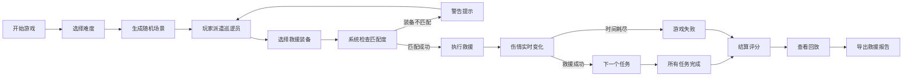

## 1. 产品概述

"滑雪救援派遣赛"是一款面向滑雪巡逻队员培训的浏览器策略游戏，玩家需要在复杂的雪场环境中快速做出救援决策。游戏通过模拟真实的伤情、天气、雪道难度等变量，训练巡逻员的路线选择、装备匹配和时间管理能力。

### 产品目标
- 为滑雪巡逻队提供沉浸式救援演练平台
- 训练新人在压力下做出正确的救援决策
- 通过回放和评分系统帮助学员复盘提升

---

## 2. 核心功能

### 2.1 用户角色
| 角色 | 核心权限 |
|------|----------|
| 玩家 | 进行游戏、查看回放、导出报告 |

### 2.2 功能模块
1. **游戏主界面**：雪场地图、伤员状态、巡逻员派遣
2. **装备选择**：救援装备库、装备匹配检查
3. **时间系统**：倒计时、伤情恶化、暂停/继续
4. **回放系统**：操作记录、时间线回放、失败原因分析
5. **报告系统**：详细救援报告、分类统计、导出功能

### 2.3 页面详情
| 页面名称 | 模块名称 | 功能描述 |
|-----------|-------------|---------------------|
| 开始页面 | 游戏标题 | 游戏说明、难度选择、开始按钮 |
| 游戏主界面 | 地图区域 | 雪道可视化、伤员标记、路线规划 |
| 游戏主界面 | 控制面板 | 巡逻员状态、装备选择、派遣按钮 |
| 游戏主界面 | 警告提示 | 装备不匹配、路线关闭、伤情恶化告警 |
| 结算页面 | 得分统计 | 救援成功率、时间评分、总分计算 |
| 回放页面 | 时间线 | 操作回放、失败点标记、修正痕迹 |
| 报告页面 | 救援报告 | 未处理/已修正/待确认分类统计、详细数据导出 |

---

## 3. 核心流程

---

## 4. 用户界面设计

### 4.1 设计风格
- **主色调**：雪山蓝 (#1E88E5) + 警示红 (#E53935) + 成功绿 (#43A047)
- **辅助色**：冰雪白 (#F5FAFF) + 深灰 (#37474F)
- **按钮风格**：圆角矩形 (8px)，带微妙阴影，悬停有缩放效果
- **字体**：标题使用 Montserrat，正文使用 Inter
- **布局**：卡片式布局，左侧地图 + 右侧控制面板
- **视觉效果**：冰雪纹理背景、玻璃拟态卡片、微妙雪花动画

### 4.2 页面设计概述
| 页面名称 | 模块名称 | UI 元素 |
|-----------|-------------|-------------|
| 开始页面 | 标题区 | 大标题、渐变背景、雪花飘落动画 |
| 开始页面 | 说明区 | 卡片式游戏规则、难度选择按钮组 |
| 游戏主界面 | 地图区 | SVG 雪道地图、可点击节点、动态路线 |
| 游戏主界面 | 状态栏 | 倒计时数字、伤情指示条、天气图标 |
| 游戏主界面 | 警告条 | 红色闪烁警告框、图标动画 |
| 结算页面 | 分数卡 | 环形进度条、分数动画、评级徽章 |
| 回放页面 | 时间线 | 横向时间轴、事件标记点、播放控制 |
| 报告页面 | 统计区 | 分类标签页、数据表格、导出按钮 |

### 4.3 响应式
- **桌面优先**：1280px 以上完整布局
- **平板适配**：900-1279px 控制面板折叠
- **手机适配**：900px 以下纵向堆叠布局

---

## 5. 游戏机制详解

### 5.1 影响因素
1. **雪道难度**：绿色(易) → 蓝色(中) → 黑色(难) → 双黑(极难)
2. **天气条件**：晴朗 → 多云 → 小雪 → 大雪 → 暴风雪
3. **伤情类型**：擦伤 → 扭伤 → 骨折 → 昏迷 → 心脏骤停
4. **装备要求**：担架、氧气、AED、急救包、绳索、通讯设备

### 5.2 警告机制
- **装备不匹配**：红色弹窗提示缺少装备
- **路线关闭**：地图上路线变灰并显示禁止符号
- **伤情恶化**：伤员图标闪烁 + 倒计时加速
