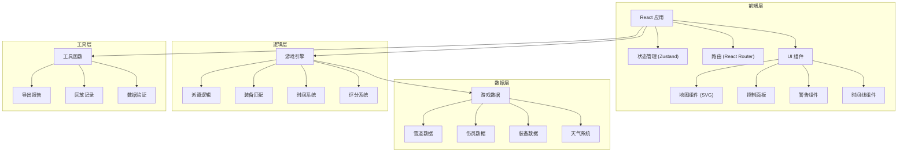

## 1. 架构设计



---

## 2. 技术选型

- **前端框架**：React@18 + TypeScript
- **构建工具**：Vite@5
- **样式方案**：TailwindCSS@3
- **状态管理**：Zustand@4
- **路由管理**：React Router Dom@6
- **图标库**：Lucide React
- **导出功能**：jsPDF (PDF导出)

---

## 3. 路由定义

| 路由 | 页面组件 | 用途 |
|-------|---------|------|
| `/` | `StartPage` | 游戏开始页面，选择难度 |
| `/game` | `GamePage` | 游戏主界面 |
| `/result` | `ResultPage` | 结算评分页面 |
| `/replay` | `ReplayPage` | 回放查看页面 |
| `/report` | `ReportPage` | 报告导出页面 |

---

## 4. 数据模型

### 4.1 TypeScript 类型定义

```typescript
// 雪道难度
type SlopeDifficulty = 'green' | 'blue' | 'black' | 'double-black';

// 天气状态
type WeatherCondition = 'sunny' | 'cloudy' | 'light-snow' | 'heavy-snow' | 'blizzard';

// 伤情类型
type InjuryType = 'abrasion' | 'sprain' | 'fracture' | 'unconscious' | 'cardiac-arrest';

// 装备类型
type EquipmentType = 'stretcher' | 'oxygen' | 'aed' | 'first-aid' | 'rope' | 'radio';

// 游戏状态
type GameStatus = 'idle' | 'playing' | 'paused' | 'won' | 'lost';

// 警告类型
type WarningType = 'equipment-mismatch' | 'route-closed' | 'injury-worsening';

// 雪道节点
interface SlopeNode {
  id: string;
  name: string;
  x: number;
  y: number;
  difficulty: SlopeDifficulty;
  isOpen: boolean;
  connectedTo: string[];
}

// 伤员
interface Victim {
  id: string;
  name: string;
  location: string;
  injury: InjuryType;
  severity: number;
  requiredEquipment: EquipmentType[];
  timeRemaining: number;
  isRescued: boolean;
}

// 巡逻员
interface Patroller {
  id: string;
  name: string;
  status: 'idle' | 'en-route' | 'rescuing' | 'returning';
  currentLocation: string;
  targetLocation: string | null;
  equipment: EquipmentType[];
  assignedVictim: string | null;
}

// 警告记录
interface WarningRecord {
  id: string;
  type: WarningType;
  message: string;
  timestamp: number;
  isResolved: boolean;
  resolvedAt?: number;
}

// 救援报告
interface RescueReport {
  totalVictims: number;
  rescued: number;
  failed: number;
  unhandled: number;
  corrected: number;
  needsConfirmation: number;
  warnings: WarningRecord[];
  totalTime: number;
  score: number;
  grade: string;
}

// 游戏状态
interface GameState {
  status: GameStatus;
  difficulty: 'easy' | 'normal' | 'hard';
  currentTime: number;
  totalTime: number;
  weather: WeatherCondition;
  slopeMap: SlopeNode[];
  victims: Victim[];
  patrollers: Patroller[];
  warnings: WarningRecord[];
  actionHistory: ActionRecord[];
  report: RescueReport | null;
}

// 操作记录
interface ActionRecord {
  id: string;
  type: 'dispatch' | 'equip' | 'rescue' | 'warning' | 'correction';
  timestamp: number;
  description: string;
  details: Record<string, unknown>;
}
```

---

## 5. 目录结构

```
src/
├── components/
│   ├── game/
│   │   ├── SlopeMap.tsx        # 雪道地图组件
│   │   ├── ControlPanel.tsx    # 控制面板
│   │   ├── WarningBanner.tsx   # 警告横幅
│   │   ├── Timer.tsx           # 计时器
│   │   └── EquipmentSelector.tsx # 装备选择器
│   ├── replay/
│   │   ├── Timeline.tsx        # 时间线组件
│   │   └── ReplayControls.tsx  # 回放控制
│   ├── report/
│   │   ├── ReportStats.tsx     # 报告统计
│   │   └── ExportButton.tsx    # 导出按钮
│   └── common/
│       ├── Button.tsx          # 通用按钮
│       ├── Card.tsx            # 通用卡片
│       └── Modal.tsx           # 通用弹窗
├── pages/
│   ├── StartPage.tsx           # 开始页面
│   ├── GamePage.tsx            # 游戏页面
│   ├── ResultPage.tsx          # 结算页面
│   ├── ReplayPage.tsx          # 回放页面
│   └── ReportPage.tsx          # 报告页面
├── store/
│   └── useGameStore.ts         # Zustand 状态管理
├── hooks/
│   ├── useGameEngine.ts        # 游戏引擎 Hook
│   ├── useTimer.ts             # 计时器 Hook
│   └── useWeather.ts           # 天气系统 Hook
├── utils/
│   ├── pathfinding.ts          # 路径计算
│   ├── scoring.ts              # 评分系统
│   ├── export.ts               # 报告导出
│   └── validation.ts           # 数据验证
├── data/
│   ├── slopes.ts               # 雪道数据
│   ├── victims.ts              # 伤员模板
│   └── equipment.ts            # 装备数据
├── types/
│   └── index.ts                # 类型定义
├── App.tsx                     # 应用入口
├── main.tsx                    # 渲染入口
└── index.css                   # 全局样式
```

---

## 6. 核心算法

### 6.1 路径查找算法
- 使用 Dijkstra 算法计算最短路径
- 考虑雪道难度和天气对时间的影响
- 实时检测路线关闭情况

### 6.2 装备匹配算法
- 对比伤员所需装备与巡逻员携带装备
- 标记缺失装备并生成警告
- 记录修正历史

### 6.3 评分系统
- 救援成功率 (40%)
- 响应速度 (30%)
- 装备正确率 (20%)
- 警告处理 (10%)
