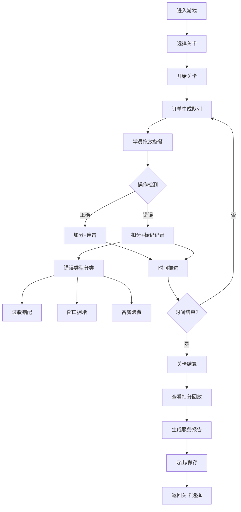

## 1. 产品概述

"校园食堂备餐 rush"是一款面向食堂新人的训练模拟游戏，通过沉浸式备餐流程训练员工正确处理不同年级、过敏原要求的订单，避免过敏餐错配、窗口拥堵和备餐浪费。

### 产品目标
- 让新人快速掌握按年级分类、过敏原管理、窗口分配的备餐流程
- 通过游戏化机制降低培训成本，提高训练效果
- 记录操作痕迹，便于复盘和针对性改进

---

## 2. 核心功能

### 2.1 用户角色
| 角色 | 登录方式 | 核心权限 |
|------|----------|----------|
| 学员 | 本地访客 | 进行游戏训练、查看个人成绩、导出报告 |
| 主管 | 本地访客 | 查看所有训练记录、分析错误类型 |

### 2.2 功能模块
1. **游戏主界面**：订单队列、备餐台、取餐窗口、时间进度、得分显示
2. **关卡系统**：难度递进的多个训练关卡
3. **实时反馈**：操作正确/错误提示、过敏警告、拥堵提示
4. **回放系统**：关卡结束后可回放关键操作节点
5. **报告系统**：详细的服务报告，区分未处理、已修正、人工确认项
6. **数据面板**：历史成绩统计、错误类型分析

### 2.3 页面详情
| 页面名称 | 模块名称 | 功能描述 |
|---------|---------|----------|
| 首页/开始界面 | 关卡选择 | 展示可用关卡、难度标签、最佳成绩 |
| 游戏主界面 | 订单队列 | 显示待处理订单，包含年级、过敏原、餐品信息 |
| 游戏主界面 | 备餐台 | 拖放餐品到备餐台，支持合并/调整 |
| 游戏主界面 | 取餐窗口 | 3-4个窗口，按年级分配，显示排队状态 |
| 游戏主界面 | 过敏警示 | 红色高亮标记过敏订单，防错配提醒 |
| 游戏主界面 | 时间/得分 | 倒计时、当前得分、连击奖励 |
| 结算界面 | 得分详情 | 总分、正确率、错误类型统计 |
| 结算界面 | 扣分回放 | 可点击查看每个扣分点的操作回放 |
| 报告界面 | 服务报告 | 分类展示：未处理、已修正、需人工确认 |
| 报告界面 | 导出功能 | 导出JSON/文本格式的详细报告 |

---

## 3. 核心流程

---

## 4. 用户界面设计

### 4.1 设计风格
- **主色调**：温暖橙黄色系（#FF8C42）配合食堂主题，辅以绿色（#2ECC71）表示正确，红色（#E74C3C）表示错误警告
- **按钮风格**：圆润3D质感按钮，带有轻微阴影和悬停动效
- **字体**：使用「ZCOOL KuaiLe」作为游戏标题字体，「Noto Sans SC」作为正文字体
- **布局风格**：卡片式布局，游戏区域采用网格化设计，信息层级分明
- **图标风格**：扁平化彩色emoji风格图标，增强趣味性

### 4.2 页面设计概览
| 页面名称 | 模块名称 | UI元素 |
|---------|---------|--------|
| 开始界面 | 关卡选择 | 大标题、关卡卡片（难度星标、最高分）、开始按钮 |
| 游戏界面 | 顶部信息栏 | 倒计时进度条、得分显示、连击数、暂停按钮 |
| 游戏界面 | 订单队列区 | 左侧垂直滚动列表，订单卡片带年级颜色标识、过敏红色标签 |
| 游戏界面 | 备餐台区 | 中间区域，3-4个备餐位，支持拖放操作 |
| 游戏界面 | 取餐窗口区 | 底部横向排列，窗口上方显示排队人数，拥堵时黄色闪烁 |
| 游戏界面 | 操作反馈 | 浮动+/-分数动画、正确/错误图标闪现 |
| 结算界面 | 得分概览 | 大数字总分、评级（S/A/B/C/D）、正确率圆环图 |
| 结算界面 | 错误列表 | 可展开的时间线，点击回放对应操作 |
| 报告界面 | 分类表格 | 三栏布局：未处理/已修正/需确认，每项附操作痕迹 |

### 4.3 响应式设计
- 采用桌面端优先设计，最小支持1280px宽度
- 平板设备自适应缩放，保持核心游戏区域可见
- 不支持移动端操作（拖放操作不适合触屏）

### 4.4 动效与交互
- **订单入场**：从左侧滑入，带轻微弹跳效果
- **拖放操作**：抓起时放大+阴影，放下时回弹
- **正确操作**：绿色√图标从中心扩散，+分数向上飘出
- **错误操作**：红色×图标抖动，扣分数字红色闪烁
- **过敏警告**：订单卡片边缘红色脉冲动画，配⚠️图标
- **窗口拥堵**：窗口背景黄色闪烁，排队人数数字跳动
- **倒计时**：最后10秒红色闪烁+心跳音效提示
