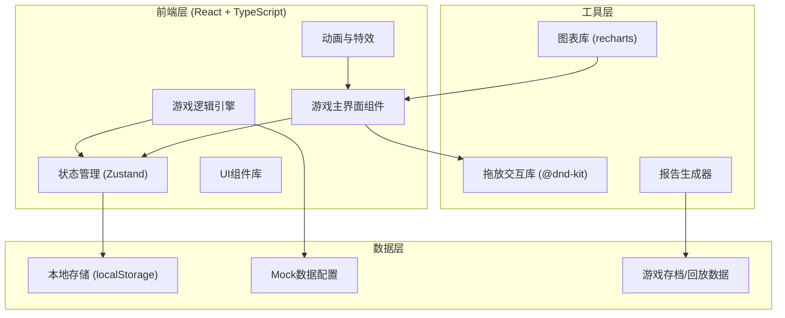

## 1. 架构设计



## 2. 技术栈说明

### 2.1 核心技术
- **前端框架**: React 18 + TypeScript
- **构建工具**: Vite 5
- **样式方案**: TailwindCSS 3 + CSS Variables
- **状态管理**: Zustand (轻量级，适合游戏状态)
- **拖放交互**: @dnd-kit/core + @dnd-kit/sortable
- **图表展示**: Recharts
- **动画**: Framer Motion

### 2.2 项目结构
```
src/
├── components/          # 组件目录
│   ├── game/           # 游戏核心组件
│   │   ├── GameBoard.tsx
│   │   ├── OrderQueue.tsx
│   │   ├── PrepStation.tsx
│   │   ├── PickupWindow.tsx
│   │   └── OrderCard.tsx
│   ├── ui/             # 通用UI组件
│   │   ├── Button.tsx
│   │   ├── Modal.tsx
│   │   └── ProgressBar.tsx
│   └── report/         # 报告相关组件
│       ├── ReportView.tsx
│       └── ReplayPlayer.tsx
├── store/              # 状态管理
│   └── useGameStore.ts
├── types/              # TypeScript类型定义
│   └── game.ts
├── data/               # Mock数据与配置
│   ├── levels.ts
│   ├── dishes.ts
│   └── allergens.ts
├── utils/              # 工具函数
│   ├── gameEngine.ts
│   ├── reportGenerator.ts
│   └── replaySystem.ts
├── hooks/              # 自定义Hooks
│   └── useGameLoop.ts
└── styles/             # 全局样式
    └── index.css
```

## 3. 路由定义

| 路由路径 | 页面用途 |
|---------|---------|
| `/` | 首页/关卡选择界面 |
| `/game/:levelId` | 游戏主界面 |
| `/result/:sessionId` | 结算与回放界面 |
| `/report/:sessionId` | 详细服务报告界面 |

## 4. 数据模型

### 4.1 核心类型定义

```typescript
// 年级类型
type Grade = '一年级' | '二年级' | '三年级' | '四年级' | '五年级' | '六年级';

// 过敏原类型
type Allergen = '花生' | '牛奶' | '鸡蛋' | '小麦' | '海鲜' | '大豆';

// 餐品类型
interface Dish {
  id: string;
  name: string;
  emoji: string;
  allergens: Allergen[];
  prepTime: number; // 毫秒
}

// 订单类型
interface Order {
  id: string;
  grade: Grade;
  dishes: string[]; // dish ids
  allergens: Allergen[]; // 学生过敏原
  windowId: string;
  createdAt: number;
  status: 'pending' | 'preparing' | 'ready' | 'delivered' | 'failed';
}

// 备餐台
interface PrepStation {
  id: string;
  orderId: string | null;
  progress: number; // 0-100
}

// 取餐窗口
interface PickupWindow {
  id: string;
  name: string;
  grade: Grade;
  queue: string[]; // order ids
  maxQueue: number;
}

// 操作记录
interface ActionLog {
  id: string;
  timestamp: number;
  type: 'correct' | 'error' | 'warning';
  action: string;
  details: Record<string, any>;
  points: number; // +/- points
  orderId?: string;
}

// 游戏会话
interface GameSession {
  id: string;
  levelId: string;
  startTime: number;
  endTime: number;
  score: number;
  maxScore: number;
  actions: ActionLog[];
  orders: Order[];
  finalReport: ServiceReport;
}

// 服务报告
interface ServiceReport {
  unhandled: Order[];      // 未处理
  corrected: ActionLog[];  // 已修正
  needReview: ActionLog[]; // 需人工确认
  statistics: {
    totalOrders: number;
    delivered: number;
    allergyMismatches: number;
    windowCongestions: number;
    foodWaste: number;
    accuracy: number;
  };
}
```

### 4.2 关卡配置
```typescript
interface LevelConfig {
  id: string;
  name: string;
  description: string;
  difficulty: 1 | 2 | 3 | 4 | 5;
  duration: number; // 秒
  orderInterval: [number, number]; // 订单生成间隔范围
  windows: PickupWindow[];
  prepStations: number;
  targetScore: number;
}
```

## 5. 游戏引擎核心逻辑

### 5.1 游戏循环
- 使用 `requestAnimationFrame` 驱动游戏主循环
- 每帧更新：备餐进度、订单生成、窗口队列检测
- 状态变更通过 Zustand 统一管理

### 5.2 错误检测规则
1. **过敏错配**: 餐品过敏原与学生过敏原冲突 → 严重扣分
2. **窗口拥堵**: 窗口排队数超过 maxQueue → 警告扣分
3. **备餐浪费**: 订单取消但已开始备餐 → 材料浪费扣分
4. **年级错配**: 订单送错年级窗口 → 扣分

### 5.3 得分规则
- 正确交付: +100分 × 连击系数
- 提前完成: +50分奖励
- 连击奖励: 连续正确5单后开始加成 (最高2x)
- 错误扣分: 过敏-200, 拥堵-50, 浪费-80, 错配-100

## 6. 回放系统设计

### 6.1 回放数据结构
```typescript
interface ReplayFrame {
  timestamp: number;
  gameState: {
    orders: Order[];
    prepStations: PrepStation[];
    windows: PickupWindow[];
    score: number;
  };
  action?: ActionLog;
}
```

### 6.2 回放控制
- 支持播放/暂停/倍速 (0.5x, 1x, 2x)
- 支持跳转到指定错误节点
- 关键帧快照 + 增量更新机制
