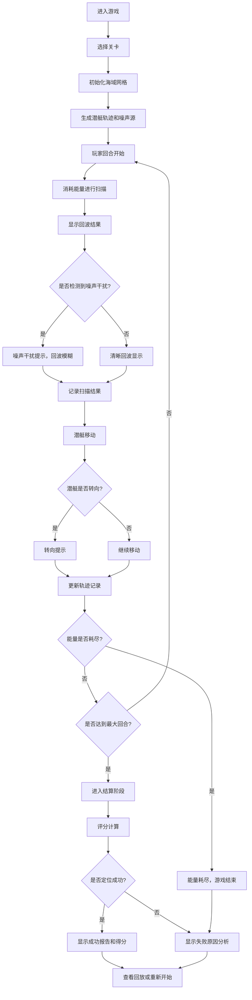

## 1. 产品概述

"声呐网格追踪"是一款面向科普教学的声呐探测小游戏，玩家通过分析声呐回波和噪声信号，在海域网格中推理并定位潜艇的位置和轨迹。游戏模拟真实的声呐探测原理，通过关卡化设计帮助玩家理解声波传播、噪声干扰、能量管理等概念。

- 核心目标：通过教育性游戏化设计，让玩家直观理解声呐探测原理
- 目标用户：中小学生科普课学习者、对声呐技术感兴趣的入门者
- 核心价值：将抽象的声学原理转化为可交互的游戏体验

## 2. 核心特性

### 2.1 用户角色
| 角色 | 注册方式 | 核心权限 |
|------|----------|----------|
| 玩家 | 无需注册，直接进入 | 进行游戏、查看历史记录、导出回放 |

### 2.2 功能模块
1. **游戏主界面**：海域网格、控制面板、状态面板
2. **声呐探测系统**：网格扫描、回波显示、冷却时间
3. **干扰系统**：噪声源模拟、噪声干扰提示
4. **能量管理系统**：能量条、能量消耗、耗尽警告
5. **目标追踪系统**：潜艇轨迹、转向提示、位置推理
6. **评分报告系统**：关卡评分、失败原因分析、得分详情
7. **回放系统**：操作记录、轨迹回放、数据导出

### 2.3 页面详情
| 页面名称 | 模块名称 | 功能描述 |
|---------|----------|----------|
| 开始界面 | 关卡选择 | 展示关卡列表、难度说明、历史最高分 |
| 开始界面 | 游戏说明 | 玩法介绍、操作指南、原理说明 |
| 游戏主界面 | 海域网格 | 10x10可交互网格，显示扫描结果和回波 |
| 游戏主界面 | 控制面板 | 扫描按钮、冷却倒计时、能量条 |
| 游戏主界面 | 状态面板 | 当前回合、已探测区域、可疑目标标记 |
| 游戏主界面 | 提示区域 | 噪声干扰警告、能量耗尽警告、目标转向提示 |
| 结算界面 | 评分报告 | 最终得分、探测准确率、失败原因（如失败） |
| 结算界面 | 轨迹展示 | 显示潜艇实际轨迹与玩家推理轨迹对比 |
| 回放界面 | 操作回放 | 逐帧回放整个游戏过程，标记每次操作 |
| 回放界面 | 数据导出 | 导出JSON格式的游戏记录和评分数据 |

## 3. 核心流程

## 4. 用户界面设计

### 4.1 设计风格
- **主色调**：深海蓝 (#0a2463) 作为主背景，辅以声呐绿 (#3e885b) 作为回波高亮
- **辅助色**：警告黄 (#f9c74f) 用于提示，危险红 (#e63946) 用于能量耗尽警告
- **按钮风格**：圆角矩形，带有轻微的水下发光效果，点击时有波纹扩散动画
- **字体**：使用等宽字体 (JetBrains Mono) 营造科技感，搭配可读性强的正文字体
- **布局风格**：左中右三栏布局，左侧为控制面板，中间为海域网格，右侧为状态面板
- **视觉风格**：模拟潜艇声呐显示屏的CRT效果，带有轻微的扫描线和辉光效果

### 4.2 页面设计概述
| 页面名称 | 模块名称 | UI元素 |
|---------|----------|--------|
| 开始界面 | 关卡选择 | 卡片式关卡列表，显示难度星级、解锁状态、最高分 |
| 开始界面 | 游戏说明 | 折叠式说明面板，配有示意图和动画演示 |
| 游戏主界面 | 海域网格 | 10x10方格矩阵，悬停高亮，点击扫描，回波用同心圆动画显示 |
| 游戏主界面 | 控制面板 | 能量条（渐变填充）、扫描按钮、冷却进度环、操作日志 |
| 游戏主界面 | 状态面板 | 回合计数器、已探测区域热力图、可疑目标标记列表 |
| 游戏主界面 | 提示区域 | 浮动提示框，带有图标和动画，支持多条堆叠显示 |
| 结算界面 | 评分报告 | 得分仪表盘、准确率柱状图、关键指标卡片 |
| 结算界面 | 轨迹展示 | 网格叠加层，用不同颜色区分实际轨迹和推理轨迹 |
| 回放界面 | 操作回放 | 时间轴滑块、播放控制按钮、关键节点标记 |
| 回放界面 | 数据导出 | 导出按钮、JSON预览框、复制到剪贴板功能 |

### 4.3 响应式设计
- 桌面端：三栏布局，充分利用屏幕空间
- 平板端：上下布局，控制面板在上，网格在中，状态面板在下
- 移动端：单栏滚动布局，网格自适应屏幕宽度
- 触摸优化：增大点击区域，支持双指缩放查看网格细节

### 4.4 动画与交互效果
- 扫描动画：点击网格后，从点击位置向外扩散的圆形波纹
- 回波显示：检测到目标时，显示绿色辉光脉冲效果
- 噪声干扰：红色雪花噪点覆盖回波区域，伴有闪烁效果
- 能量耗尽：能量条闪烁红色警告，屏幕边缘出现红色光晕
- 目标转向：轨迹线上出现黄色箭头闪烁提示
- 页面切换：带有轻微的淡入淡出和缩放效果
