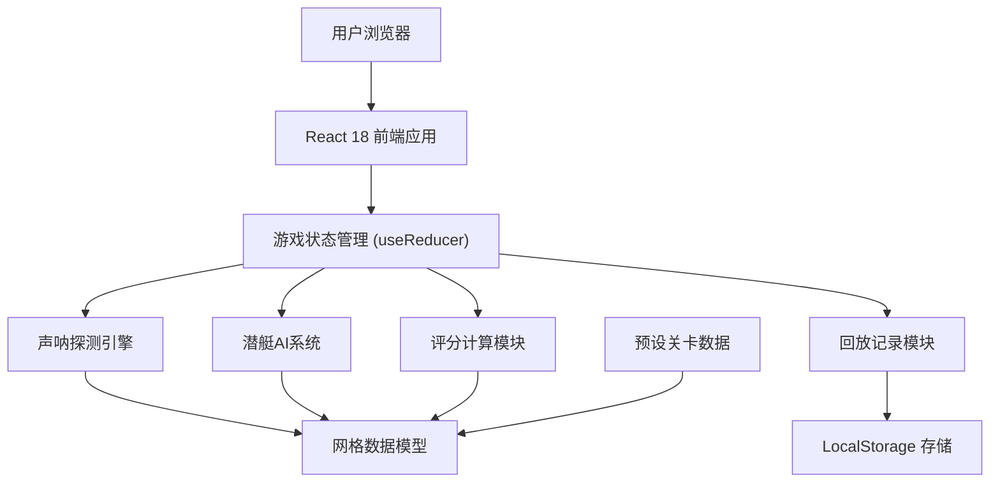

## 1. 架构设计



## 2. 技术描述

- **前端框架**: React@18 + TypeScript
- **构建工具**: Vite@5
- **样式方案**: TailwindCSS@3 + 自定义CSS变量
- **状态管理**: React useReducer + Context API
- **动画库**: Framer Motion (用于复杂动画效果)
- **图标库**: Lucide React
- **数据存储**: LocalStorage (保存游戏记录和回放)
- **后端**: 无后端，纯前端实现，所有数据在本地生成和处理

## 3. 目录结构

```
src/
├── components/          # React 组件
│   ├── game/           # 游戏核心组件
│   │   ├── GameGrid.tsx        # 海域网格
│   │   ├── ControlPanel.tsx    # 控制面板
│   │   ├── StatusPanel.tsx     # 状态面板
│   │   ├── NotificationArea.tsx # 提示区域
│   │   └── ScanAnimation.tsx   # 扫描动画
│   ├── layout/         # 布局组件
│   │   └── GameLayout.tsx
│   ├── pages/          # 页面组件
│   │   ├── StartPage.tsx       # 开始界面
│   │   ├── GamePage.tsx        # 游戏主界面
│   │   ├── ResultPage.tsx      # 结算界面
│   │   └── ReplayPage.tsx      # 回放界面
│   └── ui/             # 通用UI组件
│       ├── Button.tsx
│       ├── ProgressBar.tsx
│       └── Modal.tsx
├── hooks/              # 自定义 Hooks
│   ├── useGameEngine.ts        # 游戏引擎Hook
│   ├── useSonarSystem.ts       # 声呐系统Hook
│   ├── useSubmarineAI.ts       # 潜艇AI Hook
│   └── useReplayRecorder.ts    # 回放记录Hook
├── store/              # 状态管理
│   ├── gameContext.tsx         # 游戏上下文
│   └── gameReducer.ts          # 游戏状态Reducer
├── types/              # TypeScript 类型定义
│   └── game.ts                 # 游戏相关类型
├── utils/              # 工具函数
│   ├── gridUtils.ts            # 网格计算工具
│   ├── sonarUtils.ts           # 声呐计算工具
│   ├── scoringUtils.ts         # 评分计算工具
│   └── noiseGenerator.ts       # 噪声生成器
├── data/               # 静态数据
│   └── levels.ts               # 关卡配置数据
├── App.tsx
├── main.tsx
└── index.css
```

## 4. 核心数据模型

### 4.1 游戏状态类型定义

```typescript
// 坐标点
interface Point {
  x: number;
  y: number;
}

// 网格单元格
interface Cell {
  x: number;
  y: number;
  scanned: boolean;
  echoStrength: number; // 0-100 回波强度
  hasNoise: boolean;
  noiseLevel: number; // 0-100 噪声强度
  isTarget: boolean; // 该回合是否有潜艇
  marked: boolean; // 玩家是否标记为可疑
}

// 潜艇
interface Submarine {
  id: string;
  position: Point;
  direction: 'up' | 'down' | 'left' | 'right';
  speed: number; // 每回合移动格数
  trajectory: Point[]; // 历史轨迹
  isTurning: boolean; // 是否正在转向
}

// 噪声源
interface NoiseSource {
  id: string;
  position: Point;
  radius: number; // 影响半径
  intensity: number; // 噪声强度 0-100
  active: boolean;
}

// 扫描记录
interface ScanRecord {
  turn: number;
  position: Point;
  echoStrength: number;
  hasNoise: boolean;
  noiseLevel: number;
  detectedTarget: boolean;
  timestamp: number;
}

// 玩家操作
interface PlayerAction {
  type: 'scan' | 'mark' | 'unmark' | 'guess';
  position: Point;
  turn: number;
  timestamp: number;
}

// 游戏状态
interface GameState {
  status: 'idle' | 'playing' | 'paused' | 'finished' | 'replaying';
  currentLevel: number;
  turn: number;
  maxTurns: number;
  energy: number;
  maxEnergy: number;
  scanCost: number;
  cooldown: number; // 当前冷却剩余
  cooldownTime: number; // 每次扫描冷却时间
  grid: Cell[][];
  gridSize: number;
  submarine: Submarine;
  noiseSources: NoiseSource[];
  scanHistory: ScanRecord[];
  playerActions: PlayerAction[];
  guessPosition: Point | null;
  notifications: Notification[];
  score: number;
  result: 'success' | 'failed' | null;
  failReason: string | null;
}

// 通知
interface Notification {
  id: string;
  type: 'info' | 'warning' | 'danger' | 'success';
  message: string;
  timestamp: number;
  duration: number;
}

// 关卡配置
interface LevelConfig {
  id: number;
  name: string;
  description: string;
  difficulty: 'easy' | 'medium' | 'hard';
  gridSize: number;
  maxTurns: number;
  maxEnergy: number;
  scanCost: number;
  cooldownTime: number;
  submarineSpeed: number;
  turnProbability: number; // 每回合转向概率
  noiseSourceCount: number;
  noiseIntensityRange: [number, number];
  targetScore: number;
}

// 回放记录
interface ReplayRecord {
  id: string;
  levelId: number;
  startTime: number;
  endTime: number;
  finalScore: number;
  result: 'success' | 'failed';
  failReason: string | null;
  actions: PlayerAction[];
  submarineTrajectory: Point[];
  scanHistory: ScanRecord[];
  levelConfig: LevelConfig;
}
```

## 5. 核心算法

### 5.1 声呐探测算法
```typescript
// 计算两点间曼哈顿距离
function manhattanDistance(p1: Point, p2: Point): number {
  return Math.abs(p1.x - p2.x) + Math.abs(p1.y - p2.y);
}

// 计算回波强度（基于距离衰减）
function calculateEchoStrength(
  scanPos: Point,
  targetPos: Point,
  noiseSources: NoiseSource[]
): { strength: number; hasNoise: boolean; noiseLevel: number } {
  const distance = manhattanDistance(scanPos, targetPos);
  const maxRange = 5; // 最大探测范围
  
  // 基础回波强度随距离衰减
  let strength = Math.max(0, 100 - distance * 20);
  
  // 检查噪声干扰
  let hasNoise = false;
  let noiseLevel = 0;
  
  for (const noise of noiseSources) {
    if (!noise.active) continue;
    const noiseDist = manhattanDistance(scanPos, noise.position);
    if (noiseDist <= noise.radius) {
      hasNoise = true;
      const noiseEffect = noise.intensity * (1 - noiseDist / noise.radius);
      noiseLevel = Math.max(noiseLevel, noiseEffect);
      // 噪声降低回波强度
      strength *= (1 - noiseEffect / 200);
    }
  }
  
  return { 
    strength: Math.round(strength), 
    hasNoise, 
    noiseLevel: Math.round(noiseLevel) 
  };
}
```

### 5.2 潜艇AI移动算法
```typescript
function moveSubmarine(
  submarine: Submarine,
  gridSize: number,
  turnProbability: number
): Submarine {
  const newTrajectory = [...submarine.trajectory, submarine.position];
  
  // 决定是否转向
  const shouldTurn = Math.random() < turnProbability;
  let newDirection = submarine.direction;
  
  if (shouldTurn) {
    const directions: Array<'up' | 'down' | 'left' | 'right'> = ['up', 'down', 'left', 'right'];
    const otherDirections = directions.filter(d => d !== submarine.direction);
    newDirection = otherDirections[Math.floor(Math.random() * otherDirections.length)];
  }
  
  // 计算新位置
  let newX = submarine.position.x;
  let newY = submarine.position.y;
  
  for (let i = 0; i < submarine.speed; i++) {
    switch (newDirection) {
      case 'up': newY = Math.max(0, newY - 1); break;
      case 'down': newY = Math.min(gridSize - 1, newY + 1); break;
      case 'left': newX = Math.max(0, newX - 1); break;
      case 'right': newX = Math.min(gridSize - 1, newX + 1); break;
    }
  }
  
  return {
    ...submarine,
    position: { x: newX, y: newY },
    direction: newDirection,
    trajectory: newTrajectory,
    isTurning: shouldTurn
  };
}
```

### 5.3 评分算法
```typescript
function calculateScore(
  gameState: GameState,
  guessPosition: Point
): { score: number; accuracy: number; distance: number } {
  const actualPosition = gameState.submarine.position;
  const distance = manhattanDistance(guessPosition, actualPosition);
  
  // 基础分：距离越近分数越高
  const maxDistance = gameState.gridSize * 2;
  const distanceScore = Math.max(0, 1000 - distance * 100);
  
  // 效率分：使用的回合越少分数越高
  const turnEfficiency = Math.max(0, 500 - gameState.turn * 50);
  
  // 能量剩余加分
  const energyBonus = Math.round(gameState.energy * 2);
  
  // 准确率计算
  const accuracy = Math.max(0, 100 - distance * 10);
  
  const totalScore = distanceScore + turnEfficiency + energyBonus;
  
  return {
    score: Math.max(0, totalScore),
    accuracy,
    distance
  };
}
```

## 6. 路由定义

| 路由 | 页面 | 描述 |
|------|------|------|
| `/` | StartPage | 开始界面，关卡选择和游戏说明 |
| `/game/:levelId` | GamePage | 游戏主界面 |
| `/result/:gameId` | ResultPage | 结算界面，显示评分报告 |
| `/replay/:gameId` | ReplayPage | 回放界面，查看游戏过程 |

## 7. 关键模块说明

### 7.1 游戏引擎 (useGameEngine)
- 管理游戏主循环和状态流转
- 处理玩家输入和操作
- 协调声呐系统、潜艇AI和评分模块
- 触发通知和状态更新

### 7.2 声呐系统 (useSonarSystem)
- 实现声呐扫描逻辑
- 计算回波强度和噪声干扰
- 管理扫描冷却时间
- 生成扫描记录

### 7.3 潜艇AI (useSubmarineAI)
- 控制潜艇移动和转向
- 生成潜艇轨迹
- 根据关卡难度调整行为模式

### 7.4 回放记录器 (useReplayRecorder)
- 记录所有玩家操作和游戏事件
- 生成可导出的回放数据
- 支持回放播放控制

### 7.5 噪声生成器 (noiseGenerator)
- 模拟不同类型的噪声源
- 动态调整噪声强度和影响范围
- 实现噪声干扰效果

## 8. 数据持久化

- 使用 LocalStorage 存储：
  - 玩家历史最高分（按关卡）
  - 已解锁关卡
  - 游戏回放记录（最多保存20条）
- 回放数据导出为 JSON 格式，支持下载和分享
