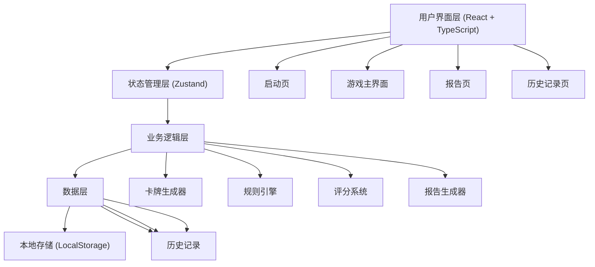

## 1. 技术架构设计



## 2. 技术栈选择

| 层级 | 技术选型 | 说明 |
|-----|---------|------|
| 前端框架 | React 18 + TypeScript | 类型安全、组件化开发 |
| 构建工具 | Vite 5 | 快速开发、热更新 |
| 状态管理 | Zustand | 轻量、简洁、易于调试 |
| 路由 | React Router DOM 6 | 单页应用路由管理 |
| 样式 | Tailwind CSS 3 | 原子化CSS、开发效率高 |
| 图标 | Lucide React | 轻量级图标库 |
| 存储 | LocalStorage | 本地持久化游戏记录 |
| 导出 | 原生JS | JSON/Markdown格式导出 |

## 3. 项目结构

```
y11652/
├── src/
│   ├── components/          # 可复用组件
│   │   ├── Card.tsx        # 档案卡牌组件
│   │   ├── Timer.tsx       # 计时器组件
│   │   ├── ScoreBoard.tsx  # 计分板组件
│   │   ├── RuleHint.tsx    # 规则提示组件
│   │   ├── OperationLog.tsx# 操作日志组件
│   │   └── ExportButton.tsx# 导出按钮组件
│   ├── pages/              # 页面组件
│   │   ├── Home.tsx        # 启动页
│   │   ├── Game.tsx        # 游戏主界面
│   │   ├── Report.tsx      # 报告页
│   │   └── History.tsx     # 历史记录页
│   ├── store/              # 状态管理
│   │   └── useGameStore.ts # 游戏状态store
│   ├── utils/              # 工具函数
│   │   ├── cardGenerator.ts # 卡牌生成器
│   │   ├── ruleEngine.ts   # 规则引擎
│   │   ├── scoreSystem.ts  # 评分系统
│   │   ├── reportGenerator.ts # 报告生成器
│   │   └── storage.ts      # 本地存储工具
│   ├── types/              # TypeScript类型定义
│   │   └── index.ts        # 全局类型
│   ├── data/               # 静态数据
│   │   ├── cardTemplates.ts # 卡牌模板数据
│   │   └── gameConfig.ts   # 游戏配置
│   ├── App.tsx             # 应用根组件
│   ├── main.tsx            # 应用入口
│   └── index.css           # 全局样式
├── public/                 # 静态资源
├── .trae/
│   └── documents/          # 项目文档
├── package.json
├── tsconfig.json
├── vite.config.ts
├── tailwind.config.js
└── postcss.config.js
```

## 4. 核心数据模型

### 4.1 TypeScript类型定义

```typescript
// 材料类型
export type MaterialType = 'contract' | 'invoice' | 'confidential';

// 保密级别
export type SecurityLevel = 'public' | 'internal' | 'secret' | 'confidential' | 'top_secret';

// 保管期限
export type RetentionPeriod = 'permanent' | '30years' | '10years';

// 卡牌来源
export type CardSource = 'file_card' | 'archive_box' | 'security_tag' | 'retention_tag' | 'borrow_request' | 'archive_report';

// 难度级别
export type Difficulty = 'easy' | 'normal' | 'hard';

// 错误类型
export type ErrorType = 'classification' | 'security_level' | 'retention_period' | 'borrow_not_registered';

// 卡牌数据
export interface Card {
  id: string;
  source: CardSource;
  materialType: MaterialType;
  title: string;
  content: string;
  correctSecurityLevel: SecurityLevel;
  correctRetentionPeriod: RetentionPeriod;
  hasBorrowRequest: boolean;
  borrower?: string;
  borrowDate?: string;
  hints: string[];
}

// 玩家操作
export interface PlayerAction {
  cardId: string;
  timestamp: number;
  selectedType: MaterialType;
  selectedSecurityLevel: SecurityLevel;
  selectedRetentionPeriod: RetentionPeriod;
  isBorrowRegistered: boolean;
  errors: ErrorType[];
  scoreChange: number;
}

// 游戏状态
export interface GameState {
  status: 'idle' | 'playing' | 'paused' | 'finished';
  difficulty: Difficulty;
  currentCardIndex: number;
  cards: Card[];
  actions: PlayerAction[];
  score: number;
  combo: number;
  maxCombo: number;
  startTime: number | null;
  endTime: number | null;
  timeLimit: number;
  remainingTime: number;
}

// 游戏报告
export interface GameReport {
  id: string;
  startTime: number;
  endTime: number;
  difficulty: Difficulty;
  totalScore: number;
  accuracy: number;
  totalCards: number;
  correctCount: number;
  errorCount: number;
  maxCombo: number;
  errorsByType: Record<ErrorType, number>;
  actions: PlayerAction[];
  cards: Card[];
}

// 历史记录
export interface HistoryRecord {
  id: string;
  date: number;
  difficulty: Difficulty;
  score: number;
  accuracy: number;
  duration: number;
  reportId: string;
}
```

## 5. 路由定义

| 路由路径 | 页面 | 说明 |
|---------|------|------|
| / | Home | 启动页，选择难度和查看规则 |
| /game | Game | 游戏主界面 |
| /report/:id | Report | 游戏报告页 |
| /history | History | 历史记录列表页 |
| /history/:id | Report | 历史报告回看 |

## 6. 状态管理设计

### 6.1 Zustand Store结构

```typescript
// useGameStore.ts
interface GameStore {
  // 状态
  gameState: GameState;
  currentCard: Card | null;
  
  // 操作
  startGame: (difficulty: Difficulty) => void;
  pauseGame: () => void;
  resumeGame: () => void;
  submitAction: (action: Omit<PlayerAction, 'timestamp' | 'errors' | 'scoreChange'>) => void;
  nextCard: () => void;
  finishGame: () => void;
  resetGame: () => void;
  tickTimer: () => void;
}
```

## 7. 核心模块说明

### 7.1 卡牌生成器 (cardGenerator.ts)
- 根据难度生成指定数量的随机卡牌
- 从卡牌模板中随机选择，确保材料类型分布均匀
- 为每张卡牌分配随机的借阅请求（30%概率）
- 确保卡牌ID唯一

### 7.2 规则引擎 (ruleEngine.ts)
- validateClassification(): 验证材料分类是否正确
- validateSecurityLevel(): 验证保密级别是否正确
- validateRetentionPeriod(): 验证保管期限是否正确
- validateBorrowRegistration(): 验证借阅是否登记
- getErrors(): 返回所有错误类型

### 7.3 评分系统 (scoreSystem.ts)
- calculateScore(): 根据操作和错误计算分数变化
- calculateComboBonus(): 计算连击加成
- getErrorPenalty(): 获取错误对应的扣分

### 7.4 报告生成器 (reportGenerator.ts)
- generateReport(): 从游戏状态生成完整报告
- exportToJSON(): 导出JSON格式报告
- exportToMarkdown(): 导出Markdown格式报告

### 7.5 本地存储 (storage.ts)
- saveReport(): 保存报告到本地
- getReport(): 根据ID获取报告
- saveHistory(): 保存历史记录
- getHistoryList(): 获取历史记录列表
- clearHistory(): 清空历史记录

## 8. 性能优化

1. **组件拆分**：将大型页面拆分为小型纯组件，使用React.memo优化重渲染
2. **状态隔离**：使用Zustand的selector只订阅需要的状态
3. **虚拟列表**：历史记录较多时使用虚拟滚动
4. **懒加载**：报告页和历史页使用React.lazy按需加载
5. **防抖节流**：计时器和快速操作使用节流优化

## 9. 安全考虑

1. **数据安全**：所有游戏数据存储在本地，不上传服务器
2. **XSS防护**：用户输入（如导出文件名）进行转义处理
3. **防止作弊**：卡牌数据和正确答案存储在内存中，不暴露给前端调试
4. **时间校验**：结束时间与开始时间校验，防止手动修改计时
