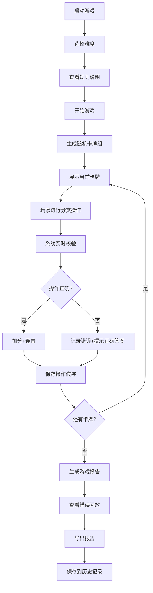
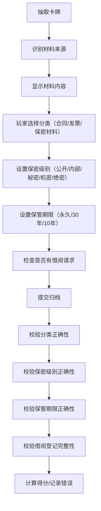

## 1. 产品概述

"资料归档审计卡牌"是一款面向办公室行政人员的档案管理培训小游戏，通过卡牌分类玩法帮助玩家掌握合同、发票、保密材料的归档规则。玩家通过对不同来源的材料卡牌进行正确分类、设置保密级别、计算保管期限、处理借阅请求来获得分数，系统实时记录每一步操作并生成审计报告。

### 1.1 产品目标
- 解决行政人员档案归档易错问题（保密级别错、期限算错、借阅未登记）
- 通过游戏化方式提升档案管理意识和操作熟练度
- 保留完整操作痕迹，支持错误回放和事后审计

### 1.2 目标用户
- 行政主管、档案管理员、办公室文员
- 需要进行档案管理培训的企业员工

## 2. 核心功能

### 2.1 功能模块
1. **游戏启动页**：难度选择、规则说明、开始游戏
2. **游戏主界面**：卡牌展示区、分类操作区、计时评分面板
3. **卡牌系统**：6种来源卡牌（文件卡、档案盒、保密级别、保管期限、借阅请求、归档报告）
4. **规则引擎**：实时校验、错误提示、修正痕迹保留
5. **错误回放**：操作历史记录、错误步骤高亮、重放功能
6. **计时评分**：倒计时模式、分数计算、连击奖励
7. **报告系统**：游戏结束报告、得分明细、失败原因分析、导出功能
8. **历史回看**：历史游戏记录、报告存档、对比分析

### 2.2 页面详情
| 页面名称 | 模块名称 | 功能描述 |
|---------|---------|----------|
| 启动页 | 难度选择 | 简单/普通/困难三档，控制卡牌数量和时间限制 |
| 启动页 | 规则说明 | 展示归档规则、材料分类标准、常见错误示例 |
| 游戏主界面 | 卡牌区 | 展示待处理卡牌，显示材料来源和内容摘要 |
| 游戏主界面 | 操作区 | 分类按钮（合同/发票/保密材料）、属性设置、提交确认 |
| 游戏主界面 | 信息面板 | 计时器、当前得分、连击数、错误次数 |
| 游戏主界面 | 规则提示 | 实时显示当前卡牌的归档规则要点 |
| 错误回放 | 时间线 | 按时间顺序展示所有操作，错误步骤标红 |
| 错误回放 | 详情查看 | 点击步骤查看当时的卡牌内容、用户操作、正确答案 |
| 报告页 | 得分概览 | 总分、正确率、耗时、最高连击 |
| 报告页 | 错误分析 | 按错误类型统计（保密级别/期限/借阅）、改进建议 |
| 报告页 | 导出功能 | 导出JSON/Markdown格式的完整审计报告 |
| 历史记录 | 列表展示 | 展示历史游戏记录，支持搜索和筛选 |
| 历史记录 | 报告回看 | 查看任意历史游戏的完整报告和操作回放 |

## 3. 核心流程

### 3.1 游戏主流程

### 3.2 卡牌处理流程

## 4. 用户界面设计

### 4.1 设计风格
- **视觉风格**：行政办公风格，专业、简洁、可信
- **主色调**：深蓝色(#1e3a5f)代表专业可信，配合档案米色(#f5f0e6)
- **强调色**：绿色(#10b981)表示正确，红色(#ef4444)表示错误，橙色(#f59e0b)表示警告
- **字体**：标题使用"Noto Serif SC"体现正式感，正文使用"Inter"保证可读性
- **卡片设计**：仿真档案袋样式，带有标签、印章、折角等细节
- **交互反馈**：卡牌拖拽有阴影变化，按钮点击有按压效果，错误有震动动画

### 4.2 页面设计要点
| 页面名称 | 模块名称 | UI元素 |
|---------|---------|--------|
| 启动页 | 标题区 | 大标题、副标题、档案印章装饰 |
| 启动页 | 难度卡片 | 三档难度卡片，选中时有高亮边框 |
| 启动页 | 规则折叠面板 | 可展开的规则说明，包含示例卡牌 |
| 游戏主界面 | 顶部状态栏 | 计时器、得分、暂停按钮 |
| 游戏主界面 | 卡牌展示 | 仿真档案卡，显示来源标签、内容摘要、保密级别标识 |
| 游戏主界面 | 分类按钮区 | 三个大按钮：合同（蓝色）、发票（绿色）、保密材料（红色） |
| 游戏主界面 | 属性设置区 | 保密级别选择器、期限选择器、借阅登记开关 |
| 游戏主界面 | 规则提示条 | 底部悬浮提示，显示当前卡牌的归档要点 |
| 报告页 | 数据看板 | 四个数据卡片：总分、正确率、耗时、错误数 |
| 报告页 | 错误时间线 | 垂直时间线，错误点红色标记 |
| 报告页 | 导出按钮 | 支持导出JSON和Markdown两种格式 |

### 4.3 响应式设计
- 桌面端：横向布局，卡牌在左，操作区在右
- 平板端：纵向布局，卡牌在上，操作区在下
- 移动端：简化操作，使用底部弹窗进行属性设置

## 5. 关键业务规则

### 5.1 材料分类规则
| 材料类型 | 特征 | 保密级别范围 | 保管期限 |
|---------|------|-------------|----------|
| 合同 | 双方/多方签署、有法律效力、涉及经济往来 | 内部~机密 | 永久/30年 |
| 发票 | 财务凭证、有税号、涉及金额 | 内部~秘密 | 30年/10年 |
| 保密材料 | 标注保密、涉及商业秘密、技术秘密 | 秘密~绝密 | 永久/30年 |

### 5.2 评分规则
- 正确分类：+10分
- 保密级别正确：+5分
- 保管期限正确：+5分
- 借阅登记正确：+5分
- 全部正确连击加成：每次连击+额外2分（最高+10分）
- 分类错误：-10分，中断连击
- 保密级别错误：-5分，显示正确级别
- 期限错误：-5分，显示正确期限
- 借阅未登记：-5分，强制提示登记

### 5.3 错误类型定义
1. **保密级别错误**：所选级别与材料实际密级不符
2. **保管期限错误**：所选期限与材料类型不匹配
3. **借阅未登记**：材料有借阅记录但玩家未登记
4. **分类错误**：将材料归为错误的大类（合同/发票/保密材料）
