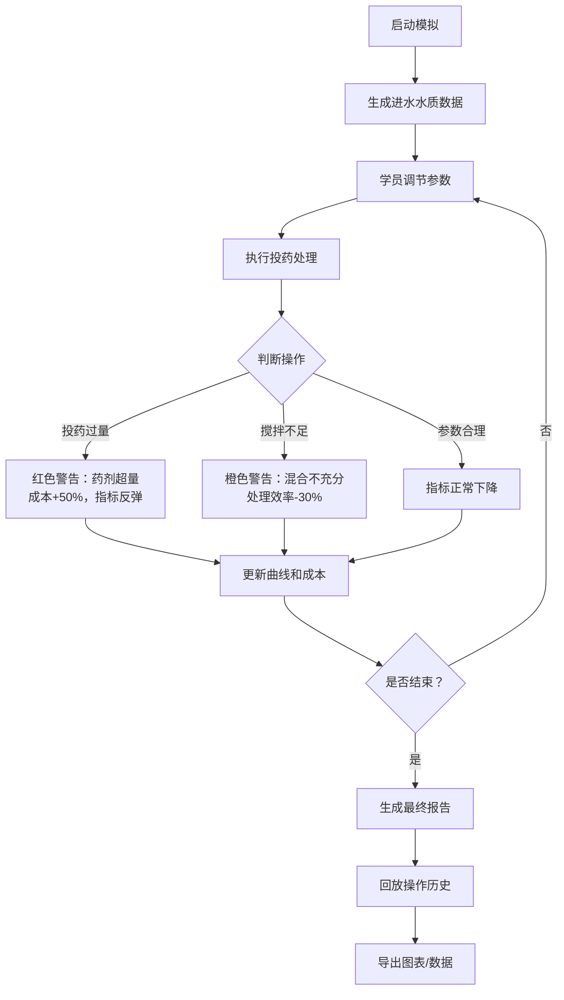

## 1. 产品概述

污水厂投药模拟是一款面向环保工程师培训的交互式教学原型，帮助新人直观理解投药量、水质指标与运行成本之间的动态关系。通过游戏化的参数调节和实时反馈，让学习者在安全的模拟环境中掌握水处理工艺的核心原理。

- **目标用户**：环保行业新人、污水处理厂操作员、环境工程专业学生
- **核心价值**：降低培训成本，减少实际操作失误，建立参数-效果-成本的系统思维

## 2. 核心功能

### 2.1 用户角色

| 角色 | 注册方式 | 核心权限 |
|------|----------|----------|
| 学员 | 无需注册，直接使用 | 完整的模拟操作、报告查看、数据导出权限 |

### 2.2 功能模块

1. **模拟控制台**：参数调节滑块、实时指标曲线、操作按钮
2. **水质监测面板**：进水/出水指标实时显示、阈值预警
3. **成本追踪系统**：药剂消耗、能耗计算、累计扣分
4. **异常反馈系统**：投药过量、指标反弹、搅拌不足等场景提示
5. **回放报告系统**：操作历史回顾、得分详情、失败原因分析
6. **数据导出功能**：图表导出、报告生成

### 2.3 页面详情

| 页面名称 | 模块名称 | 功能描述 |
|----------|----------|----------|
| 主模拟页 | 控制面板 | 投药量滑块、搅拌时间滑块、药剂选择、执行按钮 |
| 主模拟页 | 实时曲线 | COD、氨氮、总磷等指标随时间变化的折线图 |
| 主模拟页 | 状态面板 | 进水指标、出水阈值、当前得分、运行时长 |
| 主模拟页 | 异常提示 | 浮层式警告，明确标注异常类型和修正建议 |
| 报告页 | 操作回放 | 时间轴展示每一步操作及对应效果 |
| 报告页 | 得分分析 | 各项扣分明细、最终评级、改进建议 |
| 报告页 | 数据导出 | 一键导出PNG图表、CSV数据、PDF报告 |

## 3. 核心流程

### 3.1 正常流程
学员启动模拟 → 查看进水水质指标 → 调节投药量和搅拌参数 → 执行处理 → 观察出水指标变化 → 重复调节直至达标或运行结束 → 生成运行报告 → 回看操作历史和得分详情

### 3.2 异常流程
- **投药过量**：系统弹出红色警告，药剂成本剧增，水质指标先降后升（反弹）
- **搅拌不足**：系统弹出橙色警告，药剂反应不充分，出水指标不达标
- **指标反弹**：系统弹出黄色警告，提示前序操作导致后续指标恶化

## 4. 用户界面设计

### 4.1 设计风格

- **主色调**：科技蓝（#165DFF）作为主色，代表专业和信赖；辅助色采用预警三色：绿色（#00B42A）正常、橙色（#FF7D00）警告、红色（#F53F3F）危险
- **视觉风格**：工业仪表盘风格，深色背景搭配高亮数据显示，模拟真实SCADA系统
- **字体**：JetBrains Mono 作为数据显示字体，确保数字等宽对齐；Noto Sans SC 作为界面文字
- **布局**：三栏式布局，左侧参数控制、中央实时曲线、右侧状态监测
- **动效**：参数调节时滑块有阻尼反馈，异常出现时有脉冲闪烁动画，曲线更新有平滑过渡

### 4.2 页面设计

| 页面名称 | 模块名称 | UI元素 |
|----------|----------|--------|
| 主模拟页 | 控制面板 | 垂直滑块组、药剂选择卡片、执行按钮、重置按钮 |
| 主模拟页 | 曲线图区 | 多线折线图、图例切换、时间轴缩放、阈值参考线 |
| 主模拟页 | 状态面板 | 数值卡片（带趋势箭头）、进度条、扣分记录列表 |
| 主模拟页 | 异常提示 | 右上角浮动卡片、图标+文字说明、修正建议链接 |
| 报告页 | 时间轴 | 垂直时间线、操作节点可点击展开详情 |
| 报告页 | 得分卡 | 环形进度图、分项得分条、等级徽章 |

### 4.3 响应式设计

- 桌面端（>1200px）：完整三栏布局，所有控件同时可见
- 平板端（768-1200px）：上下堆叠，控制区在上，曲线区在中，状态区在下
- 移动端（<768px）：标签页切换，曲线全屏显示，控制区可折叠

### 4.4 数据可视化规范

- **指标曲线**：不同指标用不同颜色区分，实时点有呼吸动画
- **阈值线**：虚线表示排放标准，超限区域红色填充
- **成本曲线**：柱状图叠加，异常操作有特殊标记
- **回放动画**：时间轴拖动时，曲线同步回放，关键节点高亮
