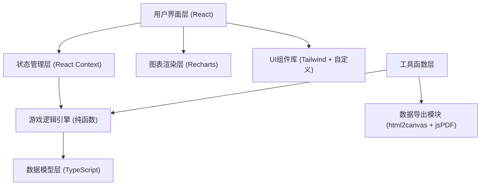

## 1. 架构设计



## 2. 技术栈说明

- **前端框架**：React 18 + TypeScript，确保类型安全和组件化开发
- **构建工具**：Vite 5，提供快速的开发体验和热更新
- **样式方案**：Tailwind CSS 3，配合 CSS 变量实现主题系统
- **图表库**：Recharts，支持交互式折线图、柱状图和自定义渲染
- **状态管理**：React Context + useReducer，管理全局游戏状态
- **数据导出**：html2canvas + jsPDF，实现图表截图和报告导出
- **图标**：Lucide React，提供一致的工业风格图标

## 3. 路由定义

| 路由路径 | 页面组件 | 功能说明 |
|----------|----------|----------|
| `/` | `SimulatorPage` | 主模拟页面，包含控制面板、实时曲线、状态监测 |
| `/report` | `ReportPage` | 报告页面，包含操作回放、得分分析、数据导出 |

## 4. 核心数据模型

### 4.1 水质指标类型

```typescript
interface WaterQuality {
  cod: number;           // 化学需氧量 (mg/L)
  ammonia: number;       // 氨氮 (mg/L)
  totalPhosphorus: number; // 总磷 (mg/L)
  totalNitrogen: number;  // 总氮 (mg/L)
  ph: number;            // pH值
  turbidity: number;     // 浊度 (NTU)
}

interface Thresholds {
  cod: number;
  ammonia: number;
  totalPhosphorus: number;
  totalNitrogen: number;
  ph: [number, number];
  turbidity: number;
}
```

### 4.2 药剂类型

```typescript
interface Chemical {
  id: string;
  name: string;
  type: 'coagulant' | 'flocculant' | 'phAdjuster' | 'nutrient';
  unitPrice: number;      // 单位价格 (元/kg)
  dosageRange: [number, number]; // 推荐投加范围 (mg/L)
  efficiency: number;     // 处理效率系数
  description: string;
}
```

### 4.3 操作记录

```typescript
interface Operation {
  id: string;
  timestamp: number;
  chemicalId: string;
  dosage: number;         // 实际投加量 (mg/L)
  mixingTime: number;     // 搅拌时间 (分钟)
  cost: number;           // 本次操作成本
  beforeQuality: WaterQuality;
  afterQuality: WaterQuality;
  anomalies: AnomalyType[]; // 本次操作触发的异常
  scoreChange: number;    // 得分变化
}

type AnomalyType = 'overdose' | 'insufficient_mixing' | 'rebound' | 'ph_extreme';
```

### 4.4 游戏状态

```typescript
interface GameState {
  status: 'idle' | 'running' | 'finished';
  currentTime: number;    // 当前模拟时间 (分钟)
  totalTime: number;      // 总模拟时长 (分钟)
  inletWater: WaterQuality;  // 进水水质
  currentWater: WaterQuality; // 当前水质
  targetThresholds: Thresholds; // 出水标准
  operations: Operation[];  // 操作历史
  score: number;
  totalCost: number;
  selectedChemical: string | null;
  currentDosage: number;
  currentMixingTime: number;
  anomalies: AnomalyEvent[];  // 活跃的异常提示
}

interface AnomalyEvent {
  id: string;
  type: AnomalyType;
  timestamp: number;
  severity: 'warning' | 'danger';
  message: string;
  suggestion: string;
}
```

## 5. 核心算法

### 5.1 投药反应模型

```
处理效率 = f(投药量, 搅拌时间, 药剂类型, 当前水质)
  其中:
  - 投药量在推荐范围内时效率最高
  - 投药量超出上限会导致效率下降并触发"投药过量"
  - 搅拌时间不足会降低处理效率30%-50%
  - 过量投药会导致后续2-3个时间步出现"指标反弹"
```

### 5.2 成本计算

```
单次成本 = 投药量(mg/L) × 处理水量 × 药剂单价 + 搅拌能耗成本
  其中:
  - 处理水量默认: 1000 m³/h
  - 搅拌能耗: 0.5元/分钟
  - 投药过量时成本增加50%惩罚
```

### 5.3 评分规则

| 项目 | 分值 | 扣分规则 |
|------|------|----------|
| 出水达标率 | 50分 | 每项指标超标扣10分 |
| 成本控制 | 30分 | 超出预算10%扣5分 |
| 操作规范性 | 20分 | 每次异常扣5-10分 |

## 6. 项目目录结构

```
src/
├── components/          # 可复用组件
│   ├── ControlPanel/    # 控制面板组件
│   ├── ChartArea/       # 图表区域组件
│   ├── StatusPanel/     # 状态面板组件
│   ├── AnomalyToast/    # 异常提示组件
│   └── common/          # 通用组件
├── contexts/            # React Context
│   └── GameContext.tsx  # 游戏状态管理
├── models/              # 数据模型定义
│   ├── water.ts         # 水质相关类型
│   ├── chemical.ts      # 药剂相关类型
│   └── game.ts          # 游戏状态类型
├── utils/               # 工具函数
│   ├── simulator.ts     # 核心模拟算法
│   ├── scoring.ts       # 评分计算
│   ├── export.ts        # 数据导出功能
│   └── mockData.ts      # 模拟数据生成
├── pages/               # 页面组件
│   ├── SimulatorPage.tsx
│   └── ReportPage.tsx
├── App.tsx
├── main.tsx
└── index.css
```

## 7. 关键技术实现点

1. **实时曲线渲染**：使用 Recharts 的 ReferenceLine 绘制阈值线，自定义 Dot 组件实现实时点呼吸动画
2. **参数滑块**：封装带刻度和数值显示的 Slider 组件，支持步进调节和范围限制
3. **异常反馈系统**：使用 React Portal 实现全局异常提示层，支持自动消失和手动关闭
4. **时间轴回放**：基于操作记录数组实现步进式回放，支持跳转到任意操作节点
5. **数据导出**：使用 html2canvas 捕获图表区域，jsPDF 生成带水印的培训报告
