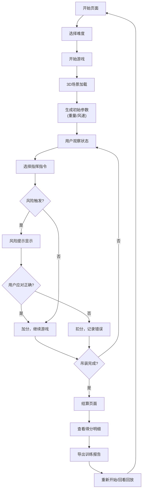

# 塔吊风速指挥赛 - 产品需求文档

## 1. 产品概述

本产品是一款基于浏览器的3D塔吊指挥训练游戏，专为工地安全员和塔吊指挥人员设计。通过模拟真实吊装场景，训练玩家在不同吊物重量、风速条件下做出正确指挥决策，识别并应对超重吊装、风速超限、人员闯入等风险场景。

- **核心目标**：提升塔吊指挥人员的风险识别能力和安全操作意识
- **目标用户**：工地安全员、塔吊指挥人员、安全培训讲师
- **产品价值**：通过游戏化训练降低工地吊装事故率，标准化安全培训流程

---

## 2. 核心功能

### 2.1 用户角色

| 角色 | 注册方式 | 核心权限 |
|------|----------|----------|
| 训练人员 | 无需注册，直接使用 | 进行游戏训练、查看成绩、导出报告 |

### 2.2 功能模块

1. **开始页面**：游戏介绍、操作说明、难度选择
2. **游戏主界面**：3D吊装场景、控制面板、实时状态监控
3. **暂停界面**：暂停状态、继续/重开选项
4. **结算界面**：得分明细、失败原因分析、成绩图表
5. **历史记录**：失败回放、操作日志回看

### 2.3 页面详情

| 页面名称 | 模块名称 | 功能描述 |
|----------|----------|----------|
| 开始页面 | 游戏介绍 | 显示游戏目的、训练目标、风险类型说明 |
| 开始页面 | 难度选择 | 简单/普通/困难三档，影响风速变化频率、重量范围 |
| 游戏主界面 | 3D场景 | 塔吊模型、吊物物理模拟、警戒线区域、人员闯入动画 |
| 游戏主界面 | 控制面板 | 起吊/停止/移动等指挥指令按钮 |
| 游戏主界面 | 状态面板 | 实时显示吊物重量、风速、风向、警戒状态 |
| 游戏主界面 | 风险提示 | 超重、风速超限、人员闯入时醒目告警 |
| 暂停界面 | 暂停控制 | 暂停倒计时、继续游戏、重新开始 |
| 结算界面 | 得分统计 | 总分、操作准确率、风险识别率 |
| 结算界面 | 明细分析 | 每项操作的得分/扣分说明，图表展示 |
| 结算界面 | 报告导出 | 导出吊装训练报告（含操作记录和风险分析） |
| 历史回放 | 失败回放 | 重现失败场景，标注错误决策点 |

---

## 3. 核心流程

### 3.1 用户流程描述

1. 用户进入游戏，查看游戏说明和操作指南
2. 选择难度等级，点击开始游戏
3. 游戏开始后，3D场景展示塔吊和工地环境
4. 系统随机生成吊物重量和初始风速
5. 用户根据实时数据判断是否可以安全起吊
6. 用户选择指挥指令（起吊、停止、移动、放下）
7. 游戏过程中随机触发风险事件（人员闯入、风速突变、重量超标）
8. 用户需及时识别风险并做出正确应对
9. 完成一轮吊装或发生安全事故后进入结算
10. 查看得分明细和失败原因，可导出训练报告
11. 选择重新开始或查看历史回放

### 3.2 核心流程图

---

## 4. 用户界面设计

### 4.1 设计风格

**工业风 + 科技感**
- **主色调**：深灰色 (#1a1a2e) 作为主背景，代表工地的稳重感
- **强调色**：橙黄色 (#f39c12) 用于警告，绿色 (#27ae60) 用于安全状态，红色 (#e74c3c) 用于危险告警
- **辅助色**：蓝色 (#3498db) 用于数据展示和图表
- **按钮风格**：圆角矩形，带有轻微3D效果和悬停动画
- **字体**：标题使用 Rajdhani（工业感字体），正文使用 Roboto（清晰易读）
- **布局风格**：卡片式布局，左侧3D场景，右侧控制面板和状态面板
- **图标风格**：线性图标，简洁明了，符合工地安全标识规范

### 4.2 页面设计概览

| 页面名称 | 模块名称 | UI元素 |
|----------|----------|--------|
| 开始页面 | Hero区域 | 大标题、塔吊剪影背景、渐入动画 |
| 开始页面 | 游戏说明 | 卡片式布局，图标+文字说明，悬停效果 |
| 开始页面 | 难度选择 | 三个难度卡片，选中态高亮，点击动画 |
| 游戏主界面 | 3D场景 | 占据左侧70%区域，工地环境模型 |
| 游戏主界面 | 状态面板 | 右侧顶部，实时数据卡片，数值变化动画 |
| 游戏主界面 | 控制面板 | 右侧底部，大按钮网格布局，按压反馈 |
| 游戏主界面 | 风险告警 | 全屏半透明遮罩 + 闪烁文字 + 音效提示 |
| 结算界面 | 得分展示 | 大数字动画，环形进度图展示准确率 |
| 结算界面 | 明细列表 | 可展开的操作记录，颜色标记得分/扣分 |
| 结算界面 | 图表区域 | 柱状图展示各项指标，折线图展示时间线 |

### 4.3 响应式设计

- **桌面端优先**：针对1920x1080及以上分辨率优化
- **平板适配**：在1024px宽度以下，将右侧面板移至底部
- **移动端**：简化3D场景，保留核心游戏逻辑
- **触控优化**：按钮最小尺寸48x48px，适合触控操作

### 4.4 3D场景指导

**环境与氛围**：
- 工地环境：地面使用混凝土纹理，背景有建筑工地轮廓
- 时间：白天，晴朗天气，适当的阴影效果
- 光照：定向主光源模拟阳光，配合环境光，确保场景明亮清晰

**模型与材质**：
- 塔吊：简化但可识别的3D模型，金属质感材质
- 吊物：长方体/圆柱体，可根据重量改变大小和颜色
- 警戒线：红色虚线或实体线，有发光效果
- 人物：低多边形小人模型，用于人员闯入场景

**相机与动画**：
- 默认视角：第三人称斜角视角，能看清塔吊和吊装区域
- 交互：支持鼠标拖拽旋转视角，滚轮缩放
- 吊装动画：塔吊臂旋转、吊物上升/下降的流畅动画
- 人员闯入：从警戒线外快速走入危险区域的动画

**性能预算**：
- 模型面数控制在1万面以内
- 使用基础材质和简单光照
- 目标帧率：30fps以上

---

## 5. 游戏规则与评分

### 5.1 风险类型与判定

| 风险类型 | 判定条件 | 正确应对 | 错误后果 |
|----------|----------|----------|----------|
| 超重吊装 | 吊物重量 > 额定载荷 | 拒绝起吊 | 扣50分，游戏失败 |
| 风速超限 | 风速 > 安全阈值 | 停止作业 | 扣40分，游戏失败 |
| 人员闯入 | 人员进入警戒区 | 紧急停止 | 扣30分，应对不及时失败 |

### 5.2 评分标准

| 操作 | 得分 | 说明 |
|------|------|------|
| 安全完成吊装 | +100分 | 无风险情况下顺利完成 |
| 正确识别风险 | +50分 | 及时发现并正确应对 |
| 响应迅速 | +20分 | 风险出现后3秒内应对 |
| 错误指令 | -30分 | 发出错误的指挥信号 |
| 响应超时 | -20分 | 风险出现后超过5秒应对 |

---

## 6. 数据记录与导出

### 6.1 记录内容
- 游戏时间、难度等级
- 每轮吊装的重量、风速数据
- 用户所有操作指令及时间点
- 所有风险事件及用户应对
- 详细得分明细

### 6.2 导出格式
- 支持导出JSON和CSV格式
- 包含训练报告摘要和详细数据
