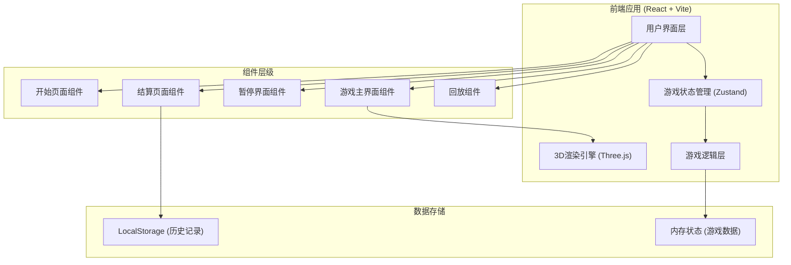
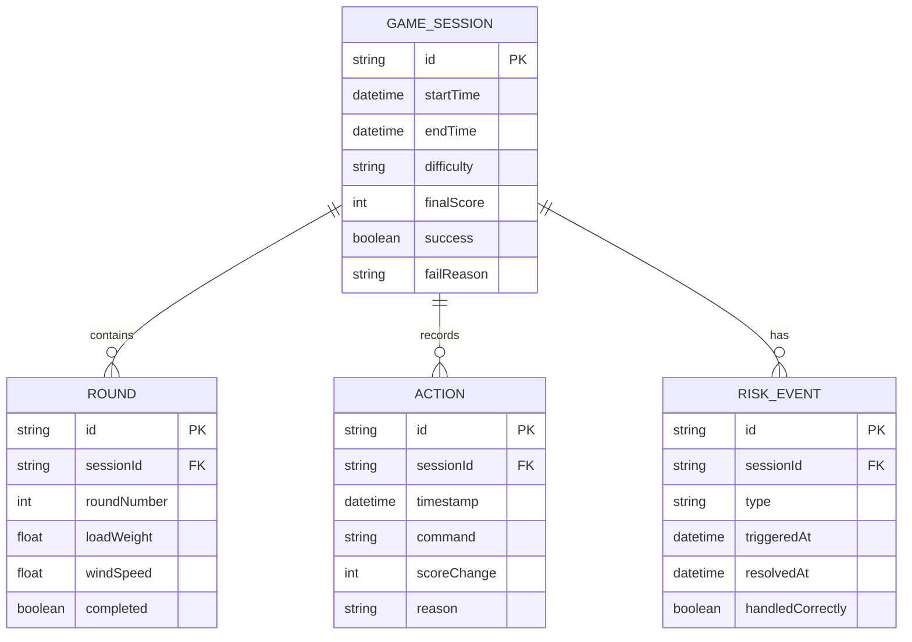

# 塔吊风速指挥赛 - 技术架构文档

## 1. 架构设计



---

## 2. 技术栈描述

### 2.1 核心技术

| 层级 | 技术选型 | 版本 | 说明 |
|------|----------|------|------|
| 前端框架 | React | 18.x | 组件化开发，高效渲染 |
| 构建工具 | Vite | 5.x | 快速开发构建 |
| 3D引擎 | Three.js | 0.160.x | 轻量级3D渲染 |
| 状态管理 | Zustand | 4.x | 简洁的状态管理方案 |
| 样式方案 | Tailwind CSS | 3.x | 原子化CSS |
| 图表库 | Chart.js | 4.x | 数据可视化 |
| 图标库 | Lucide React | 0.300.x | 简洁图标 |

### 2.2 初始化工具
- 使用 `npm create vite@latest` 初始化React项目
- TypeScript 支持确保类型安全

---

## 3. 路由定义

| 路由路径 | 页面组件 | 用途说明 |
|----------|----------|----------|
| `/` | StartPage | 开始页面，游戏介绍和难度选择 |
| `/game` | GamePage | 游戏主界面，3D场景和控制 |
| `/result` | ResultPage | 结算页面，成绩展示和报告导出 |
| `/replay` | ReplayPage | 历史回放页面 |

---

## 4. 状态管理设计

### 4.1 游戏状态 Store

```typescript
// 游戏核心状态
interface GameState {
  // 游戏状态
  status: 'idle' | 'playing' | 'paused' | 'ended' | 'failed';
  difficulty: 'easy' | 'normal' | 'hard';
  score: number;
  round: number;
  
  // 实时参数
  crane: CraneState;
  environment: EnvironmentState;
  risks: RiskState[];
  
  // 操作记录
  actions: ActionRecord[];
  
  // 操作方法
  startGame: (difficulty: Difficulty) => void;
  pauseGame: () => void;
  resumeGame: () => void;
  restartGame: () => void;
  endGame: (success: boolean) => void;
  executeCommand: (command: Command) => void;
  triggerRisk: (riskType: RiskType) => void;
}

// 塔吊状态
interface CraneState {
  loadWeight: number;      // 当前吊物重量
  maxLoad: number;         // 额定载荷
  armAngle: number;        // 臂架角度
  hookHeight: number;      // 吊钩高度
  isLifting: boolean;      // 是否正在起吊
  isMoving: boolean;       // 是否正在移动
}

// 环境状态
interface EnvironmentState {
  windSpeed: number;       // 风速 m/s
  windDirection: number;   // 风向 角度
  safeWindSpeed: number;   // 安全风速
}

// 风险状态
interface RiskState {
  id: string;
  type: RiskType;          // 'overweight' | 'wind' | 'intrusion'
  severity: 'warning' | 'danger';
  triggeredAt: number;
  resolved: boolean;
  resolvedAt?: number;
}

// 操作记录
interface ActionRecord {
  id: string;
  timestamp: number;
  command: Command;
  scoreChange: number;
  reason?: string;
}
```

---

## 5. 核心游戏逻辑

### 5.1 游戏循环

```typescript
// 游戏主循环 - 使用 requestAnimationFrame
function gameLoop() {
  if (gameState.status !== 'playing') return;
  
  // 1. 更新环境参数 (风速随机变化)
  updateEnvironment();
  
  // 2. 检查风险条件
  checkRisks();
  
  // 3. 更新3D场景
  update3DScene();
  
  // 4. 渲染
  render();
  
  requestAnimationFrame(gameLoop);
}
```

### 5.2 风险检测逻辑

```typescript
// 超重检测
function checkOverweight(): boolean {
  return craneState.loadWeight > craneState.maxLoad;
}

// 风速超限检测
function checkWindSpeed(): boolean {
  return environmentState.windSpeed > environmentState.safeWindSpeed;
}

// 人员闯入检测 (随机触发)
function checkIntrusion(): boolean {
  // 根据难度调整触发概率
  const probability = difficulty === 'hard' ? 0.02 : 
                      difficulty === 'normal' ? 0.01 : 0.005;
  return Math.random() < probability;
}
```

---

## 6. 数据模型

### 6.1 数据结构



### 6.2 本地存储

使用 LocalStorage 存储游戏历史记录，键名为 `crane_game_history`，存储格式为 JSON 数组。

---

## 7. 3D场景架构

### 7.1 场景组成

| 对象 | 类型 | 说明 |
|------|------|------|
| Ground | Mesh | 地面，混凝土纹理 |
| CraneTower | Group | 塔吊塔身 |
| CraneArm | Group | 塔吊臂架（可旋转） |
| Hook | Mesh | 吊钩 |
| Load | Mesh | 吊物 |
| WarningLine | Line | 警戒线 |
| Intruder | Group | 闯入人员模型 |

### 7.2 动画系统

- 使用 Three.js 的 AnimationMixer 管理关键帧动画
- 塔吊臂旋转：TWEEN.js 缓动动画
- 吊物升降：物理模拟 + 碰撞检测
- 人员行走：循环动画 + 路径移动

---

## 8. 导出功能设计

### 8.1 JSON 导出格式

```json
{
  "reportVersion": "1.0",
  "generatedAt": "2024-01-01T12:00:00Z",
  "session": {
    "id": "uuid",
    "startTime": "2024-01-01T11:30:00Z",
    "difficulty": "normal",
    "finalScore": 850,
    "success": true,
    "accuracy": 85.5
  },
  "actions": [...],
  "riskEvents": [...],
  "summary": {
    "totalRounds": 5,
    "risksDetected": 3,
    "correctResponses": 2,
    "avgResponseTime": 2.5
  }
}
```

### 8.2 CSV 导出格式

包含操作记录明细表，可直接导入 Excel 分析。

---

## 9. 性能优化

1. **3D渲染优化**
   - 使用几何体实例化减少Draw Call
   - 视锥体剔除不可见对象
   - LOD（细节层次）技术

2. **内存管理**
   - 及时释放不再使用的3D资源
   - 限制历史记录数量（最多保存50条）

3. **动画优化**
   - 使用CSS transform进行UI动画
   - 减少重排重绘
