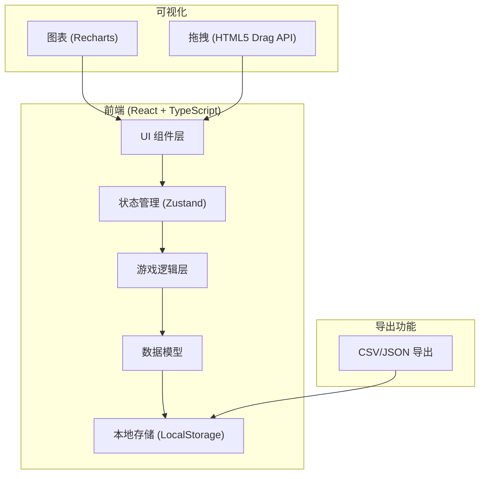
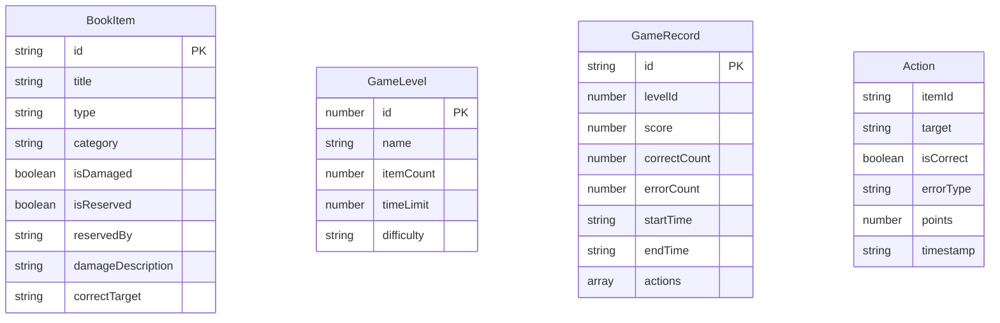

## 1. 架构设计



## 2. 技术说明
- **前端框架**: React@18 + TypeScript + Vite
- **样式方案**: Tailwind CSS 3
- **状态管理**: Zustand
- **图表库**: Recharts
- **拖拽实现**: HTML5 Drag and Drop API
- **图标库**: lucide-react
- **数据存储**: LocalStorage (历史记录、最高分)
- **后端**: 无后端，纯前端应用

## 3. 路由定义
| 路由 | 用途 |
|------|------|
| / | 主界面，显示游戏标题和关卡选择 |
| /game/:levelId | 游戏界面，根据关卡ID加载对应关卡 |
| /result/:gameId | 结果界面，显示游戏得分和错误回放 |
| /report/:gameId | 报告界面，显示详细统计和导出功能 |

## 4. 数据模型

### 4.1 数据模型定义



### 4.2 TypeScript 类型定义

```typescript
// 物品类型
type ItemType = 'return' | 'damaged' | 'reserved' | 'normal';

// 目标区域类型
type TargetArea = 'return' | 'damaged' | 'reserved' | 'shelf-A' | 'shelf-B' | 'shelf-C';

// 错误类型
type ErrorType = 'reserved_return' | 'damaged_unregistered' | 'shelf_mismatch' | 'return_mismatch';

// 图书物品
interface BookItem {
  id: string;
  title: string;
  type: ItemType;
  category: '文学' | '科技' | '艺术' | '历史' | '教育';
  isDamaged: boolean;
  isReserved: boolean;
  reservedBy?: string;
  damageDescription?: string;
  correctTarget: TargetArea;
  coverColor: string;
}

// 游戏关卡
interface GameLevel {
  id: number;
  name: string;
  itemCount: number;
  timeLimit: number;
  difficulty: 'easy' | 'medium' | 'hard';
  description: string;
}

// 操作记录
interface GameAction {
  itemId: string;
  itemTitle: string;
  target: TargetArea;
  correctTarget: TargetArea;
  isCorrect: boolean;
  errorType?: ErrorType;
  points: number;
  timestamp: number;
}

// 游戏记录
interface GameRecord {
  id: string;
  levelId: number;
  levelName: string;
  score: number;
  totalItems: number;
  correctCount: number;
  errorCount: number;
  actions: GameAction[];
  startTime: string;
  endTime: string;
  duration: number;
}

// 游戏状态
interface GameState {
  currentLevel: GameLevel | null;
  items: BookItem[];
  processedItems: Set<string>;
  score: number;
  timeRemaining: number;
  actions: GameAction[];
  status: 'idle' | 'playing' | 'paused' | 'completed';
}
```

## 5. 项目结构

```
src/
├── components/
│   ├── common/
│   │   ├── Button.tsx
│   │   ├── Card.tsx
│   │   └── Timer.tsx
│   ├── game/
│   │   ├── BookCard.tsx
│   │   ├── DropZone.tsx
│   │   ├── GameBoard.tsx
│   │   └── FeedbackToast.tsx
│   ├── result/
│   │   ├── ScoreBreakdown.tsx
│   │   ├── ErrorTimeline.tsx
│   │   └── ActionReplay.tsx
│   └── report/
│       ├── StatsChart.tsx
│       ├── ErrorRadar.tsx
│       └── ExportPanel.tsx
├── pages/
│   ├── HomePage.tsx
│   ├── GamePage.tsx
│   ├── ResultPage.tsx
│   └── ReportPage.tsx
├── store/
│   └── useGameStore.ts
├── data/
│   ├── levels.ts
│   └── books.ts
├── hooks/
│   ├── useGameTimer.ts
│   ├── useDragDrop.ts
│   └── useGameLogic.ts
├── utils/
│   ├── export.ts
│   ├── scoring.ts
│   └── storage.ts
├── types/
│   └── index.ts
├── App.tsx
└── main.tsx
```

## 6. 核心算法

### 6.1 拖拽判定逻辑
```typescript
function validateDrop(item: BookItem, target: TargetArea): ValidationResult {
  if (item.isReserved && target === 'return') {
    return { isCorrect: false, errorType: 'reserved_return', points: -15 };
  }
  if (item.isDamaged && target !== 'damaged') {
    return { isCorrect: false, errorType: 'damaged_unregistered', points: -10 };
  }
  if (target.startsWith('shelf-') && item.category !== getShelfCategory(target)) {
    return { isCorrect: false, errorType: 'shelf_mismatch', points: -8 };
  }
  if (target === 'return' && item.type !== 'return') {
    return { isCorrect: false, errorType: 'return_mismatch', points: -5 };
  }
  return { isCorrect: true, points: 10 };
}
```

### 6.2 得分计算
```typescript
function calculateScore(actions: GameAction[]): number {
  return actions.reduce((total, action) => total + action.points, 0);
}
```

### 6.3 报告生成
```typescript
function generateReport(record: GameRecord): ReportData {
  const errorTypes = ['reserved_return', 'damaged_unregistered', 'shelf_mismatch', 'return_mismatch'];
  const errorCounts = errorTypes.map(type => 
    record.actions.filter(a => a.errorType === type).length
  );
  return {
    summary: {
      totalScore: record.score,
      accuracy: record.correctCount / record.totalItems,
      avgTimePerItem: record.duration / record.totalItems
    },
    errorDistribution: {
      types: errorTypes,
      counts: errorCounts
    },
    timeline: record.actions.map(a => ({
      time: a.timestamp,
      correct: a.isCorrect,
      points: a.points
    }))
  };
}
```
