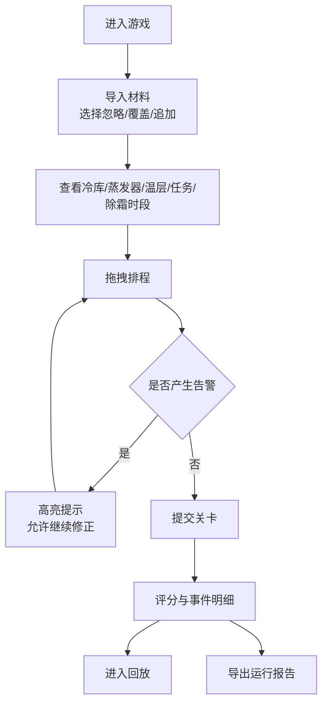

# 冷库除霜排程赛 - 产品需求文档

## 1. 产品概述
"冷库除霜排程赛"是一款面向冷库管理员/新人培训的排程模拟小成品游戏。玩家需要在给定出入库任务与温层约束下，合理安排蒸发器除霜时段，在避免温度升高、出库延误、除霜超时等事故的前提下获得高分。

- 目标用户：冷库主管、冷库管理员、新人受训者
- 目标：让新人在低风险环境下练习除霜排程，识别并避免常见事故
- 价值：可视化呈现温度曲线、任务冲突、评分回放与运行报告，便于复盘和培训

## 2. 核心功能

### 2.1 用户角色
| 角色 | 注册方式 | 核心权限 |
|------|----------|----------|
| 培训员（默认） | 无需注册，单机使用 | 导入材料、排程模拟、评分回放、导出报告 |

### 2.2 功能模块
1. **材料导入页**：导入冷库区、蒸发器、货物温层、出入库任务、除霜时段、运行报告；保留来源与每次修正痕迹；重复导入可选择忽略/覆盖/追加。
2. **排程竞技页**：时间轴拖拽安排除霜任务；实时温度曲线与温层阈值可视化；任务冲突、超时、温层越界即时提示。
3. **关卡结果页**：显示得分、失败原因、扣分明细；可回看每步事件。
4. **评分回放页**：时间轴回放排程执行过程，展示温度、除霜、出入库事件。
5. **运行报告页**：基于本次排程生成运行报告，支持导出 JSON/CSV。

### 2.3 页面详情
| 页面名称 | 模块名称 | 功能描述 |
|----------|----------|----------|
| 材料导入页 | 文件选择区 | 拖拽或选择文件；解析 JSON/CSV；展示来源清单 |
| 材料导入页 | 冲突处理 | 对重复批次提示：忽略 / 覆盖 / 追加；记录修正痕迹 |
| 排程竞技页 | 左侧任务面板 | 蒸发器列表、除霜任务卡片、可拖拽到时间轴 |
| 排程竞技页 | 中部时间轴 | 24h 时间轴，除霜块可拖放/调整时长，冲突标红 |
| 排程竞技页 | 温度曲线 | 基于排程实时计算的各温层温度曲线，超阈高亮 |
| 排程竞技页 | 出库任务 | 显示出库时间窗，延误红闪并扣分 |
| 排程竞技页 | 即时提示条 | 除霜超时、温层升高、出库延误三类告警 |
| 关卡结果页 | 得分总览 | 总分、等级、通关/失败 |
| 关卡结果页 | 事件明细 | 列表展示每段扣分项、触发时间、原因 |
| 评分回放页 | 回放控制 | 播放/暂停/速度/进度条；时间轴高亮当前位置 |
| 运行报告页 | 报告导出 | 导出本次排程的 JSON/CSV 运行报告 |

## 3. 核心流程

## 4. 用户界面设计

### 4.1 设计风格
- 主色：冷库冷蓝 `#2E5BFF` + 警示红 `#FF3B30` + 安全绿 `#34C759`
- 背景：深蓝渐变 + 细网格，模拟监控大屏
- 按钮：圆角 8px，hover 微浮起，告警按钮红色脉动
- 字体：标题用 Orbitron（数字感），正文用 PingFang SC
- 布局：顶部状态栏 + 左侧任务面板 + 中部时间轴 + 右侧温度与告警面板
- 图标：使用 lucide-react 线性图标，告警图标带脉动动画

### 4.2 页面设计概览
| 页面名称 | 模块名称 | UI 要素 |
|----------|----------|----------|
| 材料导入页 | 文件选择区 | 大虚线框、拖拽高亮、来源清单卡片 |
| 排程竞技页 | 时间轴 | 24h 栅格、拖放除霜块、冲突红底、阈值线 |
| 排程竞技页 | 温度曲线 | 多色折线、阈值带、越界红色闪烁 |
| 关卡结果页 | 得分卡 | 大号数字 + 等级徽章 + 明细时间线 |
| 评分回放页 | 回放控制 | 播放按钮 + 速度切换 + 拖动进度条 |

### 4.3 响应式
- 桌面优先（≥1280px）
- 平板：时间轴自适应换行，温度曲线下方展示
- 触控：拖放块支持指针事件

## 5. 数据与评分规则

### 5.1 材料数据结构
- **冷库区**：id、name、targetTemp、maxTemp、minTemp
- **蒸发器**：id、name、zoneId、powerKw、defrostDurationMin、defrostIntervalMin
- **货物温层**：id、zoneId、tempCeiling、maxDeviation
- **出入库任务**：id、type(in/out)、scheduledStart、scheduledEnd、zoneId、penaltyPerMin
- **除霜时段**：id、evaporatorId、start、end、status
- **运行报告**：id、zoneId、timestamp、temperature、eventType

### 5.2 评分规则（示例）
- 基础分 1000
- 除霜超时：每分钟 -10
- 温度越阈：持续每分钟 -15
- 出库延误：每分钟 -penaltyPerMin
- 所有除霜按时完成 +50
- 无任何告警 +100

### 5.3 重复导入策略
- 忽略：已存在同 id 的材料不替换
- 覆盖：同 id 覆盖，保留历史版本记录
- 追加：生成新 id 并入，保留来源与批次标记
