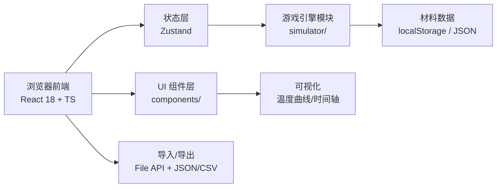
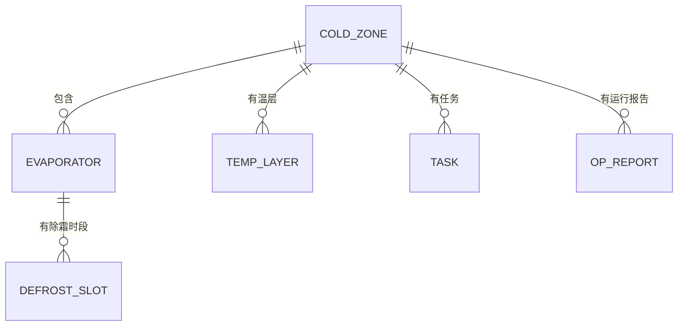

# 冷库除霜排程赛 - 技术架构文档

## 1. 架构设计



## 2. 技术说明
- 前端：React 18 + TypeScript + Tailwind CSS 3 + Vite
- 状态管理：Zustand
- 路由：React Router DOM
- 图表：Recharts（温度曲线）
- 图标：lucide-react
- 后端：无（纯前端应用，材料数据与运行报告通过 File API / localStorage 存取）
- 构建：Vite

## 3. 路由定义
| 路由 | 用途 |
|------|------|
| `/` | 入口，跳转 `/materials` |
| `/materials` | 材料导入与查看 |
| `/scheduler` | 排程竞技主界面 |
| `/result` | 关卡结果与回放 |
| `/report` | 运行报告导出 |

## 4. 数据模型



### 4.1 TypeScript 类型定义

```ts
type ImportStrategy = 'ignore' | 'overwrite' | 'append';

interface ColdZone { id: string; name: string; targetTemp: number; maxTemp: number; minTemp: number; }
interface Evaporator { id: string; name: string; zoneId: string; powerKw: number; defrostDurationMin: number; defrostIntervalMin: number; }
interface TempLayer { id: string; zoneId: string; name: string; tempCeiling: number; maxDeviation: number; }
interface Task { id: string; type: 'in' | 'out'; zoneId: string; scheduledStart: number; scheduledEnd: number; penaltyPerMin: number; }
interface DefrostSlot { id: string; evaporatorId: string; start: number; end: number; status: 'planned' | 'running' | 'done' | 'overtime'; }
interface OpReport { id: string; zoneId: string; timestamp: number; temperature: number; eventType: 'defrost' | 'task' | 'alert' | 'normal'; }

interface MaterialSource { batchId: string; fileName: string; importedAt: number; strategy: ImportStrategy; items: Record<string, any[]>; }

interface ScoreEvent { time: number; type: 'overtime' | 'temp' | 'delay' | 'bonus'; value: number; detail: string; }
interface LevelResult { score: number; grade: 'S'|'A'|'B'|'C'|'D'|'F'; events: ScoreEvent[]; passed: boolean; }
```

## 5. 核心模块结构

```
src/
  components/
    ui/                通用 UI 组件（按钮、卡片、告警条）
    materials/         材料导入、列表、冲突处理
    scheduler/         时间轴、除霜块、任务面板
    temperature/       温度曲线组件
    result/            结果页与回放控件
    report/            运行报告导出
  pages/
    Materials.tsx
    Scheduler.tsx
    Result.tsx
    Report.tsx
  store/
    gameStore.ts       Zustand store：材料、排程、得分、回放状态
  engine/
    simulator.ts       温度/除霜/任务模拟引擎
    scorer.ts          评分与事件生成
  utils/
    importExport.ts    导入/导出、策略处理
    time.ts            时间轴工具
  types/
    index.ts
```

## 6. 引擎核心逻辑（伪代码）

```ts
function simulate(plan: DefrostSlot[], tasks: Task[], zones: ColdZone[], evaps: Evaporator[]): OpReport[] {
  // 每分钟步进
  //   若当前分钟在除霜时段内：该蒸发器对应 zone 温度以速率 R1 上升
  //   否则：zone 温度以速率 R2 回落至 targetTemp
  //   若温度越阈：生成 alert 事件
  //   若出库任务完成时仍有未完成除霜：生成 delay 事件
}
```

## 7. 失败与告警提示
- 除霜超时：除霜块在时间轴上超红，告警条显示 "除霜超时 X 分钟"
- 温层升高：温度曲线越阈部分红色高亮并脉动
- 出库延误：任务卡片红色边框 + 倒计时条
- 所有告警同时在得分明细中记录，不可悄悄并入正常结果
