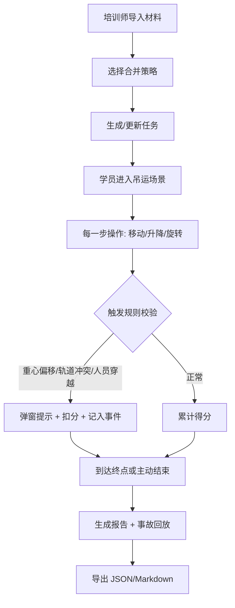

## 1. 产品概述

"钢卷吊运平衡局"是一款面向钢厂新员工的轻 3D 培训原型工具，帮助学员理解钢卷吊运重心、行车路线避让、地面禁区等关键安全知识。玩家每一步选择都会实时影响分数与结束报告，出现重心偏移、轨道冲突、人员穿越时给出明确警示，不会被悄悄计入正常结果。

- 目标用户：钢厂培训师、新员工、安全培训主管。
- 核心价值：将抽象安全规则转化为可交互、可回看、可导出的"一次吊运任务"，强调来源可追溯与修正痕迹可审计。

## 2. 核心功能

### 2.1 用户角色
| 角色 | 登录方式 | 核心权限 |
|------|----------|----------|
| 培训师 | 单机登录（模拟） | 导入材料、配置任务、查看学员报告、导出结果 |
| 学员 | 单机登录（模拟） | 执行吊运任务、查看自己的分数与事故回放 |

### 2.2 功能模块
1. **工作台首页**：任务入口、最近报告、快速开始。
2. **材料导入面板**：钢卷/吊具/行车轨道/重心/作业区/吊运报告的 JSON 导入，支持"忽略/覆盖/追加"三种合并策略。
3. **任务配置页**：选择钢卷、吊具、作业区，设置起点/终点、禁区。
4. **轻 3D 吊运场景页**：侧视/俯视双视图，重心浮标、路线高亮、禁区闪烁、事故弹窗。
5. **报告页**：分数拆解、失败原因、关键事件时间线、事故回放、导出（JSON/Markdown）。
6. **来源与修正痕迹面板**：每一项材料显示来源文件、导入时间、合并策略、历次修正 diff。

### 2.3 页面详情
| 页面 | 模块 | 功能描述 |
|------|------|----------|
| 工作台 | Hero + 任务卡片 | 快速进入最新任务，展示上次得分/事故摘要 |
| 材料导入 | 文件导入 + 合并策略选择 | 支持拖拽 JSON，展示导入预览与差异 |
| 任务配置 | 表单 + 预览 | 选择钢卷、吊具、轨道、禁区，生成任务 |
| 吊运场景 | 3D 视图 + HUD + 控制面板 | 逐格移动/升降/旋转，实时重心与碰撞提示 |
| 报告 | 分数卡片 + 事件线 + 回放 | 可导出 JSON/Markdown，可回看每一步 |

## 3. 核心流程

## 4. 用户界面设计

### 4.1 设计风格
- 主题：工业深色 + 橙黄警示。
- 主色：`#0f172a`（深蓝灰背景）、`#f59e0b`（琥珀警示）、`#10b981`（安全绿）、`#ef4444`（事故红）。
- 按钮：胶囊/圆角 2px，悬浮 0.15s 过渡；警示按钮使用红色边框 + 脉冲。
- 字体：中文用"思源黑体"替代系统字体，数字与代码用 `JetBrains Mono`。
- 布局：左侧信息栏 + 中央 3D 视图 + 右侧 HUD 评分卡，顶部导航。
- 图标：Lucide（工厂、立方体、路由、警告、文件签名）。

### 4.2 页面设计概览
| 页面 | 模块 | UI 元素 |
|------|------|---------|
| 工作台 | Hero | 深色渐变底 + 琥珀色标题 + 悬浮任务卡 |
| 材料导入 | 导入区 | 拖拽区 + 策略 Radio + diff 预览表 |
| 吊运场景 | 3D 视图 | 双视图切换、重心浮标跟随、禁区红色边框、轨道高亮 |
| 报告 | 事件线 | 时间线卡片、事故回放滑块、导出按钮 |

### 4.3 响应式
- 桌面优先（≥1280px）；平板端折叠右侧 HUD 为抽屉；移动端保留顶部摘要和事件线。

### 4.4 3D 场景指引
- 环境：工业仓库 HDRI 色调，冷色底光 + 琥珀警示灯。
- 光照：方向光 + 半球光，钢卷使用金属材质。
- 相机：正交侧视/俯视双模式，可拖拽平移，滚轮缩放。
- 交互：点击/键盘（WASD/方向键）移动，Q/E 升降，R 旋转；每步触发校验。
- 后处理：轻微 Bloom 让警示色更突出，无过度模糊。
- 性能：单场景 < 20k 面，禁用阴影投射；移动端降级为 2D Canvas。
