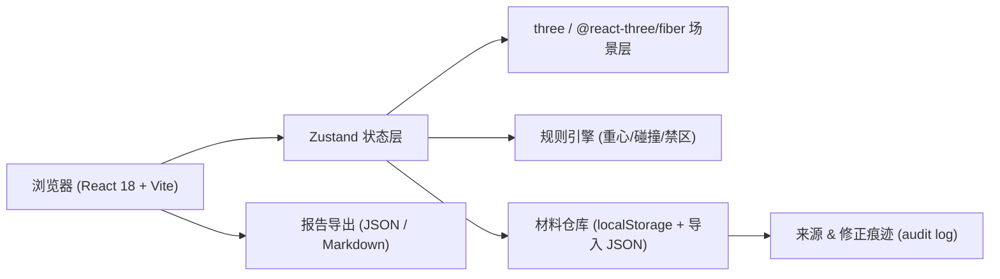

## 1. 架构设计



## 2. 技术说明
- 前端：React 18 + TypeScript + Vite 5 + Tailwind CSS 3
- 3D：three@0.160 + @react-three/fiber@8 + @react-three/drei@9
- 状态管理：zustand@4
- 路由：react-router-dom@6
- 后端：无（纯前端原型，材料以 localStorage 与 JSON 导入管理）
- 数据库：无（localStorage）
- 初始化模板：react-ts

## 3. 路由定义
| 路由 | 用途 |
|------|------|
| / | 工作台首页（任务入口 + 最近报告） |
| /materials | 材料导入与来源/修正痕迹面板 |
| /setup | 任务配置（钢卷/吊具/轨道/禁区选择） |
| /scene/:taskId | 轻 3D 吊运场景 |
| /report/:taskId | 报告页（分数/事故回放/导出） |

## 4. 数据模型

### 4.1 核心数据结构

```ts
// 来源与修正痕迹
type AuditEntry = {
  id: string
  time: string
  source: string          // 来源文件名或 "seed"
  strategy: "ignore" | "overwrite" | "append"
  diff?: { field: string; from: any; to: any }[]
  operator: string        // 培训师/学员名
}

type Coil = { id: string; name: string; weight: number; length: number; diameter: number; cog: { x: number; y: number } }
type Spreader = { id: string; name: string; capacity: number; offsetLimit: number }
type Rail = { id: string; name: string; points: { x: number; y: number; z: number }[]; capacity: number }
type Zone = { id: string; name: string; type: "safe" | "restricted" | "danger"; polygon: { x: number; z: number }[] }
type Task = {
  id: string
  name: string
  coilId: string
  spreaderId: string
  railId: string
  zones: string[]
  start: { x: number; y: number; z: number }
  end: { x: number; y: number; z: number }
  audit: AuditEntry[]
}

type StepEvent = {
  t: number                 // 步骤序号
  action: "move" | "lift" | "rotate"
  position: { x: number; y: number; z: number; rot: number }
  cogOffset: number         // 重心偏移量
  onRail: boolean
  inZone: "safe" | "restricted" | "danger" | null
  crossing: boolean         // 人员穿越
  score: number             // 本步得分
  penalty?: { type: "cog" | "rail" | "zone" | "crossing"; amount: number; message: string }
}

type Report = {
  taskId: string
  totalScore: number
  finalGrade: "S" | "A" | "B" | "C" | "F"
  events: StepEvent[]
  accidents: StepEvent[]
  exportedAt?: string
}
```

### 4.2 数据持久化
- 所有材料、任务、报告存于 `localStorage`，按 `steel_coil_balance/*` 命名空间隔离。
- 首次启动注入示例种子数据，并写入一条 `source=seed` 的 audit。

## 5. 规则引擎
- 重心偏移：`cogOffset` 超过吊具 `offsetLimit` → 扣 30 分 + 弹窗"重心偏移，吊具即将脱钩"。
- 轨道冲突：位置不在当前 `rail.points` 半径内 → 扣 20 分 + 弹窗"行车脱离轨道"。
- 人员穿越：路径与 `zones` 中 `restricted`/`danger` 区交叉 → 扣 40 分 + 弹窗"人员穿越禁区"。
- 危险禁区：进入 `danger` 区 → 直接终止任务 + 判 F。
- 所有扣分都会进入 `events` 列表并在报告页高亮。

## 6. 导入合并策略
- **忽略**：新数据的 key 已存在则跳过，仅记录一条 audit。
- **覆盖**：新数据覆盖同 key 的旧数据，记录 diff。
- **追加**：新数据追加到列表（若为数组类型），否则等同于覆盖。
- 每次导入都会在目标对象的 `audit` 数组追加一条 `AuditEntry`。

## 7. 报告导出
- JSON：序列化 `Report` 对象并下载。
- Markdown：渲染包含分数、等级、事件表、事故摘要的 `.md` 文件下载。
