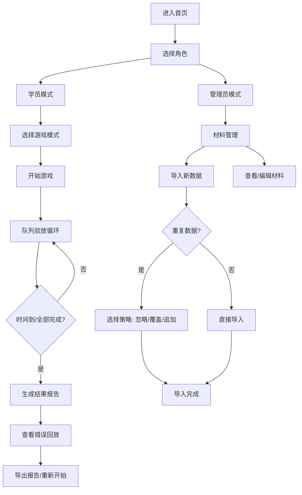

# 码头闸口验放赛 - 产品需求文档

## 1. 产品概述

码头闸口验放赛是一款面向港区闸口操作人员的培训游戏化工具，通过模拟真实闸口验放场景，训练操作人员快速准确识别集装箱箱号、核对预约信息、识别危品标记，避免预约不匹配、危品漏拦、队列超时等问题。

- **目标用户**：港区闸口班长、闸口操作人员、培训管理人员
- **核心价值**：将枯燥的表格和截图培训转化为互动游戏，提高培训效率和操作准确性
- **解决问题**：替代传统表格+截图培训方式，提供即时反馈、错误回放、成绩追踪

## 2. 核心功能

### 2.1 用户角色

| 角色 | 登录方式 | 核心权限 |
|------|----------|----------|
| 学员 | 本地选择身份 | 参与游戏、查看个人历史成绩、回放错误 |
| 管理员 | 本地选择身份 | 导入材料、管理题库、查看全员报告、导出成绩 |

### 2.2 功能模块

1. **首页/主菜单**：游戏入口、模式选择、历史记录、材料管理
2. **游戏界面**：队列验放、材料展示、限时操作、实时评分
3. **结果报告**：得分详情、错误列表、失败原因分析、成绩导出
4. **错误回放**：逐题回放、正确答案对比、操作痕迹保留
5. **材料管理**：数据导入、导入策略选择（忽略/覆盖/追加）、材料预览

### 2.3 页面详情

| 页面名称 | 模块名称 | 功能描述 |
|---------|----------|----------|
| 首页 | 角色选择 | 选择学员/管理员身份进入 |
| 首页 | 游戏模式 | 快速开始、自定义模式、历史记录入口 |
| 游戏界面 | 队列区 | 显示待验放车辆队列、等待时间、超时警告 |
| 游戏界面 | 材料区 | 集装箱照片、车牌、预约单、危品标记展示 |
| 游戏界面 | 操作区 | 验放/拦截选择、箱号输入、危品识别、备注 |
| 游戏界面 | 评分区 | 实时分数、连击奖励、时间进度条 |
| 结果报告 | 成绩总览 | 总分、正确率、平均耗时、排名 |
| 结果报告 | 错误分析 | 预约不匹配、危品漏拦、队列超时分类统计 |
| 结果报告 | 逐题详情 | 每题操作记录、正确答案对比、来源标记 |
| 错误回放 | 回放控制 | 上一题/下一题、播放/暂停、速度调节 |
| 材料管理 | 导入界面 | 文件上传、预览数据、选择导入策略 |
| 材料管理 | 材料列表 | 按类型分类展示、搜索筛选、编辑删除 |

## 3. 核心流程

### 3.1 验放流程详解

1. **队列生成**：系统随机抽取N辆车形成验放队列
2. **车辆到达**：依次展示每辆车的材料（集装箱、车牌、预约单、危品标记）
3. **信息核对**：
   - 核对箱号与预约单是否一致
   - 检查是否有危品标记及对应等级
   - 确认预约单有效性
4. **操作判断**：选择"正常放行"或"拦截"并填写原因
5. **即时反馈**：显示判断结果、扣分/加分说明
6. **队列超时**：等待车辆超过设定时间触发超时扣分

### 3.2 错误类型及提示

| 错误类型 | 触发条件 | 提示方式 | 扣分规则 |
|---------|----------|----------|----------|
| 预约不匹配 | 箱号/车牌与预约单不符时放行 | 红色醒目弹窗+语音提示 | -20分 |
| 危品漏拦 | 有危品标记未识别或错误放行 | 红色闪烁+动画警示 | -30分 |
| 队列超时 | 队列中车辆等待超过时限 | 黄色渐变警告→红色超时 | 每超10秒-5分 |
| 误拦正常 | 正常车辆被错误拦截 | 橙色提示框 | -10分 |

## 4. 用户界面设计

### 4.1 设计风格

- **主色调**：深蓝色(#1e3a5f) - 代表专业、稳重的工业风格
- **辅助色**：警示红(#e53935)、安全绿(#43a047)、警告橙(#fb8c00)
- **按钮风格**：立体圆角按钮，悬停有微动画反馈
- **字体**：标题使用"Noto Sans SC Bold"，正文使用"Noto Sans SC Regular"
- **布局风格**：卡片式布局，清晰的区域分隔，工业风边框装饰
- **图标风格**：线性图标，使用码头、集装箱、卡车等相关元素

### 4.2 页面设计概览

| 页面名称 | 模块名称 | UI 元素描述 |
|---------|----------|-------------|
| 首页 | 主界面 | 深色背景，大型游戏标题，金属质感按钮，集装箱纹理装饰 |
| 游戏界面 | 队列区 | 左侧垂直排列车辆卡片，等待时间倒计时，超时车辆红色高亮 |
| 游戏界面 | 材料区 | 中央大图展示，可切换不同材料类型，带来源标记水印 |
| 游戏界面 | 操作区 | 底部大型操作按钮，输入框带自动补全，确认按钮防误触 |
| 结果报告 | 数据可视化 | 环形图展示正确率，柱状图对比错误类型，表格展示详情 |
| 错误回放 | 对比视图 | 左右分栏：左侧用户操作，右侧正确答案，差异高亮显示 |

### 4.3 响应式设计

- 桌面端优先设计（1920×1080）
- 平板端适配：调整卡片大小，优化触控区域
- 支持全屏模式，便于投影培训使用

### 4.4 动画与交互

- 队列车辆移动：平滑的滑入滑出动画
- 错误提示：震动+闪烁+颜色渐变组合效果
- 得分变化：数字滚动动画，加分绿色弹出，扣分红色弹出
- 页面切换：淡入淡出+轻微缩放过渡
- 悬停效果：按钮上浮阴影，卡片边框发光
