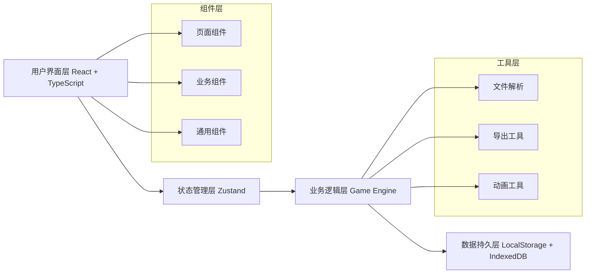

# 码头闸口验放赛 - 技术架构文档

## 1. 架构设计



## 2. 技术选型说明

### 2.1 核心技术栈
- **前端框架**: React@18 + TypeScript
- **构建工具**: Vite@5
- **样式方案**: TailwindCSS@3 + CSS Modules
- **状态管理**: Zustand (轻量级，适合游戏状态管理)
- **路由**: React Router@6
- **图表可视化**: Recharts (轻量级React图表库)
- **动画**: Framer Motion (流畅的交互动画)
- **图标**: Lucide React (现代化图标库)

### 2.2 数据存储方案
- **本地存储**: LocalStorage (用户设置、基本配置)
- **IndexedDB**: Dexie.js (存储大量题目数据、历史记录)
- **文件导入**: 支持 JSON/CSV/Excel 格式解析 (使用 SheetJS)
- **报告导出**: 支持 JSON/CSV/PDF 格式导出

## 3. 路由定义

| 路由路径 | 页面名称 | 功能说明 |
|---------|----------|---------|
| `/` | 首页 | 角色选择、游戏入口、历史记录 |
| `/game` | 游戏界面 | 核心验放游戏场景 |
| `/result` | 结果报告 | 成绩展示、错误分析 |
| `/replay` | 错误回放 | 逐题回放、答案对比 |
| `/admin` | 管理后台 | 材料管理、数据导入 |
| `/admin/import` | 导入页面 | 文件上传、策略选择 |
| `/history` | 历史记录 | 历史成绩查询、对比 |

## 4. 数据模型定义

### 4.1 核心数据结构

```typescript
// 集装箱/车辆材料
interface Material {
  id: string;
  type: 'container' | 'license_plate' | 'booking_note' | 'dangerous_mark';
  source: string; // 来源标记
  imageUrl?: string;
  data: ContainerData | LicensePlateData | BookingNoteData | DangerousMarkData;
  importTime: number;
  importBatch: string;
}

// 集装箱数据
interface ContainerData {
  containerNumber: string; // 箱号
  size: '20ft' | '40ft' | '45ft';
  type: string;
}

// 车牌数据
interface LicensePlateData {
  plateNumber: string;
  vehicleType: string;
}

// 预约单数据
interface BookingNoteData {
  bookingNumber: string;
  containerNumber: string;
  plateNumber: string;
  cargoType: string;
  isDangerous: boolean;
  dangerousClass?: string;
  valid: boolean;
}

// 危品标记数据
interface DangerousMarkData {
  classNumber: string; // 危品等级 1-9
  className: string;
  hasMark: boolean;
}

// 验放车辆（组合材料）
interface Vehicle {
  id: string;
  materials: {
    container: Material;
    licensePlate: Material;
    bookingNote: Material;
    dangerousMark?: Material;
  };
  correctAction: 'release' | 'intercept';
  interceptReason?: string[];
  difficulty: 'easy' | 'medium' | 'hard';
}

// 游戏记录
interface GameRecord {
  id: string;
  playerName: string;
  startTime: number;
  endTime: number;
  totalScore: number;
  maxScore: number;
  correctCount: number;
  totalCount: number;
  operations: OperationRecord[];
  errorTypes: Record<string, number>;
}

// 操作记录
interface OperationRecord {
  vehicleId: string;
  userAction: 'release' | 'intercept';
  userReasons?: string[];
  inputContainerNumber?: string;
  isCorrect: boolean;
  scoreChange: number;
  errorType?: string;
  operationTime: number;
  waitTime: number;
  timestamp: number;
}

// 导入配置
interface ImportConfig {
  strategy: 'ignore' | 'overwrite' | 'append';
  batchName: string;
}
```

### 4.2 状态管理结构

```typescript
// 游戏状态
interface GameState {
  status: 'idle' | 'playing' | 'paused' | 'finished';
  currentVehicleIndex: number;
  vehicles: Vehicle[];
  queue: { vehicleId: string; waitTime: number }[];
  score: number;
  combo: number;
  timeRemaining: number;
  operations: OperationRecord[];
  settings: GameSettings;
}

// 游戏设置
interface GameSettings {
  gameMode: 'quick' | 'custom';
  totalTime: number; // 秒
  vehicleCount: number;
  timeoutThreshold: number; // 超时阈值 秒
  difficulty: 'easy' | 'medium' | 'hard' | 'mixed';
}
```

## 5. 核心模块设计

### 5.1 游戏引擎模块 (GameEngine)
- 职责：控制游戏流程、计分逻辑、超时判断
- 核心方法：
  - `startGame()` - 初始化游戏
  - `nextVehicle()` - 切换下一辆车
  - `submitAction(action, reasons)` - 提交验放操作
  - `calculateScore(operation)` - 计算得分
  - `checkTimeout()` - 检查队列超时

### 5.2 计分规则模块 (ScoringService)
- 基础分：正确放行 +10分
- 加分项：连续正确 +5分/连击，快速响应 (<5秒) +3分
- 扣分项：
  - 预约不匹配放行：-20分
  - 危品漏拦：-30分
  - 队列超时：-5分/10秒
  - 误拦正常：-10分

### 5.3 数据导入模块 (ImportService)
- 支持格式：JSON、CSV、Excel
- 重复数据检测：基于ID或内容哈希
- 导入策略：
  - **忽略**：保留已有数据，跳过重复
  - **覆盖**：删除重复数据，导入新数据
  - **追加**：保留所有数据，重复数据保留最新

### 5.4 报告导出模块 (ExportService)
- 导出格式：JSON、CSV、PDF
- 报告内容：总分、正确率、错误分类统计、逐题详情

## 6. 目录结构

```
src/
├── assets/              # 静态资源
│   ├── images/
│   └── fonts/
├── components/          # 组件
│   ├── common/         # 通用组件
│   ├── game/           # 游戏相关组件
│   ├── admin/          # 管理后台组件
│   └── report/         # 报告相关组件
├── pages/              # 页面组件
├── store/              # 状态管理
│   ├── gameStore.ts
│   └── materialStore.ts
├── services/           # 业务服务
│   ├── gameEngine.ts
│   ├── scoringService.ts
│   ├── importService.ts
│   └── exportService.ts
├── types/              # TypeScript类型定义
├── utils/              # 工具函数
├── data/               # Mock数据
├── hooks/              # 自定义Hooks
├── styles/             # 全局样式
├── App.tsx
├── main.tsx
└── router.tsx
```

## 7. 性能优化策略

1. **虚拟列表**：历史记录和材料列表使用虚拟滚动
2. **图片懒加载**：材料图片按需加载
3. **IndexedDB缓存**：大量数据存储使用IndexedDB
4. **状态分片**：Zustand状态分片，避免不必要重渲染
5. **防抖节流**：输入框、倒计时等操作优化
