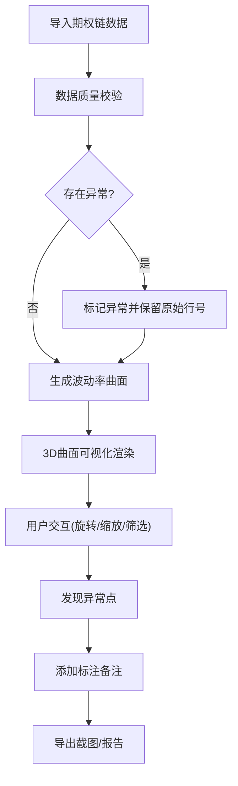

## 1. 产品概述

期权波动率曲面检查器是专为衍生品研究员设计的3D可视化工具，用于早会前快速识别波动率曲面的异常凸点、缺失报价和数据质量问题。

- 核心目的：将期权链数据转化为可交互的3D波动率曲面，帮助研究员在晨会前快速发现异常
- 目标用户：衍生品研究员、量化交易员、风险管理人员
- 产品价值：提升异常检测效率，保留数据来源和修正痕迹，避免错误数据进入决策流程

## 2. 核心功能

### 2.1 用户角色

| 角色 | 登录方式 | 核心权限 |
|------|----------|----------|
| 研究员 | 本地访问 | 查看3D曲面、筛选数据、添加标注、导出截图、查看异常报告 |

### 2.2 功能模块

1. **3D波动率曲面主界面**：可旋转3D曲面、悬浮信息、异常高亮显示
2. **数据筛选面板**：到期日切片、执行价范围、波动率阈值筛选
3. **异常检测系统**：缺失报价检测、异常尖峰识别、到期日错层预警
4. **标注历史系统**：添加备注、查看历史标注、追踪修正痕迹
5. **导出功能**：截图导出、异常报告导出

### 2.3 页面详情

| 页面名称 | 模块名称 | 功能描述 |
|---------|----------|----------|
| 主界面 | 3D曲面视图 | 鼠标拖拽旋转、滚轮缩放、悬浮显示详细数据 |
| 主界面 | 左侧控制面板 | 数据导入、筛选条件、异常检测开关 |
| 主界面 | 右侧信息面板 | 悬浮点详情、异常列表、标注历史 |
| 主界面 | 顶部工具栏 | 视图重置、截图导出、报告生成 |

## 3. 核心流程

用户导入期权链数据 → 系统自动生成3D波动率曲面并检测异常 → 用户旋转/缩放查看曲面 → 通过筛选器聚焦特定区域 → 发现异常后添加标注 → 导出截图用于晨会讨论

## 4. 用户界面设计

### 4.1 设计风格

- **主色调**：深海军蓝(#0A1628)作为背景，科技感青色(#00D4FF)作为高亮，警示红(#FF4757)标记异常
- **按钮风格**：圆角矩形，微悬浮效果，异常按钮带脉冲动画
- **字体**：标题使用 Orbitron (科技感)，正文使用 JetBrains Mono (等宽易读)
- **布局风格**：深色模式仪表盘布局，左侧控制面板 + 中央3D视图 + 右侧信息面板
- **图标风格**：线性简约图标，异常状态使用填充图标

### 4.2 页面设计概览

| 页面名称 | 模块名称 | UI元素 |
|---------|----------|--------|
| 主界面 | 3D曲面视图 | 渐变色曲面、异常点红色高亮、网格参考线、坐标轴标签 |
| 主界面 | 左侧控制面板 | 折叠面板、滑块控件、复选框、下拉选择器 |
| 主界面 | 右侧信息面板 | 数据卡片、异常列表、时间线标注记录 |
| 主界面 | 顶部工具栏 | 图标按钮、状态指示器、面包屑导航 |

### 4.3 响应式

- 桌面端优先设计(>1200px)：三栏完整布局
- 平板端(768-1200px)：左右面板可折叠收起
- 移动端(<768px)：单栏布局，面板切换显示

### 4.4 3D场景指引

- **环境**：深色科技背景，微弱网格地面，淡蓝色环境光
- **光照设置**：主光源(冷白色) + 补光(淡蓝色) + 边缘光(青色)，营造科技感
- **相机设置**：透视相机，初始45度俯视角，支持轨道控制
- **交互与动画**：曲面加载淡入动画、异常点脉冲闪烁、鼠标悬停时的点放大效果
- **后处理效果**：轻微泛光、边缘抗锯齿，异常点使用辉光效果
- **性能预算**：曲面顶点数控制在1万以内，保证60fps流畅度

### 4.5 异常提示设计

- **缺失报价**：曲面显示为孔洞，边框闪烁黄色警告
- **异常尖峰**：顶点显示为红色发光球体，附带感叹号图标
- **到期日错层**：相邻曲面片使用对比色区分，悬停显示偏移量
- **所有错误**：提示信息包含原始数据行号、来源文件、具体数值
