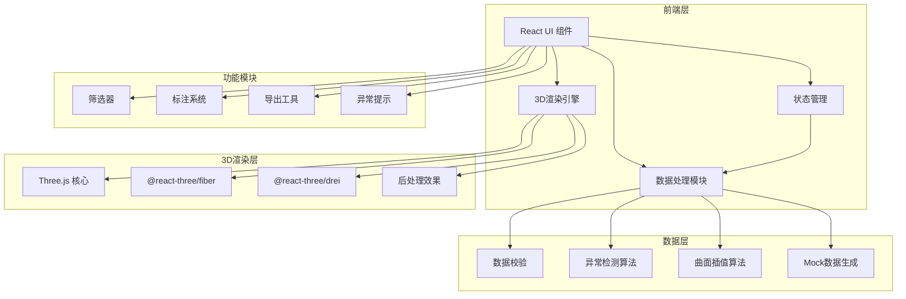

## 1. 架构设计



## 2. 技术选型说明

- **前端框架**: React@18 + TypeScript
- **构建工具**: Vite@5
- **样式方案**: TailwindCSS@3
- **3D引擎**: Three.js + @react-three/fiber + @react-three/drei
- **后处理**: @react-three/postprocessing
- **状态管理**: Zustand (轻量级状态管理)
- **图表库**: Recharts (用于2D切片视图)
- **图标**: Lucide React
- **无后端设计**: 纯前端应用，数据本地处理，支持CSV导入

## 3. 目录结构

```
src/
├── components/
│   ├── layout/           # 布局组件
│   │   ├── Header.tsx    # 顶部工具栏
│   │   ├── LeftPanel.tsx # 左侧控制面板
│   │   └── RightPanel.tsx# 右侧信息面板
│   ├── three/            # 3D组件
│   │   ├── VolatilitySurface.tsx  # 波动率曲面
│   │   ├── SurfacePoints.tsx      # 数据点
│   │   ├── AnomalyMarkers.tsx     # 异常标记
│   │   └── Scene.tsx              # 3D场景
│   ├── ui/               # UI组件
│   │   ├── FilterPanel.tsx
│   │   ├── AnomalyList.tsx
│   │   ├── AnnotationTimeline.tsx
│   │   └── DataPointInfo.tsx
│   └── common/           # 通用组件
├── store/                # 状态管理
│   └── useAppStore.ts
├── utils/                # 工具函数
│   ├── dataValidator.ts  # 数据校验
│   ├── anomalyDetector.ts# 异常检测
│   ├── interpolation.ts  # 曲面插值
│   ├── export.ts         # 导出工具
│   └── mockData.ts       # Mock数据
├── types/                # 类型定义
│   └── index.ts
├── App.tsx
└── main.tsx
```

## 4. 核心数据模型

### 4.1 期权数据点类型

```typescript
interface OptionDataPoint {
  id: string;
  sourceRow: number;           // 原始数据行号
  sourceFile: string;          // 来源文件名
  expirationDate: string;      // 到期日
  strikePrice: number;         // 执行价
  impliedVolatility: number;   // 隐含波动率
  volume: number;              // 成交量
  openInterest: number;        // 持仓量
  bid: number | null;          // 买价
  ask: number | null;          // 卖价
  lastPrice: number | null;    // 最新价
}

interface ProcessedDataPoint extends OptionDataPoint {
  x: number;                   // 3D坐标X (到期日归一化)
  y: number;                   // 3D坐标Y (波动率值)
  z: number;                   // 3D坐标Z (执行价归一化)
  anomalies: Anomaly[];        // 异常列表
}

interface Anomaly {
  id: string;
  type: 'missing_quote' | 'spike' | 'expiration_mismatch' | 'outlier';
  severity: 'warning' | 'error' | 'critical';
  message: string;
  details: Record<string, any>;
  timestamp: string;
}

interface Annotation {
  id: string;
  dataPointId: string;
  author: string;
  content: string;
  timestamp: string;
  revision: number;            // 修正版本号
  previousValue?: number;      // 修改前数值
  newValue?: number;           // 修改后数值
}
```

## 5. 异常检测算法

### 5.1 缺失报价检测
- 检测条件: bid/ask/lastPrice 任一为 null
- 标记方式: 曲面孔洞 + 黄色边框闪烁
- 提示信息: 包含原始行号、具体缺失字段

### 5.2 异常尖峰检测
- 算法: 基于邻域的Z-score检测
- 阈值: 局部Z-score > 3.0 标记为尖峰
- 标记方式: 红色发光球体 + 脉冲动画

### 5.3 到期日错层检测
- 算法: 相邻到期日曲面高度差分析
- 阈值: 相邻层波动率差 > 5% 标记为错层
- 标记方式: 对比色区分 + 悬停显示偏移量

## 6. 曲面插值方案

- 算法: 双三次B样条插值 (Bicubic B-spline)
- 处理缺失数据: 径向基函数(RBF)填充孔洞
- 性能优化: LOD(Level of Detail)根据距离切换精度
- 边界处理: 自然边界条件

## 7. 导出功能

### 7.1 截图导出
- 使用 html2canvas 捕获整个页面
- 支持选择导出区域
- 格式: PNG/JPEG，可调节质量

### 7.2 异常报告导出
- 格式: CSV/JSON
- 内容: 异常点列表、原始数据行号、检测时间、标注记录
