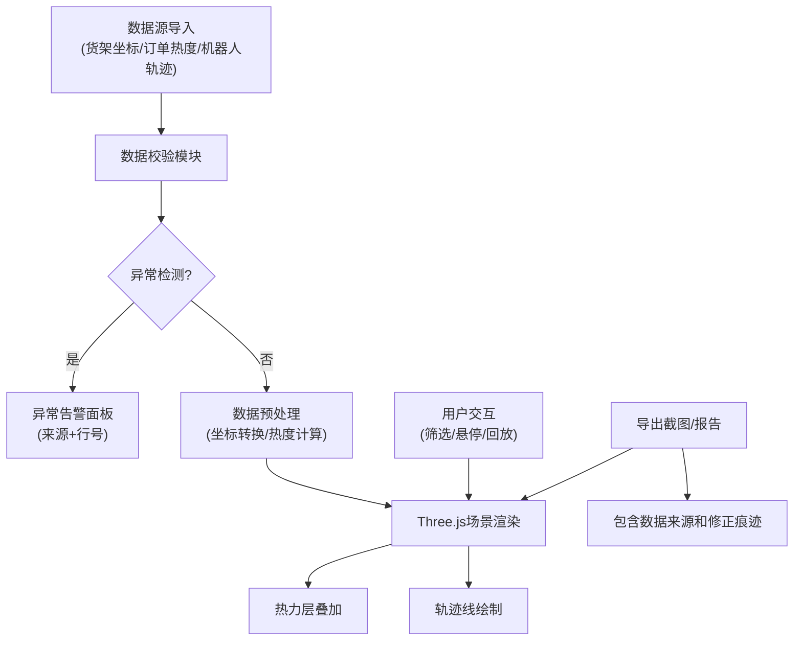

## 1. 产品概述
仓库货架热区巡检Web3D可视化系统，通过3D场景实时展示拣货热度、堵塞巷道、机器人等待点等关键运营数据，帮助仓库主管快速识别运营瓶颈和异常情况。

- 解决问题：传统报表无法直观展示空间维度的运营数据，现场问题发现滞后
- 目标用户：仓库主管、运营经理、现场巡检人员
- 产品价值：空间可视化+数据驱动决策，提升仓库运营效率和异常响应速度

## 2. 核心功能

### 2.1 用户角色
| 角色 | 登录方式 | 核心权限 |
|------|----------|----------|
| 仓库主管 | 账号密码登录 | 查看3D热区、回放轨迹、导出报告、配置数据来源 |
| 巡检人员 | 账号密码登录 | 查看热区、标记异常点、提交巡检记录 |

### 2.2 功能模块
1. **3D场景主页面**：Three.js仓库货架场景、热力层叠加、机器人轨迹展示
2. **数据筛选面板**：时间范围筛选、热度阈值调节、异常类型过滤
3. **轨迹回放模块**：机器人路径回放、速度控制、轨迹穿墙检测
4. **异常提示系统**：坐标翻转警告、热度叠加错误提示、碰撞检测告警
5. **报告导出模块**：巡检报告生成、3D场景截图导出、数据溯源记录

### 2.3 页面详情
| 页面名称 | 模块名称 | 功能描述 |
|-----------|-------------|---------------------|
| 3D巡检主页面 | 3D场景渲染 | Three.js渲染仓库货架，支持旋转/缩放/平移交互 |
| 3D巡检主页面 | 热力层展示 | 根据订单热度数据在货架表面生成渐变色热力图 |
| 3D巡检主页面 | 悬浮信息层 | 鼠标悬停显示货架编号、拣货次数、最近拣货时间 |
| 3D巡检主页面 | 机器人轨迹 | 实时/历史轨迹线展示，高亮等待点和堵塞区域 |
| 侧边筛选面板 | 时间筛选 | 按日期、时段筛选热区数据 |
| 侧边筛选面板 | 热度阈值 | 调节热力图颜色映射范围 |
| 侧边筛选面板 | 异常过滤 | 筛选显示坐标翻转、轨迹穿墙、热度叠加等异常 |
| 轨迹回放面板 | 播放控制 | 播放/暂停/快进/倍速控制机器人轨迹回放 |
| 轨迹回放面板 | 碰撞检测 | 实时检测轨迹穿墙并高亮提示原始数据行号 |
| 异常告警面板 | 告警列表 | 展示所有异常，包含来源文件名、行号、错误描述 |
| 报告导出面板 | 截图导出 | 导出当前3D场景截图，含时间戳和数据来源 |
| 报告导出面板 | 巡检报告 | 生成PDF/Excel格式巡检报告，包含修正痕迹 |

## 3. 核心流程

### 3.1 主要用户流程
1. 用户登录系统进入3D巡检主页面
2. 系统加载货架坐标、订单热度、机器人轨迹等数据
3. 数据校验模块自动检测坐标翻转、热度叠加、轨迹穿墙等异常
4. 用户通过侧边面板筛选时间范围和热度阈值
5. 3D场景实时更新热力层和轨迹展示
6. 用户可选择单机器人进行轨迹回放，观察等待点和堵塞巷道
7. 发现异常可标记并填写巡检记录
8. 导出包含数据溯源和修正痕迹的巡检报告

### 3.2 数据处理流程

## 4. 用户界面设计

### 4.1 设计风格
- **主色调**：工业蓝(#165DFF)作为主色，配合深灰(#1D2129)背景，营造科技感和专业感
- **辅助色**：热力渐变色(蓝→绿→黄→红)，异常告警红(#F53F3F)，正常绿(#00B42A)
- **按钮风格**：直角硬朗风格，轻微3D凸起效果，hover时有发光边框
- **字体**：采用JetBrains Mono作为数字和代码展示，Inter作为正文字体
- **布局风格**：左侧筛选面板固定宽度，右侧大区域3D场景，底部信息状态栏
- **图标风格**：线性图标，粗细2px，科技感强

### 4.2 页面设计概述
| 页面名称 | 模块名称 | UI元素 |
|-----------|-------------|-------------|
| 3D巡检主页面 | 3D场景容器 | 深灰背景，雾化效果，OrbitControls控制器，网格地面 |
| 3D巡检主页面 | 货架模型 | 金属质感货架，不同热度显示不同颜色发光材质 |
| 3D巡检主页面 | 热力层 | 半透明渐变平面，叠加在货架顶部，随筛选实时更新 |
| 3D巡检主页面 | 轨迹线 | TubeGeometry管道，颜色表示速度，闪烁点表示等待位置 |
| 侧边筛选面板 | 筛选控件 | 折叠面板，滑块控件，多选checkbox，时间选择器 |
| 异常告警面板 | 告警条目 | 红色边框，代码样式字体显示来源和行号，点击定位到3D场景 |
| 轨迹回放面板 | 播放控件 | 进度条，播放按钮，倍速选择，时间轴刻度 |
| 报告导出面板 | 导出选项 | 截图预览，报告格式选择，导出按钮带加载动画 |

### 4.3 响应式设计
- **桌面端优先**：主要面向仓库管理室大屏显示器(1920×1080及以上)
- **侧边面板**：可折叠收起，为3D场景留出更多空间
- **触控优化**：支持平板设备的手势旋转缩放
- **断点适配**：1200px以上完整布局，1200px以下面板自动堆叠

### 4.4 3D场景指导
- **环境与氛围**：工业仓库风格，HDRI环境贴图模拟仓库灯光，轻微雾效增强空间感
- **光照设置**：主方向光+环境光，货架边缘加轮廓光，增强3D立体感
- **相机设置**：PerspectiveCamera，初始角度45度俯视，可自由旋转平移
- **动画效果**：热力层颜色渐变过渡，轨迹线绘制动画，异常点脉冲闪烁
- **后期处理**：Bloom发光效果增强热区视觉冲击力，轻微抗锯齿
- **性能控制**：实例化渲染大量货架，LOD技术，帧率监控面板
- **交互反馈**：选中物体高亮外框，悬浮显示信息卡片，点击放大细节

## 5. 数据溯源与修正痕迹
- 所有展示数据保留原始来源文件名和行号
- 异常修正记录保存修改前后值、修改人、修改时间
- 导出报告包含数据来源清单和修正历史
- 错误提示精确到原始数据的具体行号和字段
