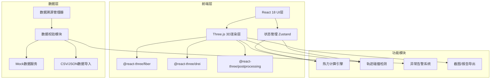

## 1. 架构设计



## 2. 技术选型说明

### 2.1 核心技术栈
- **前端框架**：React@18 + TypeScript@5
- **构建工具**：Vite@5
- **样式方案**：TailwindCSS@3 + CSS Modules
- **3D渲染**：Three.js@0.160 + @react-three/fiber@8 + @react-three/drei@9
- **状态管理**：Zustand@4
- **后处理效果**：@react-three/postprocessing@2

### 2.2 工具库
- **数据处理**：Lodash、Papaparse (CSV解析)
- **时间处理**：Day.js
- **导出功能**：html2canvas、jspdf、xlsx
- **动画**：Framer Motion
- **图标**：Lucide React

### 2.3 开发规范
- ESLint + Prettier 代码规范
- TypeScript 严格模式
- 模块化组件设计

## 3. 路由定义

| 路由路径 | 页面名称 | 功能描述 |
|----------|----------|----------|
| `/` | 3D巡检主页面 | 核心3D场景展示、热力层、轨迹回放 |
| `/login` | 登录页面 | 用户登录认证 |
| `/settings` | 数据配置页面 | 数据源配置、参数设置 |

## 4. 数据模型定义

### 4.1 货架坐标数据 (Shelf)
```typescript
interface Shelf {
  id: string;
  code: string;           // 货架编号
  row: number;            // 行号
  col: number;            // 列号
  level: number;          // 层数
  position: {
    x: number;
    y: number;
    z: number;
  };
  dimensions: {
    width: number;
    height: number;
    depth: number;
  };
  heatValue: number;      // 热度值
  source: {
    fileName: string;
    lineNumber: number;
  };
}
```

### 4.2 机器人轨迹数据 (RobotTrajectory)
```typescript
interface RobotTrajectory {
  id: string;
  robotId: string;
  timestamp: number;
  position: { x: number; y: number; z: number };
  speed: number;
  status: 'moving' | 'waiting' | 'picking' | 'blocked';
  source: {
    fileName: string;
    lineNumber: number;
  };
}
```

### 4.3 订单热度数据 (OrderHeat)
```typescript
interface OrderHeat {
  id: string;
  shelfId: string;
  timestamp: number;
  pickCount: number;
  source: {
    fileName: string;
    lineNumber: number;
  };
}
```

### 4.4 异常告警数据 (Alert)
```typescript
interface Alert {
  id: string;
  type: 'coordinate_flip' | 'heat_overflow' | 'trajectory_collision' | 'data_invalid';
  severity: 'warning' | 'error' | 'critical';
  message: string;
  source: {
    fileName: string;
    lineNumber: number;
    field: string;
    rawValue: string;
  };
  timestamp: number;
  resolved: boolean;
  correction?: {
    before: string;
    after: string;
    operator: string;
    timestamp: number;
  };
}
```

### 4.5 巷道数据 (Aisle)
```typescript
interface Aisle {
  id: string;
  code: string;
  startPoint: { x: number; z: number };
  endPoint: { x: number; z: number };
  width: number;
  blockageLevel: number;  // 0-100
  source: {
    fileName: string;
    lineNumber: number;
  };
}
```

## 5. 核心模块设计

### 5.1 数据校验模块
**文件路径**：`src/utils/dataValidator.ts`

**核心功能**：
- 坐标翻转检测：检查X/Z坐标是否超出合理范围
- 热度叠加检测：检查同一货架热度值是否异常叠加
- 轨迹穿墙检测：计算轨迹线与货架的碰撞
- 保留原始数据来源（文件名+行号）

### 5.2 热力计算引擎
**文件路径**：`src/utils/heatEngine.ts`

**核心算法**：
- 基于时间窗口的热度归一化
- 颜色渐变映射（蓝-绿-黄-红）
- 空间插值平滑热力分布
- 阈值过滤和分级显示

### 5.3 碰撞检测模块
**文件路径**：`src/utils/collisionDetector.ts`

**核心功能**：
- AABB包围盒碰撞检测
- 轨迹线段与货架的相交计算
- 巷道宽度边界检查
- 实时检测与告警

### 5.4 数据溯源管理器
**文件路径**：`src/stores/sourceStore.ts`

**核心功能**：
- 维护所有数据的来源信息
- 记录修正历史
- 导出时生成溯源清单

## 6. 3D场景组件结构

```
src/components/three/
├── Scene.tsx              # 主场景容器
├── ShelfGroup.tsx         # 货架组（实例化渲染）
├── HeatMapLayer.tsx       # 热力层
├── TrajectoryLine.tsx     # 轨迹线
├── RobotMarker.tsx        # 机器人标记
├── Aisle.tsx              # 巷道
├── FloorGrid.tsx          # 地面网格
├── HoverTooltip.tsx       # 悬浮提示
└── Effects.tsx            # 后处理效果
```

## 7. 状态管理结构

```
src/stores/
├── useSceneStore.ts       # 3D场景状态
├── useDataStore.ts        # 业务数据状态
├── useFilterStore.ts      # 筛选条件状态
├── useAlertStore.ts       # 告警状态
├── usePlaybackStore.ts    # 轨迹回放状态
└── useSourceStore.ts      # 数据溯源状态
```

## 8. 导出功能设计

### 8.1 截图导出
- 使用Three.js的renderer.domElement.toDataURL()
- 添加时间戳和数据来源水印
- 支持PNG/JPEG格式

### 8.2 巡检报告
- PDF格式：包含3D截图、热力统计、异常清单、数据溯源
- Excel格式：原始数据、统计汇总、修正记录
- 所有导出文件包含版本号和生成时间

## 9. 性能优化策略

1. **实例化渲染**：使用InstancedMesh渲染大量货架
2. **LOD技术**：远距离货架降低细节
3. **视锥体剔除**：只渲染可见区域
4. **WebWorker**：数据校验和热力计算在Worker中进行
5. **按需加载**：轨迹数据分段加载
