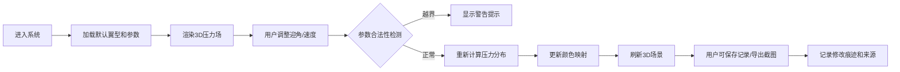

## 1. 产品概述

风洞翼型压力场Web3D交互式展示系统，用于大学物理实验教学。学生可通过调整迎角等参数实时观察翼型周围压力分布变化，系统支持数据记录、异常检测和截图导出功能。

- 核心目的：通过可视化交互帮助学生理解空气动力学原理
- 解决问题：传统实验设备昂贵、操作复杂，难以直观展示压力场变化
- 目标用户：大学物理教师和学生
- 产品价值：降低实验门槛，提升教学效果，支持远程教学

## 2. 核心功能

### 2.1 功能模块

1. **3D可视化场景**：翼型模型展示、压力场云图、速度流线
2. **参数控制面板**：迎角滑块、速度调节、翼型选择
3. **数据采样系统**：压力采样点显示、数值读取、采样状态提示
4. **实验记录管理**：参数保存、记录列表、来源追溯、修改痕迹
5. **异常检测系统**：迎角越界警告、采样缺失提示、颜色反转检测
6. **导出功能**：场景截图、数据导出

### 2.2 页面详情

| 页面名称 | 模块名称 | 功能描述 |
|---------|---------|---------|
| 主场景页 | 3D视窗 | Three.js渲染翼型模型和压力场，支持鼠标旋转缩放 |
| 主场景页 | 控制面板 | 迎角滑块(-30°~30°)、速度调节(0~100m/s)、翼型选择下拉框 |
| 主场景页 | 采样面板 | 显示采样点位置、压力数值、采样质量状态 |
| 主场景页 | 记录面板 | 实验记录列表，支持添加、查看、对比记录 |
| 主场景页 | 异常提示 | 顶部通知条显示警告信息，红/黄/绿三色区分严重程度 |

## 3. 核心流程

## 4. 用户界面设计

### 4.1 设计风格

- **主色调**：深蓝色(#0A2463)代表专业科技感，配合青色(#3E92CC)作为交互色
- **辅助色**：红色(#D8315B)用于警告，黄色(#E9D758)用于提示，绿色(#44AF69)用于正常状态
- **按钮风格**：直角矩形，轻微阴影，hover时有颜色渐变效果
- **字体**：标题使用Orbitron(科技感字体)，正文使用Roboto Mono(等宽字体便于数据展示)
- **布局**：左侧3D场景占70%宽度，右侧控制面板堆叠布局，顶部异常提示条
- **图标风格**：线性简约图标，使用Font Awesome

### 4.2 3D场景设计

- **环境**：深色科技感背景，添加轻微网格地面
- **光照**：主光源+环境光，确保翼型表面细节清晰可见
- **相机**：默认透视相机，支持OrbitControls交互
- **压力场表现**：使用颜色映射(蓝→绿→黄→红)表示压力从低到高
- **动画**：迎角调整时有平滑过渡动画，压力场渐变更新

### 4.3 页面设计概览

| 页面名称 | 模块名称 | UI元素 |
|---------|---------|---------|
| 主场景页 | 3D视窗 | 全屏Canvas、翼型模型、压力云图、采样点标记 |
| 主场景页 | 控制面板 | 滑块组件、数值输入框、下拉选择、实时数值显示 |
| 主场景页 | 记录面板 | 卡片列表、时间戳、参数摘要、操作按钮 |
| 主场景页 | 异常提示 | 浮动通知条、图标+文字、可关闭 |

### 4.4 响应式设计

- 桌面端：左右分栏布局，左侧场景右侧控制
- 平板端：上下布局，控制区域折叠可展开
- 移动端：简化控制，保留核心交互功能

## 5. 数据记录规范

### 5.1 样例数据

| 记录类型 | 迎角 | 速度 | 采样状态 | 备注 |
|---------|------|------|---------|------|
| 正常记录 | 5° | 50m/s | 完整(20点) | 标准巡航状态 |
| 边界记录 | 30° | 80m/s | 完整(20点) | 接近失速迎角 |
| 坏数据 | -45° | 120m/s | 缺失(3点) | 迎角越界+速度超限+采样缺失 |

### 5.2 记录字段

- 记录ID、创建时间、修改时间
- 翼型参数(类型、弦长、厚度)
- 运行参数(迎角、速度、雷诺数)
- 采样数据(各点位置、压力值)
- 数据来源(手动输入/导入/讲义截图)
- 修改历史(每次变更的时间、用户、内容)
