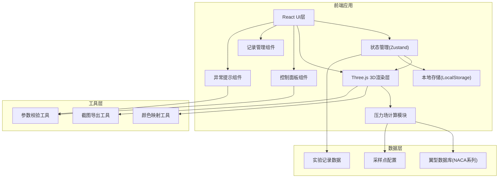

## 1. 架构设计



## 2. 技术描述

- **前端框架**: React@18 + TypeScript
- **构建工具**: Vite@5
- **样式方案**: TailwindCSS@3
- **3D渲染**: Three.js@0.160 + @react-three/fiber@8 + @react-three/drei@9
- **状态管理**: Zustand@4
- **图标库**: Font Awesome
- **数据持久化**: LocalStorage (无需后端)
- **模拟数据**: 内置NACA翼型数据和压力场计算公式

## 3. 目录结构

```
src/
├── components/
│   ├── Airfoil3D/          # 3D翼型渲染组件
│   ├── ControlPanel/       # 参数控制面板
│   ├── SamplingPanel/      # 采样数据面板
│   ├── RecordPanel/        # 实验记录面板
│   ├── AlertBanner/        # 异常提示组件
│   └── ColorBar/           # 颜色映射条
├── store/
│   └── useExperimentStore  # 实验状态管理
├── utils/
│   ├── airfoilMath.ts      # 翼型数学计算
│   ├── pressureCalc.ts     # 压力场计算
│   ├── colorMap.ts         # 颜色映射工具
│   ├── validation.ts       # 参数校验
│   └── export.ts           # 导出工具
├── data/
│   ├── airfoils.ts         # NACA翼型数据
│   └── sampleRecords.ts    # 样例记录数据
├── types/
│   └── index.ts            # TypeScript类型定义
└── App.tsx                 # 主应用入口
```

## 4. 核心数据模型

### 4.1 TypeScript类型定义

```typescript
// 翼型参数
interface Airfoil {
  id: string;
  name: string; // NACA 0012, NACA 2412等
  chordLength: number; // 弦长
  thickness: number; // 厚度比
  camber: number; // 弯度
  coordinates: Point2D[]; // 翼型坐标点
}

// 实验参数
interface ExperimentParams {
  angleOfAttack: number; // 迎角(度)
  velocity: number; // 速度(m/s)
  airDensity: number; // 空气密度
  reynoldsNumber: number; // 雷诺数
}

// 采样点
interface SamplingPoint {
  id: string;
  position: Point3D; // 空间位置
  pressure: number | null; // 压力值(Pa)，null表示缺失
  isValid: boolean; // 数据是否有效
}

// 压力场数据
interface PressureField {
  airfoilId: string;
  params: ExperimentParams;
  samplingPoints: SamplingPoint[];
  minPressure: number;
  maxPressure: number;
  colorInverted: boolean; // 颜色是否反转
}

// 实验记录
interface ExperimentRecord {
  id: string;
  createdAt: string;
  updatedAt: string;
  airfoil: Airfoil;
  params: ExperimentParams;
  pressureField: PressureField;
  source: 'manual' | 'import' | 'lecture'; // 数据来源
  sourceNote?: string; // 来源说明
  modificationHistory: Modification[];
  notes: string;
  tags: string[];
}

// 修改痕迹
interface Modification {
  timestamp: string;
  field: string;
  oldValue: any;
  newValue: any;
  reason: string;
}

// 异常警告
interface Alert {
  id: string;
  type: 'error' | 'warning' | 'info';
  message: string;
  details?: string;
  timestamp: string;
}
```

## 5. 参数校验规则

### 5.1 迎角校验
- 正常范围: -30° ~ 30°
- 警告范围: -25° ~ -30° 或 25° ~ 30° (黄色警告)
- 越界: < -30° 或 > 30° (红色错误)

### 5.2 速度校验
- 正常范围: 0 ~ 100 m/s
- 警告范围: 80 ~ 100 m/s (黄色警告)
- 越界: > 100 m/s (红色错误)

### 5.3 采样校验
- 完整采样: 20个点全部有效 (绿色状态)
- 部分缺失: 1~5个点缺失 (黄色警告)
- 严重缺失: >5个点缺失 (红色错误)

### 5.4 颜色反转检测
- 检测压力极值是否合理
- 低压区应在翼型上表面(正常迎角)
- 如出现反转需提示用户

## 6. 压力场计算算法

### 6.1 基础公式
使用简化的势流理论计算翼型压力分布:

```
Cp = 1 - (V/V∞)²
其中:
- Cp: 压力系数
- V: 当地速度
- V∞: 来流速度
```

### 6.2 翼型坐标生成
NACA四位数字翼型坐标生成算法已内置。

### 6.3 压力采样点分布
- 翼型上表面: 10个均匀分布点
- 翼型下表面: 10个均匀分布点
- 前缘和后缘各设关键点

## 7. 颜色映射方案

| 压力范围 | 颜色 | HEX |
|---------|------|-----|
| 最低压力 | 深蓝色 | #1E3A8A |
| 低压区 | 青色 | #0EA5E9 |
| 中压区 | 绿色 | #10B981 |
| 高压区 | 黄色 | #F59E0B |
| 最高压力 | 红色 | #EF4444 |
