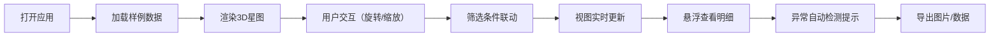

## 1. 产品概述

基金组合风险星图是一个交互式3D数据可视化工具，帮助投顾顾问直观展示基金组合的风险分布。通过三维散点图呈现行业权重、波动率、最大回撤等多维风险指标，解决传统二维表格难以直观解释复杂风险关系的问题。

## 2. 核心功能

### 2.1 用户角色
| 角色 | 注册方式 | 核心权限 |
|------|---------|----------|
| 投顾顾问 | 无需注册 | 查看3D风险星图、筛选数据、导出图片、查看明细 |

### 2.2 功能模块
1. **3D风险星图主界面**：三维散点图展示、视角控制、风险高亮
2. **数据筛选面板**：多维度筛选、筛选联动、实时更新
3. **侧边明细面板**：悬浮详情、数据来源、修正痕迹
4. **异常提示系统**：行业重叠提示、风险点遮挡警告、负收益高亮
5. **导出功能**：3D视图截图导出、数据报告导出

### 2.3 页面详情
| 页面名称 | 模块名称 | 功能描述 |
|---------|---------|----------|
| 主界面 | 3D星图区域 | 可旋转/缩放/平移的3D散点图，每个点代表一只基金，XYZ轴分别对应波动率、最大回撤、收益率，颜色区分行业 |
| 主界面 | 顶部筛选栏 | 行业筛选、风险等级筛选、收益区间筛选、时间范围选择 |
| 主界面 | 右侧明细面板 | 悬浮显示选中基金详情、数据来源追溯、历史修正记录 |
| 主界面 | 异常提示区 | 实时显示行业权重重叠、风险点遮挡、负收益等异常警告 |
| 主界面 | 底部工具栏 | 重置视角、切换视图模式、导出图片/数据按钮 |

## 3. 核心流程

用户打开应用 → 加载样例数据（正常/边界/坏数据各一条）→ 3D星图自动渲染 → 拖动旋转查看三维分布 → 点击筛选条件联动更新视图 → 悬浮查看基金明细和数据来源 → 发现异常时自动高亮提示 → 导出当前视图为图片

## 4. 用户界面设计

### 4.1 设计风格
- **主色调**：深空蓝 #0a1628 作为背景，营造星空氛围
- **强调色**：科技青 #00d4ff 用于正常数据，警示橙 #ff6b35 用于边界数据，危险红 #ff3366 用于坏数据
- **辅助色**：各行业使用差异化配色，便于快速识别
- **字体**：标题使用 Orbitron（科技感字体），正文使用 Inter（清晰易读）
- **布局**：暗色主题，全屏3D画布 + 半透明侧边面板，玻璃拟态风格
- **按钮**：圆角矩形，发光边框效果，悬停时有呼吸动画

### 4.2 页面设计概述
| 页面名称 | 模块名称 | UI元素 |
|---------|---------|--------|
| 主界面 | 3D星图 | 深空背景、闪烁星点、发光散点、网格辅助线、坐标轴标签、悬浮连接线 |
| 主界面 | 筛选栏 | 下拉选择器、滑块控件、标签式切换、清除按钮 |
| 主界面 | 明细面板 | 卡片式布局、数据来源标签、时间线修正记录、风险指标仪表盘 |
| 主界面 | 异常提示 | 顶部通知条、闪烁警告图标、可展开详情、一键定位功能 |

### 4.3 响应式
- 桌面端（1920px+）：完整布局，三栏结构
- 平板端（1024-1919px）：侧边面板可折叠，筛选栏简化
- 移动端：仅保留核心3D视图，筛选和明细通过抽屉方式展示

### 4.4 3D场景设计
- **环境**：深空黑色背景，添加微弱噪点纹理营造星空感
- **光照**：环境光 + 3个方向光，确保散点从各角度都清晰可见
- **相机**：透视相机，初始视角45度俯角，支持轨道控制
- **交互**：鼠标拖动旋转，滚轮缩放，右键平移，双击重置
- **动画**：数据点入场动画（从原点飞出），选中时放大发光，异常点脉冲闪烁
- **后期**：轻微辉光效果，增强科技感
