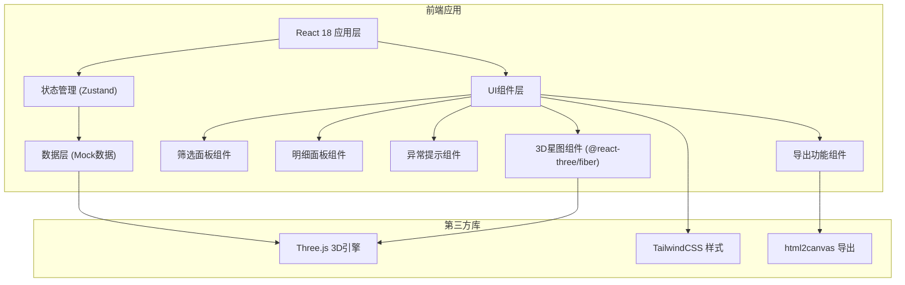
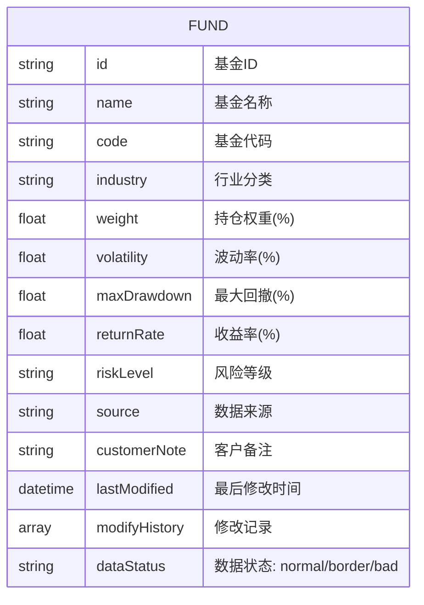

## 1. 架构设计



## 2. 技术描述

- **前端框架**: React@18 + TypeScript
- **构建工具**: Vite@5
- **样式方案**: TailwindCSS@3
- **3D引擎**: Three.js + @react-three/fiber + @react-three/drei + @react-three/postprocessing
- **状态管理**: Zustand (轻量级，适合单页应用)
- **后端**: 无后端，使用Mock数据
- **数据导出**: html2canvas

## 3. 路由定义

| 路由 | 用途 |
|-----|------|
| / | 主界面 - 3D风险星图可视化 |

## 4. 数据模型

### 4.1 数据模型定义



### 4.2 TypeScript 类型定义

```typescript
interface FundData {
  id: string;
  name: string;
  code: string;
  industry: string;
  weight: number;
  volatility: number;
  maxDrawdown: number;
  returnRate: number;
  riskLevel: 'low' | 'medium' | 'high';
  source: string;
  customerNote?: string;
  lastModified: string;
  modifyHistory: ModifyRecord[];
  dataStatus: 'normal' | 'border' | 'bad';
}

interface ModifyRecord {
  timestamp: string;
  field: string;
  oldValue: any;
  newValue: any;
  operator: string;
  reason: string;
}

interface FilterState {
  industries: string[];
  riskLevels: string[];
  returnRange: [number, number];
  volatilityRange: [number, number];
}

interface AnomalyAlert {
  id: string;
  type: 'industry_overlap' | 'occlusion' | 'negative_return' | 'bad_data';
  severity: 'warning' | 'danger';
  message: string;
  relatedFunds: string[];
}
```

### 4.3 Mock数据说明

样例数据包含：
- **正常数据**: 1条，各项指标在合理范围内
- **边界数据**: 1条，接近风险阈值
- **坏数据**: 1条，存在明显异常（如负收益过大、数据冲突）
- 其他辅助数据: 约15-20条不同行业的基金数据，构成完整星图

## 5. 核心组件结构

```
src/
├── components/
│   ├── Scene3D/
│   │   ├── index.tsx          # 3D场景主组件
│   │   ├── StarPoints.tsx     # 散点渲染
│   │   ├── Axes.tsx           # 坐标轴
│   │   ├── GridHelper.tsx     # 网格辅助线
│   │   └── HoverLine.tsx      # 悬浮连接线
│   ├── FilterPanel/
│   │   ├── index.tsx          # 筛选面板主组件
│   │   ├── IndustryFilter.tsx # 行业筛选
│   │   └── RangeSlider.tsx    # 区间滑块
│   ├── DetailPanel/
│   │   ├── index.tsx          # 明细面板主组件
│   │   ├── FundInfo.tsx       # 基金信息
│   │   ├── SourceTag.tsx      # 数据来源标签
│   │   └── ModifyTimeline.tsx # 修改时间线
│   ├── AlertPanel/
│   │   ├── index.tsx          # 异常提示主组件
│   │   └── AlertItem.tsx      # 单条警告
│   └── Toolbar/
│       └── index.tsx          # 底部工具栏
├── store/
│   └── useStore.ts            # Zustand状态管理
├── data/
│   └── mockFunds.ts           # Mock数据
├── utils/
│   ├── anomalyDetector.ts     # 异常检测算法
│   └── exportUtils.ts         # 导出工具
├── App.tsx
└── main.tsx
```

## 6. 异常检测逻辑

1. **行业权重重叠检测**: 计算同行业基金权重之和，超过30%触发警告
2. **风险点遮挡检测**: 计算3D空间中点与点的距离，小于阈值时提示遮挡
3. **负收益高亮**: 收益率 < -5% 时标记为异常
4. **坏数据识别**: 数据状态标记为 'bad' 或指标超出合理范围
