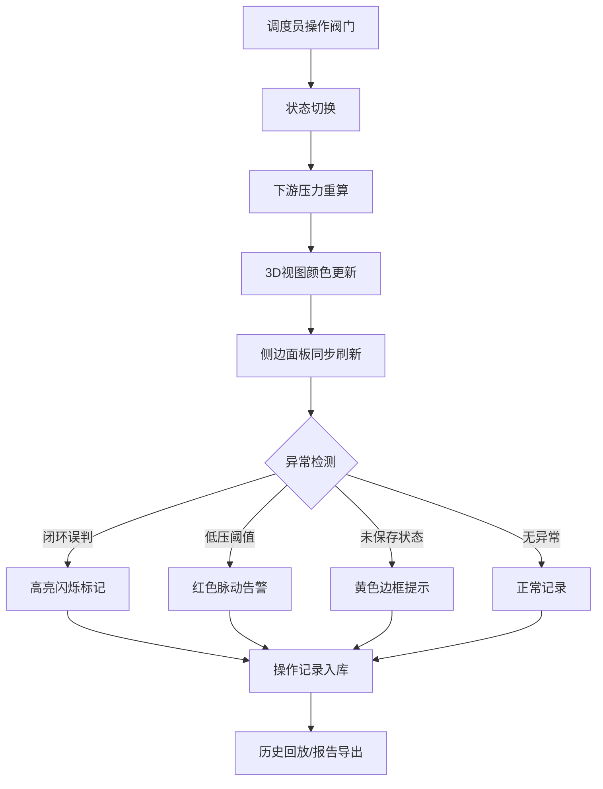

## 1. 产品概述
城市水管压力沙盘是一款面向水务调度员的3D交互可视化工具，用于模拟管网阀门开关操作后各小区的水压变化，辅助调度决策与异常检测。
- 解决问题：闭环管网误判、低压盲区、阀门状态未保存等调度风险，提供可追溯的压力模拟与记录回放
- 目标用户：水务公司调度员、管网工程师
- 产品价值：将分散的管段坐标、阀门、泵站、用户区、压力值、调度记录整合为可交互的3D沙盘，降低误判率、提升响应速度

## 2. 核心功能

### 2.1 用户角色
| 角色 | 注册方式 | 核心权限 |
|------|----------|----------|
| 水务调度员 | 系统账号 | 3D管网操作、阀门开关模拟、历史回放、报告导出 |
| 管网工程师 | 系统账号 | 数据修正、来源追溯、异常标记 |

### 2.2 功能模块
1. **3D管网沙盘页**：管网建模、压力颜色映射、阀门交互、泵站显示、用户区标注
2. **侧边明细面板**：管段信息、压力值、阀门状态、异常告警、数据来源追踪
3. **历史回放页**：时间轴播放、调度记录回放、阀门操作时间线
4. **报告导出页**：生成调度报告、异常摘要、数据修正痕迹

### 2.3 页面详情
| 页面名称 | 模块名称 | 功能描述 |
|----------|----------|----------|
| 3D管网沙盘 | 管网模型 | 3D渲染管道、阀门、泵站、用户区，支持旋转缩放 |
| 3D管网沙盘 | 压力热力图 | 根据水压值自动着色，冷色低压暖色高压，支持阈值过滤 |
| 3D管网沙盘 | 阀门交互 | 点击阀门切换开关状态，实时重算下游压力变化 |
| 3D管网沙盘 | 泵站标注 | 显示泵站位置与供压参数，支持供压调整 |
| 3D管网沙盘 | 异常标记 | 闭环误判区高亮闪烁、低压区红色脉动、未保存状态黄色边框 |
| 侧边明细 | 管段详情 | 显示选中管段的坐标、材质、直径、压力值、来源记录 |
| 侧边明细 | 压力仪表盘 | 数字仪表盘显示当前选中区域压力，低于阈值红色告警 |
| 侧边明细 | 异常列表 | 实时列出所有异常项：类型、位置、严重等级、处理建议 |
| 侧边明细 | 修正痕迹 | 显示数据来源和每次人工修正的时间、操作人、修正前后值 |
| 历史回放 | 时间轴 | 拖动时间轴回放调度过程，阀门操作高亮标记 |
| 历史回放 | 调度记录 | 列表展示每次调度操作，可点击跳转至对应时间点 |
| 报告导出 | 报告生成 | 汇总选定时间段的压力变化、阀门操作、异常事件 |
| 报告导出 | 导出下载 | 支持PDF/Excel格式导出，包含修正痕迹与数据来源 |

## 3. 核心流程

### 3.1 阀门操作模拟流程
调度员点击阀门 → 切换阀门状态 → 系统重算下游管网压力 → 3D视图实时更新颜色 → 侧边明细同步刷新压力值 → 检测异常并告警 → 操作自动记录到历史

### 3.2 异常检测流程
阀门状态变更 → 压力值重算 → 遍历所有节点 → 检测闭环误判/低压阈值/未保存状态 → 生成异常项 → 3D视图标记 + 侧边列表展示

### 3.3 历史回放流程
调度员选择回放时间段 → 时间轴初始化 → 拖动/播放 → 逐帧恢复阀门状态 → 压力值随时间变化 → 3D视图同步动画 → 可暂停、跳转、导出

## 4. 用户界面设计

### 4.1 设计风格
- 主色调：深青蓝 `#0E2A47` 背景 + 荧光青 `#00D4FF` 管道 + 琥珀黄 `#FFB547` 阀门高亮
- 按钮风格：圆角胶囊按钮，悬浮态发光边框
- 字体：标题使用 `Space Grotesk`，正文使用 `IBM Plex Mono`（等宽数字对齐）
- 布局：左侧3D画布占70%，右侧明细面板占30%，底部时间轴
- 图标风格：lucide-react 线性图标，配合发光效果

### 4.2 页面设计概览
| 页面名称 | 模块名称 | UI元素 |
|----------|----------|----------|
| 3D管网沙盘 | 管网模型 | Three.js 3D渲染，蓝色管道发光材质，节点球形标注 |
| 3D管网沙盘 | 压力热力图 | 蓝→青→黄→红渐变色映射，支持悬浮显示数值 |
| 3D管网沙盘 | 阀门交互 | 橙色球形体，点击缩放动效，开关状态颜色切换 |
| 3D管网沙盘 | 泵站标注 | 绿色立方体，带压力数字浮动标签 |
| 3D管网沙盘 | 用户区 | 半透明粉色区域，标注小区名称 |
| 侧边明细 | 管段详情 | 卡片式信息列表，等宽字体数值，来源和修正痕迹折叠面板 |
| 侧边明细 | 压力仪表盘 | 圆形仪表盘动画，指针随数值转动，低于阈值红色闪烁 |
| 侧边明细 | 异常列表 | 时间线式列表，异常项带图标和严重等级颜色 |
| 历史回放 | 时间轴 | 线性时间轴，带刻度和操作标记点，支持拖动和播放按钮 |
| 历史回放 | 调度记录 | 卡片列表，点击高亮对应时间点 |
| 报告导出 | 报告生成 | 表单选择时间段，生成进度条，报告预览 |

### 4.3 响应式设计
- 桌面优先，断点1280px
- 平板端：右侧面板折叠为抽屉
- 不支持手机端（专业调度工具）

### 4.4 3D场景指导
- 环境：深色背景配少量噪点，营造工业监控氛围
- 光照：蓝色环境光 + 点光源跟随相机，模拟沙盘投影效果
- 相机：透视相机，初始视角45度俯视，支持轨道控制
- 交互：OrbitControls旋转缩放，Raycaster拾取点击
- 后处理：Bloom泛光效果让管道和阀门发光
- 性能：管段使用BufferGeometry，LOD策略，500+管段保持60fps
