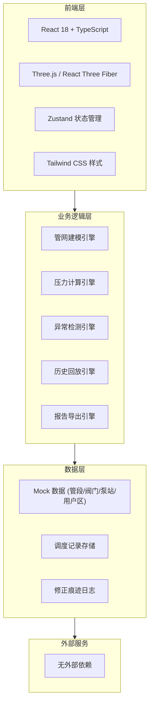
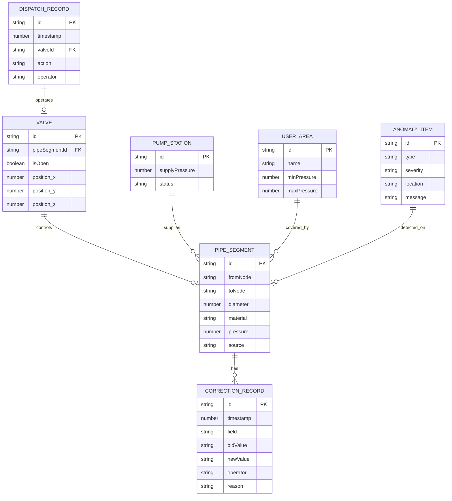

## 1. 架构设计



## 2. 技术说明
- 前端：React@18 + TypeScript + Tailwind CSS@3 + Vite
- 3D渲染：Three.js + @react-three/fiber + @react-three/drei + @react-three/postprocessing
- 状态管理：Zustand
- 路由：React Router DOM
- 图标：lucide-react
- 初始化工具：vite-init
- 后端：无（纯前端应用，数据Mock）
- 数据库：无，使用LocalStorage持久化调度记录

## 3. 路由定义
| 路由 | 用途 |
|------|------|
| / | 3D管网沙盘主页面（含侧边明细面板） |
| /playback | 历史回放页面 |
| /report | 报告导出页面 |

## 4. API定义
无后端API，纯前端Mock数据接口：

```typescript
// 数据类型定义
interface PipeSegment {
  id: string;
  fromNode: string;
  toNode: string;
  diameter: number;
  material: string;
  pressure: number;
  source: string;
  corrections: CorrectionRecord[];
}

interface Valve {
  id: string;
  position: [number, number, number];
  isOpen: boolean;
  pipeSegmentId: string;
}

interface PumpStation {
  id: string;
  position: [number, number, number];
  supplyPressure: number;
  status: 'running' | 'standby' | 'fault';
}

interface UserArea {
  id: string;
  name: string;
  position: [number, number, number];
  minPressure: number;
  maxPressure: number;
}

interface DispatchRecord {
  id: string;
  timestamp: number;
  valveId: string;
  action: 'open' | 'close';
  operator: string;
  notes: string;
}

interface CorrectionRecord {
  id: string;
  timestamp: number;
  field: string;
  oldValue: any;
  newValue: any;
  operator: string;
  reason: string;
}

interface AnomalyItem {
  id: string;
  type: 'closed_loop' | 'low_pressure' | 'unsaved_state';
  severity: 'high' | 'medium' | 'low';
  location: string;
  message: string;
  suggestion: string;
  timestamp: number;
}
```

## 5. 数据模型

### 5.1 数据模型定义



### 5.2 初始数据（样例）
- 正常记录：阀门V001正常开关，下游压力平稳在0.35MPa
- 边界记录：阀门V003操作后下游压力恰好达到阈值0.14MPa
- 坏数据：管段P012压力值为-0.05MPa（不可能的负值），来源标记为"传感器故障"
