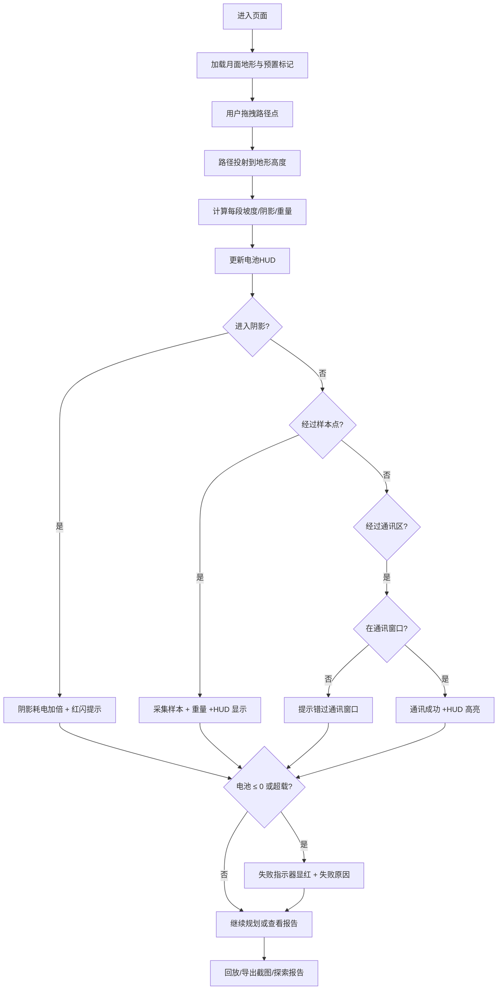

# 月球车能量路径 — 产品需求文档（PRD）

## 1. 产品概述
面向科普社社长的 Web3D 月面路径规划工具，玩家通过拖拽路线在月面地形上规划月球车路径，实时显示阴影耗电量、样本重量、通讯窗口与失败提示，并可回放并导出探索报告。
- 目标用户：科普社师生、STEM 教学工作者
- 核心价值：以可交互 3D 月面为载体，把"阴影耗电、样本超载、通讯窗口错过"这些关键失败因素显性化，让路线规划的能量逻辑可观察、可解释、可复盘。

## 2. 核心功能

### 2.1 功能模块
1. **月面 3D 场景**：程序化月面地形（陨石坑、阴影）、太阳角度可调、月球车模型、阴影与地形起伏投射。
2. **路径规划**：拖拽在地形上添加路径点；路线高亮；支持撤销/重做；路径实时投影到地形高度。
3. **能量计算**：每段路径按地形坡度、阴影时长、样本重量计算能耗；电池从 100% 起算；阴影区加速耗电；超载加倍惩罚。
4. **样本与通讯**：月面预置样本点（岩石/土壤/冰）与通讯窗口时段；路径经过样本点触发"采集"（加入重量）；错过窗口或超载都明确提示。
5. **失败指示器**：阴影深度、电池剩余、样本重量、通讯状态四类 HUD，失败时以红色闪烁+悬浮说明显性呈现，不静默计入。
6. **探索报告**：汇总路线数据，保留来源（材料/地形/太阳角度/电池/样本/通讯）与每次修正的历史痕迹；导出 PNG 截图。
7. **回放**：按时间顺序回放路径推进与能量变化，可步进、暂停、重置。

### 2.2 页面细节
| 页面名称 | 模块名称 | 功能描述 |
|----------|----------|----------|
| 主页面 | 顶部控制栏 | 主题切换、太阳角度、重置、导出截图、回放控制 |
| 主页面 | 左侧筛选面板 | 样本类型开关、通讯窗口显示开关、阴影灵敏度 |
| 主页面 | 中央 3D 场景 | 月面地形、月球车、路径、阴影投射、相机控制 |
| 主页面 | 右侧信息面板 | 电池、重量、阴影、通讯状态 HUD；失败提示；路线数值明细 |
| 主页面 | 底部时间线 | 回放进度、步进到节点、导出探索报告 |

## 3. 核心流程
用户打开页面 → 观察月面与太阳位置 → 在 3D 场景上拖拽添加路径点 → 每段路径实时计算能耗 → 经过样本点自动采集（重量增加） → 进入阴影区 HUD 显红并显示额外耗电 → 经过通讯区若在窗口外则提示"错过" → 完成后查看探索报告，可回放、可导出截图。

## 4. 界面设计

### 4.1 设计风格
- 主色：月面深灰 `#1b1d22`、陨石坑青 `#2a3440`、能量蓝 `#4dc4ff`、警告红 `#ff5a5a`、成功绿 `#6ef2a1`。
- 按钮：圆角胶囊，带 1px 描边与高光，hover 发光。
- 字体：标题用 `Orbitron`/`Genos` 类等宽感字体；正文用系统无衬线。
- 布局：三栏 + 顶部工具栏 + 底部时间线的任务台风格，信息高密度但层次分明。
- 图标：线性图标 + SVG，阴影/电池/重量/通讯有专属视觉符号。

### 4.2 页面设计概览
| 页面名称 | 模块名称 | UI 元素 |
|----------|----------|----------|
| 主页面 | 顶部控制栏 | 胶囊按钮组：重置、导出、回放、主题切换；角标显示当前太阳角度 |
| 主页面 | 左侧筛选面板 | 折叠式卡片：样本类型勾选、通讯窗口开关、阴影灵敏度滑杆 |
| 主页面 | 中央 3D 场景 | 暗色星幕、月面雾效、方向光阴影、路径为能量蓝发光管、月球车低模 |
| 主页面 | 右侧 HUD 面板 | 四格状态卡（电池环、重量条、阴影深度、通讯），失败时整卡红闪 |
| 主页面 | 底部时间线 | 节点气泡 + 进度条 + 步进按钮 |

### 4.3 响应式
桌面优先，≥ 1280px 显示完整三栏；1024-1280 折叠左右面板；< 1024 仅保留 3D 场景 + 顶部控制，面板抽屉化。

### 4.4 3D 场景指引
- 环境：星点粒子背景、月面雾化、冷色调方向光模拟太阳。
- 光照：方向光 + 环境光，阴影软阴影 2048px map。
- 相机：Orbit 控制，初始 45° 俯角，拖拽添加路径点时支持按住 Shift+点击在地面取点。
- 交互：拖拽添加路径点、悬停显示信息、右键删除。
- 后处理：Bloom、轻微色调映射，发光路径与 HUD 突出。
- 素材来源：程序化生成（three.js 内置几何体 + simplex noise），无外部贴图依赖。
