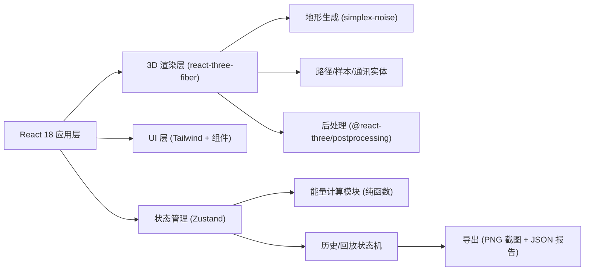
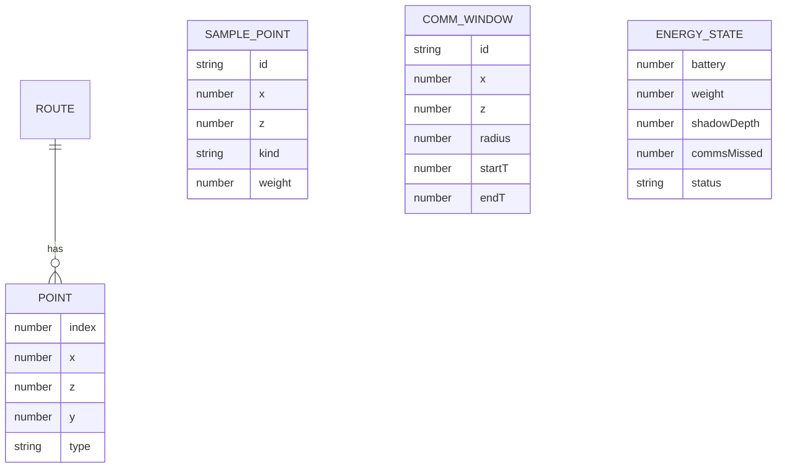

# 月球车能量路径 — 技术架构

## 1. 架构设计

## 2. 技术说明
- 前端：React 18 + TypeScript + Vite
- 3D：three.js、@react-three/fiber、@react-three/drei、@react-three/postprocessing
- 状态：Zustand（含 history 中间件用于撤销/重做与回放）
- 样式：Tailwind CSS 3
- 工具：simplex-noise（地形生成）、html2canvas（截图导出）
- 无后端，数据全部本地计算与导出。

## 3. 路由定义
| 路由 | 用途 |
|------|------|
| `/` | 主场景（月面 3D + 控制面板 + HUD + 时间线） |

## 4. 数据模型

### 4.1 数据模型定义

### 4.2 状态 Schema（Zustand store）
- `terrain`: 地形高度场缓存
- `route`: `Array<{x, z, y, idx}>` 当前路径点
- `samples`: 预置样本点
- `commWindows`: 通讯窗口
- `energy`: `{battery, weight, shadowDepth, shadowCost, commStatus}`
- `sun`: `{angle, intensity}`
- `history`: 时间线快照数组（每次路径修改 push）
- `filters`: 样本/通讯/阴影灵敏度
- `replay`: `{playing, step, speed}`

## 5. 能量计算规则
- 基础能耗：每米 0.3% 电池
- 坡度加成：`|Δh/Δd| * 0.8`，上坡加倍
- 阴影加成：路径段处于阴影投射内（采样方向光阴影 map）时能耗 × 2.5，并触发 HUD 警告
- 样本重量：每 kg 增加 0.02%/m 能耗，超过 50kg 触发超载警告（×3 惩罚）
- 通讯：路径经过通讯圆圈且在时间窗口内成功，否则记录 missed 并闪烁
- 失败显式：battery ≤ 0 或 超载未解决或 通讯 missed ≥ 2 时状态标记 `failed`，不静默计入正常结果
