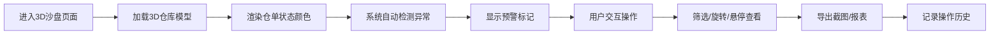

## 1. 产品概述

期货仓单库容沙盘是一个基于Web3D的大宗商品仓单管理可视化系统，解决当前仓单管理中重复仓单、库容超限、质检未过仍交割等反复出错的问题，为商品运营团队提供直观的3D仓库视图。

- 核心目标：通过3D可视化实现仓单分布、质检状态、可交割库容的实时监控与预警
- 目标用户：大宗商品运营团队、期货交割管理人员
- 市场价值：降低人工核查错误率，提升仓单管理效率和交割安全性

## 2. 核心功能

### 2.1 用户角色

| 角色 | 注册方式 | 核心权限 |
|------|----------|----------|
| 商品运营 | 系统账号 | 查看3D沙盘、筛选仓单、导出报告、查看历史记录 |

### 2.2 功能模块

1. **3D仓库沙盘主页面**：仓库3D可视化、库位状态展示、仓单悬浮信息
2. **仓单筛选系统**：批次筛选、质检状态筛选、交割日期筛选、仓库筛选
3. **状态预警系统**：重复仓单提示、库容超限警告、质检未过警示、交割日预警
4. **报告导出功能**：沙盘截图导出、仓单报表导出、操作历史记录

### 2.3 页面详情

| 页面名称 | 模块名称 | 功能描述 |
|----------|----------|----------|
| 3D沙盘主页面 | 3D仓库场景 | 多层仓库3D模型、可旋转缩放、库位颜色编码 |
| 3D沙盘主页面 | 悬浮信息面板 | 鼠标悬停显示仓单详情、质检结果、库容占用率 |
| 3D沙盘主页面 | 状态图例 | 颜色说明：正常/警告/超限/质检未过/交割预警 |
| 筛选侧边栏 | 多维度筛选 | 按批次、仓库、质检状态、交割日范围筛选 |
| 筛选侧边栏 | 数据来源标注 | 显示仓库坐标、仓单批次、质检结果等数据来源 |
| 预警面板 | 异常提示 | 醒目显示重复仓单、库容超限、质检不合格项 |
| 顶部工具栏 | 导出功能 | 导出3D场景截图、导出CSV/Excel仓单报表 |
| 顶部工具栏 | 历史记录 | 查看操作历史、数据版本变更痕迹 |

## 3. 核心流程

用户进入系统后，首先看到完整的3D仓库沙盘，可以通过鼠标交互浏览各个库位。通过侧边栏筛选条件可以快速定位特定仓单，系统自动标记异常情况。用户可随时导出当前视图的截图和数据报表，所有操作均保留历史记录。

## 4. 用户界面设计

### 4.1 设计风格

- 主色调：深科技蓝 (#0F172A) 配合工业灰，体现专业大宗商品交易氛围
- 辅助色：正常绿 (#10B981)、警告橙 (#F59E0B)、超限红 (#EF4444)、质检黄 (#EAB308)、交割预警紫 (#8B5CF6)
- 按钮风格：扁平直角，轻微悬停上浮效果，工业感设计
- 字体：JetBrains Mono (数字) + Noto Sans SC (中文)，强调数据可读性
- 布局风格：左侧筛选边栏 + 中央3D场景 + 右侧预警面板，顶部工具栏
- 图标风格：线性简洁图标，配合状态颜色编码

### 4.2 页面设计概览

| 页面名称 | 模块名称 | UI元素 |
|----------|----------|--------|
| 3D沙盘主页面 | 3D场景 | 暗色系背景、库位按状态着色、边缘发光效果、悬浮高亮 |
| 3D沙盘主页面 | 顶部工具栏 | 深色半透明、导出按钮组、历史记录按钮、数据来源标注 |
| 3D沙盘主页面 | 左侧筛选栏 | 折叠式面板、多选标签、日期范围选择器 |
| 3D沙盘主页面 | 右侧预警面板 | 醒目红色/黄色警告卡片、异常数量统计 |
| 3D沙盘主页面 | 悬浮信息卡 | 毛玻璃效果、仓单编号大字号显示、质检结果醒目呈现 |

### 4.3 响应式

- 桌面端优先设计，支持1920×1080及以上分辨率
- 侧边栏可折叠以适应小屏幕
- 3D场景自适应容器大小

### 4.4 3D场景指导

- 环境：深色工业风环境，轻微雾效，模拟仓库内部
- 光照：顶部主光源 + 四周补光，确保每个库位状态清晰可见
- 摄像机：默认45度俯视角，支持轨道控制、平移、缩放
- 交互：点击选中库位高亮，悬停显示信息，双击放大查看
- 动画：库位状态变化时有颜色过渡动画，预警库位有呼吸闪烁效果
- 后处理：轻微Bloom效果，提升科技感
- 性能：控制多边形数量，确保60fps流畅运行

## 5. 数据与历史管理

### 5.1 数据来源标注

系统中所有数据均需标注来源：
- 仓库坐标数据来源
- 仓单批次数据来源
- 质检结果数据来源
- 库容数据来源
- 交割日数据来源

### 5.2 修正痕迹保留

- 每次数据修正记录时间、操作人、修改内容
- 支持查看历史版本对比
- 导出报告包含数据版本信息
