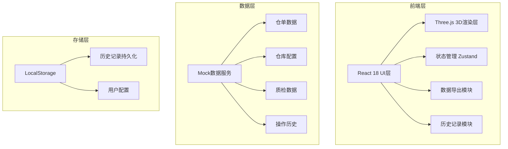
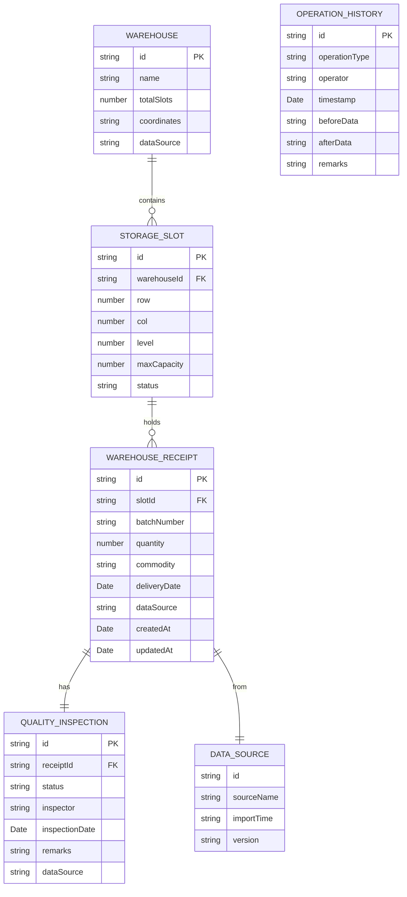

## 1. 架构设计



## 2. 技术选型

- **前端框架**: React@18 + TypeScript + Vite@5
- **3D引擎**: Three.js + @react-three/fiber + @react-three/drei
- **状态管理**: Zustand
- **样式方案**: TailwindCSS@3
- **UI组件**: 自定义工业风组件
- **数据导出**: html2canvas (截图) + 原生CSV导出
- **数据存储**: LocalStorage (历史记录)
- **后端**: 无后端，使用Mock数据

## 3. 目录结构

```
src/
├── components/
│   ├── Sandbox3D/           # 3D沙盘核心组件
│   │   ├── Warehouse3D.tsx  # 仓库3D模型
│   │   ├── StorageSlot.tsx  # 单个库位组件
│   │   └── SlotTooltip.tsx  # 悬浮信息卡
│   ├── FilterSidebar/       # 筛选侧边栏
│   ├── AlertPanel/          # 预警面板
│   ├── Toolbar/             # 顶部工具栏
│   └── HistoryModal/        # 历史记录弹窗
├── store/
│   ├── useWarehouseStore.ts # 仓库状态管理
│   └── useHistoryStore.ts   # 历史记录管理
├── types/
│   └── index.ts             # TypeScript类型定义
├── data/
│   ├── mockData.ts          # Mock仓单数据
│   └── warehouseConfig.ts   # 仓库配置
├── utils/
│   ├── exportUtils.ts       # 导出工具函数
│   ├── validation.ts        # 数据校验逻辑
│   └── colorUtils.ts        # 颜色映射工具
└── App.tsx
```

## 4. 路由定义

| 路由 | 用途 |
|------|------|
| / | 3D沙盘主页面 |

## 5. 数据模型

### 5.1 数据模型定义



### 5.2 TypeScript类型定义

```typescript
// 仓单状态类型
export type ReceiptStatus = 'normal' | 'warning' | 'overload' | 'quality_fail' | 'delivery_soon';

// 仓库信息
export interface Warehouse {
  id: string;
  name: string;
  totalSlots: number;
  rows: number;
  cols: number;
  levels: number;
  coordinates: { x: number; y: number; z: number };
  dataSource: string;
}

// 库位信息
export interface StorageSlot {
  id: string;
  warehouseId: string;
  row: number;
  col: number;
  level: number;
  maxCapacity: number;
  usedCapacity: number;
  status: ReceiptStatus;
  receipts: WarehouseReceipt[];
}

// 仓单信息
export interface WarehouseReceipt {
  id: string;
  slotId: string;
  batchNumber: string;
  commodity: string;
  quantity: number;
  deliveryDate: string;
  qualityStatus: 'pass' | 'fail' | 'pending';
  dataSource: string;
  createdAt: string;
  updatedAt: string;
}

// 预警信息
export interface Alert {
  id: string;
  type: 'duplicate' | 'overload' | 'quality_fail' | 'delivery_soon';
  severity: 'warning' | 'error';
  message: string;
  receiptId?: string;
  slotId?: string;
}

// 操作历史
export interface OperationHistory {
  id: string;
  operationType: 'create' | 'update' | 'delete' | 'export' | 'import';
  operator: string;
  timestamp: string;
  description: string;
  dataSource?: string;
  beforeData?: string;
  afterData?: string;
}

// 筛选条件
export interface FilterOptions {
  batchNumbers: string[];
  warehouses: string[];
  qualityStatus: ('pass' | 'fail' | 'pending')[];
  deliveryDateRange: { start: string; end: string } | null;
}
```

## 6. 核心功能实现方案

### 6.1 3D仓库渲染

- 使用Three.js + @react-three/fiber创建程序化3D仓库模型
- 每个库位为独立的Mesh对象，支持颜色动态更新
- 使用InstancedMesh优化性能，支持大量库位渲染
- 轨道控制器支持旋转、缩放、平移

### 6.2 数据校验逻辑

```typescript
// 重复仓单检测
export function detectDuplicateReceipts(receipts: WarehouseReceipt[]): Alert[] {
  const batchMap = new Map<string, WarehouseReceipt[]>();
  receipts.forEach(r => {
    const existing = batchMap.get(r.batchNumber) || [];
    batchMap.set(r.batchNumber, [...existing, r]);
  });
  // 返回重复批次的预警
}

// 库容超限检测
export function detectOverload(slots: StorageSlot[]): Alert[] {
  return slots
    .filter(s => s.usedCapacity > s.maxCapacity)
    .map(s => ({ /* 超限预警 */ }));
}

// 质检未过检测
export function detectQualityFail(receipts: WarehouseReceipt[]): Alert[] {
  return receipts
    .filter(r => r.qualityStatus === 'fail')
    .map(r => ({ /* 质检失败预警 */ }));
}

// 交割日预警（7天内到期）
export function detectDeliverySoon(receipts: WarehouseReceipt[]): Alert[] {
  const sevenDays = 7 * 24 * 60 * 60 * 1000;
  return receipts
    .filter(r => new Date(r.deliveryDate).getTime() - Date.now() < sevenDays)
    .map(r => ({ /* 交割预警 */ }));
}
```

### 6.3 历史记录实现

- 使用LocalStorage持久化操作历史
- 每次数据变更、导出操作均记录
- 支持时间线查看和版本对比

### 6.4 导出功能

- **截图导出**: 使用html2canvas捕获3D容器区域
- **数据导出**: 原生CSV格式导出，包含数据来源和版本信息
- 导出文件命名包含时间戳和版本号
