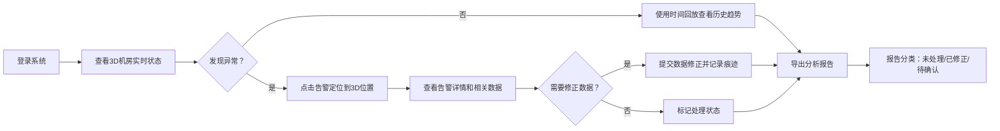

## 1. 产品概述

3D机房温度流场监控系统是面向数据中心运维值班员的专业可视化监控平台，通过3D建模和体渲染技术直观呈现机房温度分布、空调运行状态与机柜负载情况，解决传统平面热图信息维度不足、问题定位困难的痛点。

- 核心价值：将多源异构数据（机柜坐标、温度采样、空调状态、负载任务、告警、巡检报告）整合到统一3D场景中，支持时间回溯、告警定位和智能报告生成
- 目标用户：数据中心运维值班员、机房管理员、运维工程师

## 2. 核心特性

### 2.1 用户角色
| 角色 | 使用方式 | 核心权限 |
|------|----------|----------|
| 运维值班员 | 系统登录 | 3D场景浏览、温度流场查看、时间回放、告警处理、报告导出 |
| 机房管理员 | 系统登录 | 值班员权限 + 参数配置、数据修正、痕迹审核 |

### 2.2 功能模块
1. **3D机房主场景**：机柜建模、空调设备、温度体渲染、实时数据流
2. **时间回放系统**：历史数据回溯、播放控制、关键帧标记
3. **告警管理中心**：告警定位、分级展示、处理状态追踪
4. **数据来源追踪**：采样断点提示、数据修正痕迹、来源标注
5. **智能报告生成**：分类统计、详情导出、异常高亮

### 2.3 页面详情
| 页面名称 | 模块名称 | 功能描述 |
|-----------|-------------|---------------------|
| 3D机房监控主页 | 场景渲染区 | Three.js 3D机房场景，支持旋转、缩放、平移交互，温度云团体渲染叠加 |
| 3D机房监控主页 | 控制面板 | 时间轴滑块、播放/暂停、速度调节、图层开关（温度/空调/负载/告警） |
| 3D机房监控主页 | 侧边信息栏 | 选中机柜详情、空调实时参数、当前告警列表 |
| 告警管理页 | 告警列表 | 按级别/状态/时间筛选，支持批量操作 |
| 告警管理页 | 告警详情 | 关联3D场景定位、历史处理记录、修正痕迹 |
| 数据来源页 | 采样追踪 | 显示各温度采样点状态，断点/滞后/遮挡异常高亮 |
| 数据来源页 | 修正历史 | 数据修改变更记录、操作人、时间戳、前后对比 |
| 报告导出页 | 报告生成 | 选择时间范围、配置报告模板、预览统计数据 |
| 报告导出页 | 分类统计 | 未处理告警、已修正问题、需人工确认项三类分列 |

## 3. 核心流程

## 4. 用户界面设计

### 4.1 设计风格
- **主色调**：深空蓝 #0A1628 作为背景，科技蓝 #2196F3 作为主交互色，告警红 #F44336、警告橙 #FF9800、正常绿 #4CAF50 作为状态色
- **视觉风格**：赛博科技风，暗色主题配合霓虹光效，3D场景带辉光后处理效果
- **字体**：JetBrains Mono 作为等宽数据字体，Inter 作为界面字体
- **布局**：沉浸式3D场景占满视口，半透明浮动面板叠加，信息密度高但层级清晰
- **交互**：3D场景支持鼠标/触摸操作，Hover高亮选中对象，点击展开详情

### 4.2 页面设计概览
| 页面名称 | 模块名称 | UI元素 |
|-----------|-------------|-------------|
| 3D机房主页 | 场景区 | 机柜阵列半透明材质、温度云团体积渲染、空调送风粒子效果、告警脉冲光效 |
| 3D机房主页 | 控制条 | 底部悬浮时间轴，播放按钮带发光动效，图层切换使用带图标胶囊按钮 |
| 3D机房主页 | 侧边栏 | 毛玻璃效果卡片，数据滚动显示，告警项闪烁提示 |
| 告警管理页 | 列表区 | 表格行悬停高亮，严重告警带红边，处理状态标签彩色区分 |
| 报告导出页 | 统计区 | 三列卡片分别展示未处理/已修正/待确认，数字大号加粗，趋势小图 |

### 4.3 响应式设计
- 桌面端优先设计，适配1920×1080及以上分辨率
- 侧边栏可折叠，控制条可自动隐藏
- 关键操作按钮保持足够点击区域，支持键盘快捷键

### 4.4 3D场景指引
- **环境**：纯黑空间背景，地面网格线发光，营造科技感空间
- **光照**：环境光 + 机柜自发光 + 告警点光源，避免过暗或过曝
- **相机**：默认透视相机，初始视角俯瞰全场，支持飞行模式和快速定位
- **交互**：左键旋转、滚轮缩放、右键平移，双击机柜居中聚焦
- **动效**：温度云团缓慢脉动，空调送风粒子流动，告警点呼吸闪烁
- **后处理**：Bloom泛光效果增强科技感，物体选中时描边高亮

## 5. 异常处理要求

### 5.1 数据异常提示
- **采样断点**：时间轴上用红色标记断点位置，3D场景中对应采样点显示虚线连接
- **热点遮挡**：被遮挡的高温区域用半透明红色轮廓线标记，提示用户调整视角
- **空调状态滞后**：空调状态卡片显示"数据滞后"警告标签，滞后时长精确到分钟

### 5.2 报告分类规则
- **未处理项**：告警未确认、异常未修复、巡检未完成
- **已修正项**：人工修正的数据、已处理的告警、已闭环的问题
- **需人工确认**：自动修复的告警、数据冲突项、临界值预警
