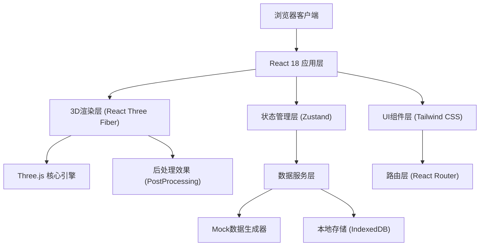
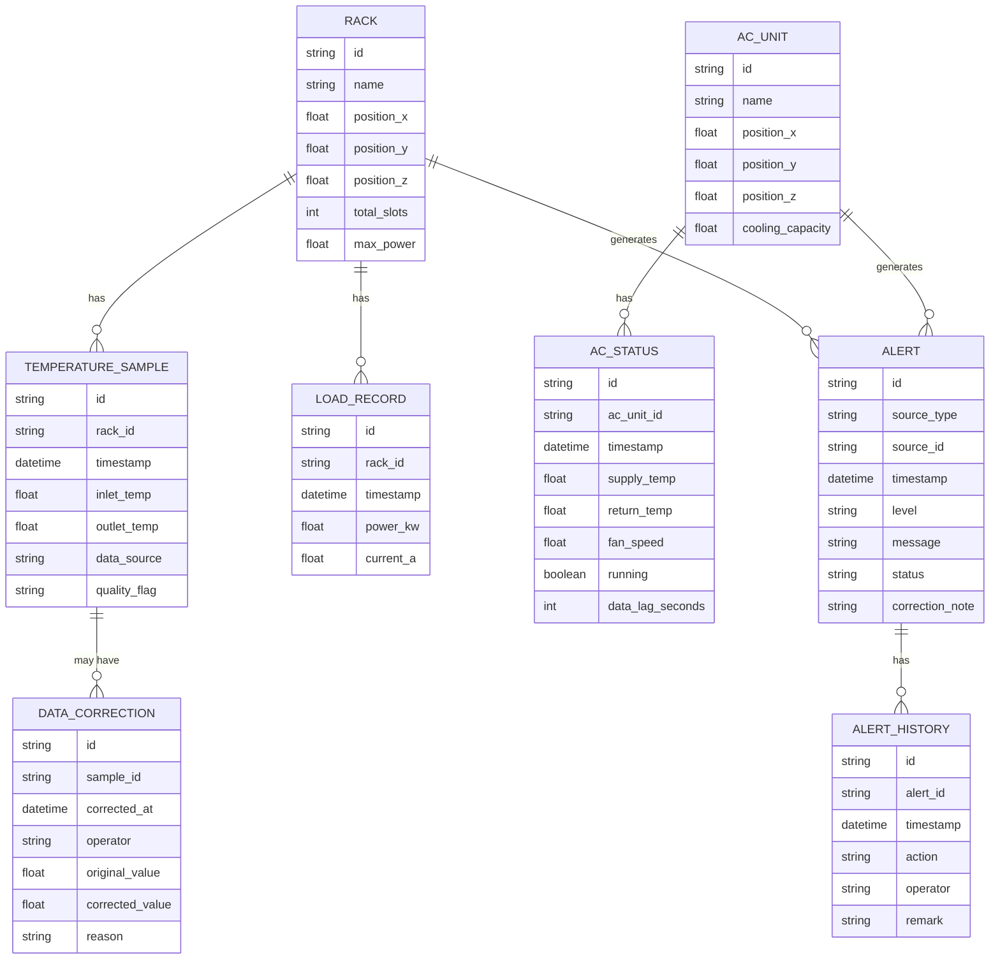

## 1. 架构设计



## 2. 技术栈说明

- **前端框架**：React 18 + TypeScript
- **构建工具**：Vite 5
- **3D引擎**：Three.js r160 + @react-three/fiber + @react-three/drei + @react-three/postprocessing
- **状态管理**：Zustand (轻量级，适合实时数据流)
- **路由**：React Router v6
- **样式**：Tailwind CSS 3 + PostCSS
- **图表**：Recharts (趋势图、统计图)
- **数据持久化**：IndexedDB (存储历史数据和修正痕迹)
- **导出**：html2canvas + jspdf (PDF报告)、xlsx (Excel导出)

## 3. 目录结构

```
src/
├── components/
│   ├── ui/               # 通用UI组件 (按钮、卡片、表格等)
│   ├── three/            # 3D场景组件
│   │   ├── Scene.tsx     # 主场景容器
│   │   ├── Rack.tsx      # 机柜组件
│   │   ├── ACUnit.tsx    # 空调组件
│   │   ├── TempCloud.tsx # 温度云团体渲染
│   │   └── AlertMarker.tsx # 告警标记
│   ├── layout/           # 布局组件
│   │   ├── Sidebar.tsx   # 侧边信息栏
│   │   ├── ControlBar.tsx # 底部控制条
│   │   └── Timeline.tsx  # 时间轴组件
│   └── pages/            # 页面组件
│       ├── Dashboard.tsx # 3D机房主页
│       ├── Alerts.tsx    # 告警管理页
│       ├── DataSource.tsx # 数据来源页
│       └── Reports.tsx   # 报告导出页
├── store/                # Zustand状态管理
│   ├── useSceneStore.ts  # 3D场景状态
│   ├── useDataStore.ts   # 数据状态
│   └── useAlertStore.ts  # 告警状态
├── services/             # 数据服务
│   ├── mockData.ts       # Mock数据生成
│   ├── dataCorrection.ts # 数据修正服务
│   └── reportGenerator.ts # 报告生成
├── types/                # TypeScript类型定义
│   ├── scene.ts          # 3D场景类型
│   ├── data.ts           # 数据类型
│   └── alert.ts          # 告警类型
├── utils/                # 工具函数
│   ├── threeHelpers.ts   # Three.js辅助函数
│   ├── colorScale.ts     # 温度色标映射
│   └── timeUtils.ts      # 时间处理
├── App.tsx
├── main.tsx
└── index.css
```

## 4. 路由定义

| 路由 | 页面 | 功能 |
|-------|------|------|
| / | 3D机房监控主页 | 3D场景渲染、实时监控、时间回放 |
| /alerts | 告警管理页 | 告警列表、详情查看、处理操作 |
| /data-source | 数据来源页 | 采样状态监控、修正历史查看 |
| /reports | 报告导出页 | 报告生成、预览、导出 |

## 5. 核心数据模型

### 5.1 数据模型ER图



### 5.2 温度体渲染算法

1. **数据网格化**：将离散温度采样点通过逆距离加权(IDW)插值生成3D网格温度场
2. **传输函数**：使用色标映射温度值到RGBA颜色，高温区域增加不透明度
3. **光线步进**：在片元着色器中对视线方向进行采样累积，实现体渲染效果
4. **性能优化**：使用3D纹理存储温度场，降低采样分辨率平衡性能

### 5.3 时间回放机制

1. 数据按时间分片预加载到IndexedDB
2. 时间轴控制触发数据查询
3. 使用requestAnimationFrame实现平滑动画
4. 关键帧插值避免数据跳变

## 6. 数据质量检测规则

| 异常类型 | 检测条件 | 提示方式 |
|---------|---------|---------|
| 采样断点 | 连续两个采样点时间间隔 > 阈值(默认5分钟) | 时间轴红标、场景虚线 |
| 热点遮挡 | 高温点在当前相机视角下被其他机柜遮挡 | 半透明轮廓线、视角提示 |
| 空调滞后 | 空调状态数据时间戳滞后当前时间 > 阈值 | 警告标签、滞后时长显示 |
| 数据冲突 | 同一时间点多个来源数据差值 > 阈值 | 数据来源页高亮标记 |
| 临界值预警 | 温度/负载接近阈值但未触发告警 | 黄色预警标记 |
