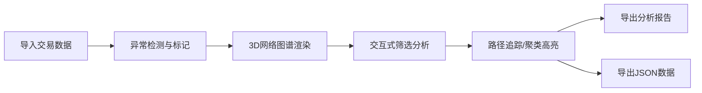

## 1. 产品概述

Web3交易网络星图是一款链上分析工具，通过3D可视化技术展示钱包地址之间的资金流动网络，帮助分析师快速识别交易所地址和可疑犯罪团伙。

- 核心用途：链上交易追踪、反洗钱(AML)分析、犯罪资金网络识别
- 目标用户：区块链分析师、合规调查人员、执法机构
- 产品价值：将复杂的交易数据转化为直观的3D网络图谱，大幅提升分析效率

## 2. 核心功能

### 2.1 用户角色

| 角色 | 注册方式 | 核心权限 |
|------|----------|----------|
| 链上分析师 | 本地登录 | 数据导入、3D可视化、路径追踪、报告导出 |

### 2.2 功能模块

1. **3D网络星图主界面**：节点可视化、边关联展示、3D交互操作
2. **数据筛选面板**：时间滑块、金额筛选、标签过滤
3. **侧边明细面板**：地址详情、交易记录、调查备注
4. **异常检测模块**：循环转账识别、交易所中转标记、标签冲突提示
5. **分析工具集**：聚类高亮、路径追踪、JSON导出
6. **修正痕迹管理**：数据来源记录、修正历史追踪
7. **分析报告**：未处理/已修正/待确认分类统计

### 2.3 页面详情

| 页面名称 | 模块名称 | 功能描述 |
|----------|----------|----------|
| 主界面 | 3D星图画布 | Three.js渲染的3D网络图谱，支持拖拽、缩放、旋转 |
| 主界面 | 顶部工具栏 | 数据导入、视图重置、导出功能、布局切换 |
| 主界面 | 左侧筛选面板 | 时间范围滑块、金额区间、标签多选过滤 |
| 主界面 | 右侧详情面板 | 选中节点/边的详细信息、调查备注编辑 |
| 主界面 | 底部状态栏 | 异常提示栏、统计信息、修正痕迹记录 |
| 报告弹窗 | 分类统计 | 未处理、已修正、需人工确认的明细列表 |

## 3. 核心流程

用户导入交易数据 → 系统自动检测异常并标记 → 3D网络图谱渲染 → 用户筛选/交互分析 → 路径追踪/聚类高亮 → 导出分析结果与JSON数据

## 4. 用户界面设计

### 4.1 设计风格

- **主色调**：深空黑 (#0a0a1a) 为背景，霓虹青 (#00f5ff) 为主色，警示红 (#ff3366) 为异常标记
- **次色调**：科技紫 (#9933ff)、数据绿 (#00ff88)、警戒黄 (#ffcc00)
- **按钮风格**：霓虹发光边框、悬浮时脉冲动画、圆角矩形
- **字体**：Display: Orbitron (科技感)；Body: JetBrains Mono (等宽易读)
- **布局风格**：暗黑科技风、玻璃拟态面板、网格背景、粒子特效
- **图标风格**：线性霓虹图标、发光效果

### 4.2 页面设计概述

| 页面名称 | 模块名称 | UI元素 |
|----------|----------|--------|
| 主界面 | 3D星图画布 | 粒子背景、发光节点、脉冲连线、光晕效果、景深 |
| 主界面 | 筛选面板 | 玻璃拟态卡片、霓虹滑块、发光复选框、滑动动画 |
| 主界面 | 详情面板 | 分层信息卡片、时间线记录、标签徽章、编辑悬浮态 |
| 主界面 | 异常提示 | 闪烁警示图标、弹窗动画、颜色分级提示 |
| 报告弹窗 | 分类统计 | 三色状态卡片、进度环形图、可展开明细列表 |

### 4.3 响应式

- Desktop-first设计，针对大屏优化 (1920x1080+)
- 平板适配：面板可折叠、触控优化
- 移动端：简化视图、核心功能保留

### 4.4 3D场景指导

- **环境**：深空黑色背景 + 星空粒子效果 + 网格地板
- **光照**：环境光 + 点光源随选中节点移动 + 霓虹发光材质
- **相机**：透视相机、轨道控制器、阻尼平滑效果
- **构图**：力导向布局、中心聚类、层级分明
- **交互**：拖拽节点、双击聚焦、悬停显示信息、框选高亮
- **动画**：节点脉冲、连线流光、选中缩放、转场过渡
- **后处理**：泛光效果、轻微色差、景深模糊、胶片颗粒
