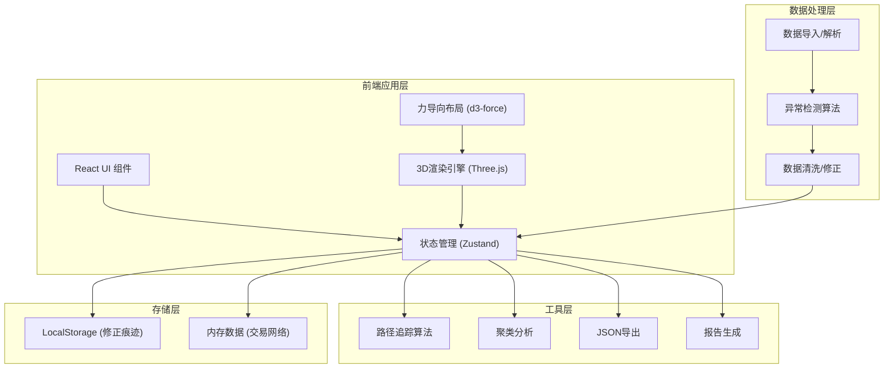
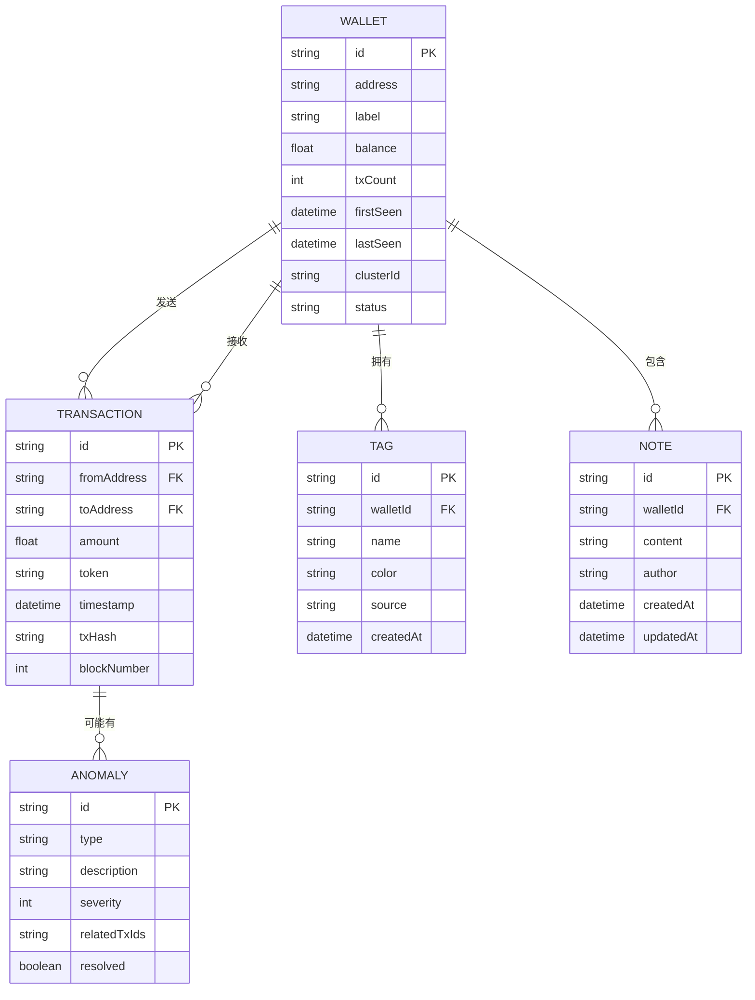

## 1. 架构设计



## 2. 技术描述

- **前端框架**: React@18 + TypeScript + Vite
- **样式方案**: TailwindCSS@3 + CSS Variables (霓虹主题)
- **3D渲染**: Three.js + @react-three/fiber + @react-three/drei
- **后处理效果**: @react-three/postprocessing
- **力导向布局**: d3-force@3
- **状态管理**: Zustand (轻量级, 适合复杂交互)
- **图表库**: recharts (统计报告)
- **图标**: lucide-react (霓虹风格自定义)
- **动画**: framer-motion (UI动画) + GSAP (高级时间线)

## 3. 路由定义

| 路由 | 用途 |
|------|------|
| / | 主界面 - 3D网络星图 |

## 4. 数据模型

### 4.1 核心数据结构



### 4.2 TypeScript 类型定义

```typescript
// 钱包节点
interface WalletNode {
  id: string;
  address: string;
  label: string;
  balance: number;
  txCount: number;
  firstSeen: Date;
  lastSeen: Date;
  tags: Tag[];
  notes: Note[];
  clusterId?: string;
  status: 'untreated' | 'corrected' | 'pending';
  isExchange: boolean;
  isSuspicious: boolean;
}

// 交易边
interface TransactionEdge {
  id: string;
  source: string;
  target: string;
  amount: number;
  token: string;
  timestamp: Date;
  txHash: string;
  blockNumber: number;
}

// 标签
interface Tag {
  id: string;
  name: string;
  color: string;
  source: string;
  createdAt: Date;
}

// 调查备注
interface Note {
  id: string;
  content: string;
  author: string;
  createdAt: Date;
  updatedAt: Date;
}

// 异常检测
interface Anomaly {
  id: string;
  type: 'cycle' | 'exchange_hub' | 'tag_conflict';
  description: string;
  severity: 'low' | 'medium' | 'high';
  relatedEntities: string[];
  resolved: boolean;
}

// 修正痕迹
interface AuditTrail {
  id: string;
  entityId: string;
  action: 'create' | 'update' | 'delete';
  field: string;
  oldValue: any;
  newValue: any;
  source: string;
  timestamp: Date;
}

// 筛选状态
interface FilterState {
  timeRange: [Date, Date];
  amountRange: [number, number];
  selectedTags: string[];
  showExchanges: boolean;
  showSuspicious: boolean;
  minTxCount: number;
}
```

## 5. 核心算法模块

### 5.1 异常检测

1. **循环转账检测**：DFS寻找有向环，标记资金回流路径
2. **交易所中转识别**：基于节点度数、资金吞吐量、停留时间的评分模型
3. **标签冲突检测**：多来源标签不一致时触发警告

### 5.2 网络分析

1. **聚类算法**：Louvain社区发现 + 基于交易密度的社区合并
2. **路径追踪**：最短路径 + 资金流动权重路径
3. **重要性评分**：PageRank变体，考虑交易金额和频次

## 6. 性能优化策略

1. **3D渲染优化**：实例化渲染、LOD、视锥体剔除
2. **力导向布局**：Web Worker计算、增量更新
3. **数据处理**：时间分片、虚拟列表、懒加载
4. **内存管理**：对象池、纹理复用、及时清理
