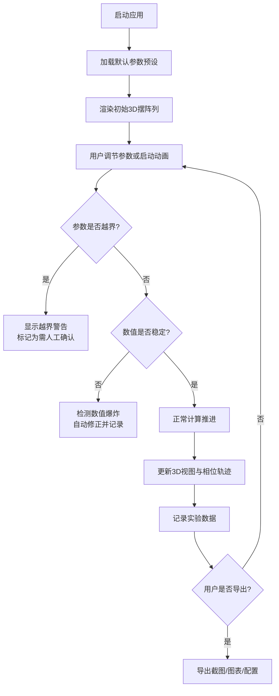

## 1. 产品概述

物理摆阵列观察器是一款面向物理兴趣课的耦合摆阵3D交互动画可视化工具，用于展示多摆耦合系统的相位差演化过程。学生可调节摆长、质量、初始角、耦合系数等参数，实时观察3D动画与相位轨迹，并保存实验结果。

- 目标用户：物理兴趣课学生与教师
- 核心价值：将抽象的耦合振荡物理现象具象化，支持参数探索与结果记录
- 问题解决：传统教具无法实时动态展示耦合摆相位传播、能量传递、相位锁定等复杂现象

## 2. 核心功能

### 2.1 功能模块

1. **3D视图主界面**：耦合摆阵列3D渲染、实时动画、相机操作
2. **参数控制面板**：摆长、质量、初始角度、耦合系数、时间步长调节
3. **相位轨迹面板**：各摆相位随时间变化的曲线图
4. **播放控制栏**：开始/暂停/重置/单步推进/保存快照
5. **实验报告生成**：未处理/已修正/需人工确认分类统计
6. **数据导出**：图表导出为PNG，参数配置导出为JSON

### 2.2 页面详情

| 页面名称 | 模块名称 | 功能描述 |
|----------|----------|----------|
| 主工作台 | 3D摆阵列视图 | 渲染N个耦合摆，支持旋转/缩放/平移，摆体颜色标识相位 |
| 主工作台 | 参数控制区 | 滑块调节摆长/质量/初始角/耦合系数/时间步长/阻尼系数 |
| 主工作台 | 相位轨迹图 | 实时绘制各摆相位随时间变化曲线，支持悬停查看数值 |
| 主工作台 | 播放控制 | 开始/暂停/重置/步进/速度调节/保存当前状态 |
| 主工作台 | 实验报告区 | 展示未处理/已修正/需人工确认的分类统计及修正历史 |
| 主工作台 | 导出面板 | 导出3D视图截图、相位轨迹图、参数配置JSON |

## 3. 核心流程

## 4. 用户界面设计

### 4.1 设计风格

- **主题色**：深空蓝(#0a1628) + 电蓝(#00d4ff) + 警示橙(#ff6b35)
- **按钮风格**：圆角(8px)、微发光阴影、hover时亮度增强
- **字体**：标题用 'Orbitron' 科技感字体；正文用 'Noto Sans SC'
- **布局**：三栏布局（左侧参数控制 + 中央3D视图 + 右侧数据面板）
- **图标风格**：线性图标，统一2px描边

### 4.2 页面设计概览

| 模块名称 | UI元素 | 风格描述 |
|----------|--------|----------|
| 3D视图区 | 摆线/摆球/支撑框架 | 深色背景，摆球发光显示相位，摆线半透明 |
| 参数控制区 | 滑块/输入框/预设选择器 | 卡片式分组，带数值实时显示 |
| 相位轨迹面板 | Canvas折线图 | 多色曲线，网格背景，自动滚动 |
| 播放控制栏 | 圆形按钮组 | 播放/暂停/步进/重置图标 |
| 实验报告区 | 分类标签 + 列表 | 已修正(绿)/需确认(橙)/未处理(灰) |

### 4.3 响应式设计

- 桌面端优先（最小支持1280px）
- 平板端折叠为上下两栏布局
- 移动端隐藏3D视图，仅保留参数控制和数据面板

### 4.4 3D场景指导

- **环境**：深色空间感背景，无HDRI，使用纯色背景+渐变光晕
- **光照**：主光源方向光+环境光，摆球自发光材质
- **相机**：透视相机，初始俯视角45°，支持轨道控制
- **合成**：轻微Bloom辉光效果，增强摆球发光感
