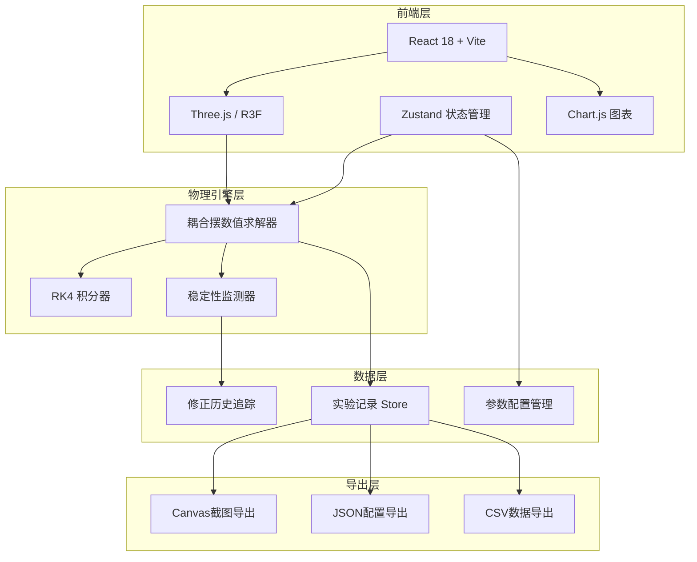

## 1. 架构设计



## 2. 技术选型说明

- **前端框架**：React 18 + TypeScript + Vite 5
- **3D渲染**：@react-three/fiber + @react-three/drei + three
- **状态管理**：Zustand（轻量、支持订阅）
- **图表绘制**：Chart.js + react-chartjs-2
- **样式方案**：TailwindCSS 3
- **数值计算**：自实现RK4积分器（无外部依赖）
- **导出功能**：html2canvas + 原生JSON序列化

## 3. 路由定义

| 路由 | 用途 |
|------|------|
| `/` | 主工作台（3D视图 + 参数控制 + 数据面板） |

## 4. 核心数据模型

```typescript
// 单个摆的参数
interface Pendulum {
  id: number;
  length: number;      // 摆长 (m)
  mass: number;        // 质量 (kg)
  initialAngle: number; // 初始角度 (rad)
  angle: number;       // 当前角度
  angularVelocity: number; // 角速度
  phase: number;       // 当前相位
}

// 耦合系统参数
interface CouplingParams {
  couplingCoeff: number; // 耦合系数
  timeStep: number;      // 时间步长 (s)
  damping: number;       // 阻尼系数
  gravity: number;       // 重力加速度
}

// 实验记录
interface ExperimentRecord {
  id: string;
  timestamp: number;
  params: CouplingParams;
  pendulums: Pendulum[];
  status: 'normal' | 'corrected' | 'needs_review';
  corrections: CorrectionEntry[];
  note?: string;
}

// 修正记录
interface CorrectionEntry {
  time: number;
  type: 'angle_overflow' | 'numerical_explosion' | 'phase_mismatch';
  description: string;
  autoFixed: boolean;
  beforeValue?: number;
  afterValue?: number;
}
```

## 5. 物理引擎核心算法

### 5.1 耦合摆运动方程

N个耦合摆的运动方程（小角度近似）：

```
θ_i'' = -(g/L_i)θ_i - (k/m_i)(θ_i - θ_{i-1}) - (k/m_i)(θ_i - θ_{i+1}) - γθ_i'
```

其中：
- θ_i 为第i个摆的角度
- k 为耦合系数
- γ 为阻尼系数

### 5.2 RK4积分器

使用四阶龙格-库塔方法进行数值积分，确保精度和稳定性：

```
k1 = f(t, y)
k2 = f(t + h/2, y + h*k1/2)
k3 = f(t + h/2, y + h*k2/2)
k4 = f(t + h, y + h*k3)
y(t+h) = y(t) + (k1 + 2*k2 + 2*k3 + k4) * h / 6
```

### 5.3 稳定性监测

- **角度越界检测**：|θ| > π/2 时标记警告
- **数值爆炸检测**：|θ''| > 100 rad/s² 时触发自动修正
- **相位计算**：使用Hilbert变换提取瞬时相位
