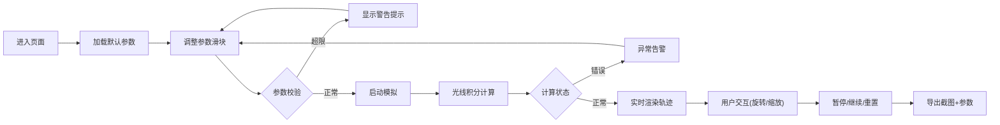

## 1. 产品概述
黑洞光线弯曲Web3D演示系统，基于广义相对论原理，通过交互式3D可视化展示光线在黑洞引力场中的偏折现象。

- 核心目的：帮助天文社学生直观理解引力透镜效应，替代传统表格和截图的教学方式
- 目标用户：天文社师生、物理爱好者
- 产品价值：提供可调参数的实时3D模拟，支持参数记录和截图导出，便于教学展示和实验记录

## 2. 核心功能

### 2.1 用户角色
| 角色 | 注册方式 | 核心权限 |
|------|----------|----------|
| 学生/教师 | 无需注册 | 调整参数、运行模拟、导出截图、查看说明 |

### 2.2 功能模块
1. **3D场景主界面**：黑洞模型、光线轨迹、网格背景、观察视角控制
2. **参数控制面板**：黑洞质量、入射光线参数、观察角度、显示选项
3. **运行控制**：开始/暂停/重置、积分进度显示
4. **信息展示**：悬浮提示、参数记录、异常警告
5. **导出功能**：截图导出、参数记录保存

### 2.3 页面详情
| 页面名称 | 模块名称 | 功能描述 |
|-----------|-------------|---------------------|
| 主演示页 | 3D视窗 | WebGL渲染黑洞和光线轨迹，支持鼠标拖拽旋转视角 |
| 主演示页 | 参数滑块区 | 黑洞质量(1-100M☉)、光线数量(10-200条)、观察角度(0-180°)、网格开关 |
| 主演示页 | 运行控制 | 开始模拟、暂停、重置按钮，积分状态指示器 |
| 主演示页 | 信息面板 | 实时物理参数显示、当前计算状态、历史参数记录 |
| 主演示页 | 异常提示 | 参数超限警告、计算错误提示、轨迹不连续告警 |
| 主演示页 | 导出区 | 场景截图导出、当前参数记录导出 |

## 3. 核心流程
用户进入页面 → 调整模拟参数 → 启动光线追踪 → 观察3D轨迹 → 暂停/重置/调整 → 导出截图和参数记录

## 4. 用户界面设计

### 4.1 设计风格
- **主色调**：深空黑(#0a0a1a)为背景，星蓝(#1a1a3a)为面板色，引力橙(#ff6b35)为强调色
- **辅助色**：轨迹青色(#00d4ff)、警告红(#ff4757)、成功绿(#2ed573)
- **按钮风格**：圆角矩形，微发光边框，悬停时亮度提升
- **字体**：显示字体使用Orbitron（科技感），正文字体使用Roboto Mono（等宽易读）
- **布局**：左侧3D主视窗(75%)，右侧控制面板(25%)，底部信息条
- **视觉元素**：星空粒子背景、引力场渐变光晕、扫描线效果

### 4.2 页面设计概览
| 页面名称 | 模块名称 | UI元素 |
|-----------|-------------|-------------|
| 主演示页 | 3D视窗 | 黑洞施瓦西半径可视化、彩色光线轨迹、可切换网格、鼠标拖拽控制 |
| 主演示页 | 参数面板 | 分组滑块、实时数值显示、单位标注、范围指示 |
| 主演示页 | 控制区 | 胶囊形按钮组、状态指示灯、进度条 |
| 主演示页 | 信息区 | 半透明玻璃态面板、滚动参数记录列表、异常横幅 |
| 主演示页 | 导出区 | 截图预览缩略图、下载按钮、时间戳命名 |

### 4.3 响应式
- Desktop-first设计，优先保证1920×1080分辨率体验
- 平板设备：控制面板折叠为底部抽屉
- 手机端：简化参数选项，单列布局
- 所有触控操作支持触摸手势

### 4.4 3D场景指导
- **环境**：深空背景，远处星点粒子系统，无HDRI以保持计算性能
- **光照**：自发光黑洞吸积盘效果，轨迹线发光材质，环境光强度0.1
- **相机**：PerspectiveCamera，fov=60，默认距离15单位，支持OrbitControls
- **构图**：黑洞位于场景中心，光线从左侧入射，右侧出射/被吞噬
- **交互**：鼠标拖拽旋转，滚轮缩放，右键平移，双击重置视角
- **后处理**：Bloom发光效果，轻微色差模拟引力透镜，无过度特效以免影响性能
- **性能**：光线使用LineSegments，单帧绘制调用<50，目标帧率60fps
