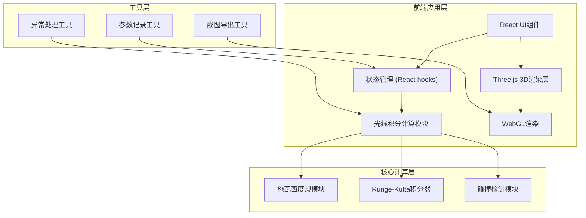

## 1. 架构设计



## 2. 技术描述
- **前端框架**: React@18 + TypeScript
- **构建工具**: Vite@5
- **3D渲染**: Three.js@0.160
- **样式方案**: TailwindCSS@3
- **状态管理**: React useState + useContext
- **数学计算**: 原生TypeScript实现（无额外依赖）
- **后端**: 无（纯前端应用）
- **数据库**: 无（使用localStorage存储参数记录）

## 3. 技术选型理由
1. **Three.js**: 成熟的WebGL封装，提供OrbitControls、LineSegments等必要组件
2. **Runge-Kutta 4阶积分**: 保证光线轨迹计算的数值稳定性
3. **纯前端架构**: 无需后端部署，便于学生离线使用
4. **TailwindCSS**: 快速构建控制面板UI，支持响应式布局

## 4. 目录结构
```
src/
├── components/
│   ├── Scene3D.tsx          # 3D场景主组件
│   ├── ControlPanel.tsx     # 参数控制面板
│   ├── InfoPanel.tsx        # 信息显示面板
│   ├── ExportPanel.tsx      # 导出功能面板
│   └── AlertBanner.tsx      # 异常提示组件
├── physics/
│   ├── Schwarzschild.ts     # 施瓦西度规计算
│   ├── RayIntegrator.ts     # 光线积分器(RK4)
│   └── RayGenerator.ts      # 光线生成器
├── hooks/
│   ├── useSimulation.ts     # 模拟状态管理
│   └── useExport.ts         # 导出功能hook
├── utils/
│   ├── screenshot.ts        # 截图工具
│   ├── paramRecorder.ts     # 参数记录工具
│   └── errorHandler.ts      # 异常处理工具
├── types/
│   └── index.ts             # TypeScript类型定义
├── App.tsx
└── main.tsx
```

## 5. 核心模块接口定义

### 5.1 物理计算模块
```typescript
// 光线状态
interface RayState {
  position: [number, number, number];  // 3D位置
  momentum: [number, number, number];  // 动量方向
  wavelength: number;                   // 波长(影响颜色)
}

// 积分结果
interface IntegrationResult {
  points: [number, number, number][];   // 轨迹点序列
  status: 'complete' | 'absorbed' | 'escaped' | 'error';
  errorMessage?: string;
  totalSteps: number;
}

// 施瓦西度规类
class SchwarzschildMetric {
  constructor(mass: number);  // 质量(太阳质量单位)
  getEventHorizonRadius(): number;
  getPhotonSphereRadius(): number;
  integrateRay(initial: RayState, maxSteps: number): IntegrationResult;
}
```

### 5.2 模拟参数
```typescript
interface SimulationParams {
  blackHoleMass: number;      // 1-100 太阳质量
  rayCount: number;           // 10-200 条光线
  rayAngleRange: number;      // 入射角度范围
  observationAngle: number;   // 观察角度 0-180°
  showGrid: boolean;          // 显示网格
  showEventHorizon: boolean;  // 显示事件视界
  showPhotonSphere: boolean;  // 显示光子球
  integrationSteps: number;   // 积分步数 500-5000
}
```

### 5.3 异常处理接口
```typescript
interface SimulationError {
  type: 'parameter' | 'integration' | 'render' | 'performance';
  severity: 'warning' | 'error' | 'critical';
  message: string;
  timestamp: number;
  recoverable: boolean;
}

class ErrorHandler {
  validateParams(params: SimulationParams): SimulationError[];
  handleIntegrationError(error: Error): SimulationError;
  checkPerformance(fps: number): SimulationError | null;
}
```

## 6. 参数约束与异常处理策略

### 6.1 参数安全范围
| 参数 | 正常范围 | 警告阈值 | 临界阈值 | 处理方式 |
|------|----------|----------|----------|----------|
| 黑洞质量 | 1-50 M☉ | 51-80 M☉ | >80 M☉ | 临界时禁止启动 |
| 光线数量 | 10-100 条 | 101-150 条 | >150 条 | 临界时降质渲染 |
| 积分步数 | 500-2000 | 2001-4000 | >4000 | 临界时强制限制 |
| 单步长度 | 0.01-0.1 | 0.11-0.5 | >0.5 | 临界时自动调小 |

### 6.2 计算异常处理
1. **轨迹不连续**: 检测相邻点距离突变，标记异常段，显示红色警告
2. **光线穿越事件视界**: 正常终止积分，标记为"被吞噬"状态
3. **数值发散**: 检测动量/位置NaN，立即终止，显示错误提示
4. **性能下降**: FPS<30时显示警告，建议减少光线数量

## 7. 导出功能设计
### 7.1 截图导出
- 使用Three.js的renderer.domElement.toDataURL()
- 自动添加时间戳和参数水印
- 格式: PNG, 分辨率与画布一致
- 文件名: `blackhole_YYYYMMDD_HHMMSS.png`

### 7.2 参数记录导出
- JSON格式导出当前参数和计算结果统计
- 包含: 参数值、异常数量、各光线状态分布、计算耗时
- 文件名: `params_YYYYMMDD_HHMMSS.json`
