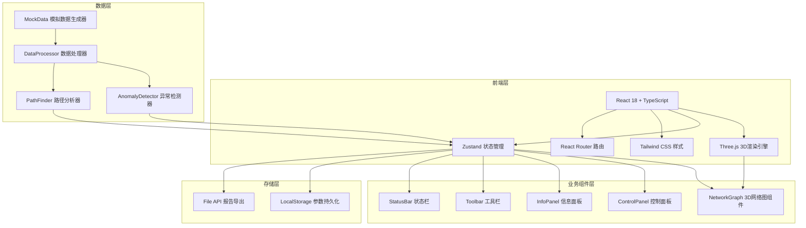
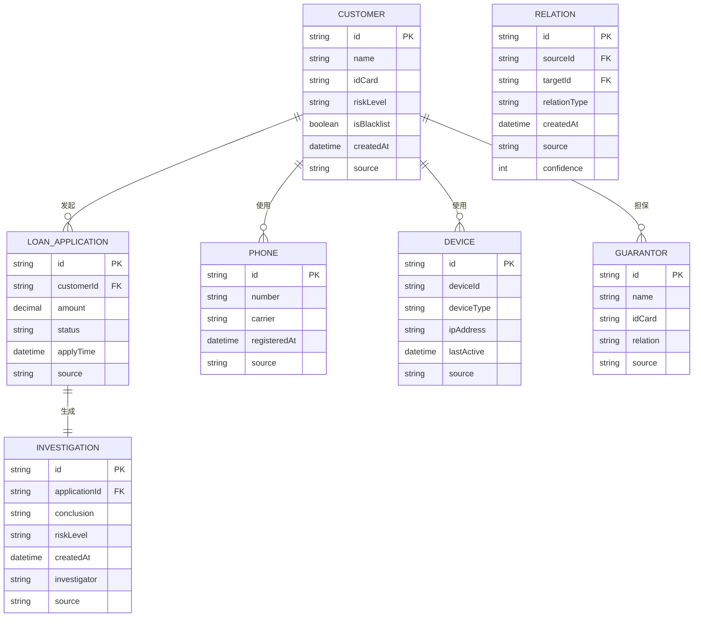

## 1. 架构设计



## 2. 技术描述
- **前端**：React@18 + TypeScript + Vite
- **3D引擎**：three@^0.160.0 + @react-three/fiber@^8.15.0 + @react-three/drei@^9.92.0
- **状态管理**：zustand@^4.4.0
- **样式**：tailwindcss@^3.4.0
- **路由**：react-router-dom@^6.21.0
- **图标**：lucide-react@^0.294.0
- **后端**：纯前端应用，无后端服务
- **数据**：内置模拟数据生成器，支持JSON导入

## 3. 路由定义
| 路由 | 用途 |
|------|------|
| / | 主工作台页面 |
| /help | 使用帮助页面 |

## 4. 数据模型

### 4.1 数据模型定义



### 4.2 节点类型定义

```typescript
type NodeType = 'customer' | 'phone' | 'device' | 'guarantor' | 'loan' | 'investigation';
type RiskLevel = 'low' | 'medium' | 'high' | 'critical';

interface BaseNode {
  id: string;
  type: NodeType;
  label: string;
  riskLevel: RiskLevel;
  isBlacklist: boolean;
  source: string;
  createdAt: string;
  position?: { x: number; y: number; z: number };
}

interface CustomerNode extends BaseNode {
  type: 'customer';
  idCard: string;
  phone?: string;
}

interface PhoneNode extends BaseNode {
  type: 'phone';
  number: string;
  carrier: string;
}

interface DeviceNode extends BaseNode {
  type: 'device';
  deviceId: string;
  deviceType: string;
  ipAddress: string;
}

interface GuarantorNode extends BaseNode {
  type: 'guarantor';
  idCard: string;
  relation: string;
}

interface LoanNode extends BaseNode {
  type: 'loan';
  amount: number;
  status: string;
  applyTime: string;
}

interface InvestigationNode extends BaseNode {
  type: 'investigation';
  conclusion: string;
  investigator: string;
}

type NetworkNode = CustomerNode | PhoneNode | DeviceNode | GuarantorNode | LoanNode | InvestigationNode;

interface NetworkEdge {
  id: string;
  source: string;
  target: string;
  relationType: string;
  confidence: number;
  source: string;
  createdAt: string;
  isDuplicate?: boolean;
}

interface Anomaly {
  id: string;
  type: 'duplicate_relation' | 'dense_cluster' | 'blacklist_missing' | 'high_risk_path';
  severity: 'warning' | 'error' | 'info';
  message: string;
  relatedNodes: string[];
  relatedEdges: string[];
  detectedAt: string;
}

interface AnalysisState {
  nodes: NetworkNode[];
  edges: NetworkEdge[];
  anomalies: Anomaly[];
  selectedNode: string | null;
  selectedPath: string[];
  filters: {
    nodeTypes: NodeType[];
    riskLevels: RiskLevel[];
    showBlacklistOnly: boolean;
    searchQuery: string;
  };
  viewParams: {
    autoLayout: boolean;
    showLabels: boolean;
    showEdges: boolean;
    animationEnabled: boolean;
  };
  operationHistory: OperationRecord[];
}

interface OperationRecord {
  id: string;
  type: 'select' | 'filter' | 'mark' | 'path_find' | 'export' | 'save_params';
  description: string;
  timestamp: string;
  operator: string;
}
```

## 5. 核心模块说明

### 5.1 3D网络图模块 (NetworkGraph)
- 基于 @react-three/fiber 封装的3D场景
- 使用 Force-directed 布局算法自动排布节点
- 支持节点拖拽、缩放、旋转、选中
- 节点按类型和风险等级着色
- Bloom发光后处理效果

### 5.2 异常检测模块 (AnomalyDetector)
- 关系重复检测：检测同一对节点间的重复关系
- 节点过密检测：检测连接数超过阈值的节点簇
- 黑名单检测：检测黑名单节点是否未高亮
- 高风险路径检测：检测包含多个高风险节点的路径

### 5.3 路径分析模块 (PathFinder)
- BFS/DFS 路径查找算法
- 支持最短路径、所有路径查找
- 路径高亮展示
- 路径风险评估

### 5.4 数据持久化模块
- LocalStorage 存储视图参数和筛选条件
- JSON 格式导入导出分析结果
- 操作历史记录保存
