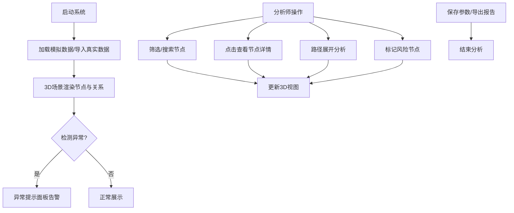

## 1. 产品概述
银行反欺诈客户关系网络3D可视化系统，帮助反欺诈分析师直观展示和分析贷款客户之间的关联关系（共同手机号、担保人、设备关系等），快速识别潜在欺诈风险。

- **核心问题**：解决关系重复、节点过密、黑名单未高亮等分析痛点
- **目标用户**：银行反欺诈分析师、风险控制人员
- **核心价值**：通过3D可视化交互，提升欺诈关联识别效率，降低人工分析误差

## 2. 核心 Features

### 2.1 用户角色
| 角色 | 注册方式 | 核心权限 |
|------|---------|----------|
| 反欺诈分析师 | 系统登录 | 3D图交互、筛选搜索、风险标记、路径展开、导出报告、参数保存 |

### 2.2 Feature 模块
1. **3D关系网络图**：客户、手机号、设备、担保人、贷款申请、调查结论六类节点的三维可视化
2. **筛选搜索模块**：按节点类型、风险等级、时间范围等多维度筛选，支持节点名称搜索
3. **风险标记模块**：黑名单高亮、风险等级着色、异常关系标记
4. **路径展开模块**：两节点间关联路径查找、多层关系展开
5. **异常检测模块**：关系重复检测、节点过密预警、黑名单未高亮提示
6. **报告导出模块**：分析结果导出为PDF/JSON，参数配置保存与加载

### 2.3 页面详情
| 页面名称 | 模块名称 | Feature 描述 |
|---------|---------|-------------|
| 主工作台 | 3D场景区域 | Three.js渲染的可交互3D网络图，支持缩放、旋转、拖拽、点击选中 |
| 主工作台 | 左侧控制面板 | 节点类型筛选、风险等级筛选、搜索框、异常提示列表 |
| 主工作台 | 右侧信息面板 | 选中节点详情、关联关系列表、操作历史记录 |
| 主工作台 | 顶部工具栏 | 参数保存/加载、导出报告、视图重置、造数功能 |
| 主工作台 | 底部状态栏 | 当前节点/边统计、异常告警数量、操作提示 |

## 3. 核心流程

## 4. 用户界面设计

### 4.1 设计风格
- **主色调**：深空蓝(#0a1628)为背景，科技感暗色系
- **强调色**：风险红(#ef4444)、警告黄(#f59e0b)、安全绿(#10b981)、信息蓝(#3b82f6)
- **节点配色**：客户(紫)、手机号(青)、设备(橙)、担保人(绿)、贷款申请(蓝)、调查结论(灰)
- **字体**：JetBrains Mono 等宽字体用于数据展示，Inter 用于界面文本
- **布局**：三栏布局，左侧控制面板(280px)、中间3D场景(自适应)、右侧信息面板(320px)
- **交互效果**：节点悬停发光、选中脉冲动画、关系线高亮流动

### 4.2 页面设计概述
| 页面名称 | 模块名称 | UI 元素 |
|---------|---------|--------|
| 主工作台 | 3D场景区域 | 暗色背景、发光节点、发光连线、星空粒子背景、雾化效果 |
| 主工作台 | 左侧控制面板 | 半透明玻璃态卡片、复选框组、搜索输入框、异常列表带图标 |
| 主工作台 | 右侧信息面板 | 详情卡片、关联列表、操作时间线、标签组 |
| 主工作台 | 顶部工具栏 | 图标按钮组、下拉菜单、状态指示器 |
| 主工作台 | 底部状态栏 | 统计数字、告警徽标、帮助提示 |

### 4.3 响应性
- 桌面端为主，支持 1280px 及以上分辨率
- 面板可折叠，3D场景自适应剩余空间
- 触控设备支持手势缩放旋转

### 4.4 3D 场景指引
- **环境**：深空背景 + 星空粒子 + 雾化效果，营造科技感
- **光照**：环境光 + 方向光 + 节点自发光，确保清晰可见
- **相机**：透视相机，支持轨道控制(OrbitControls)，自动适配场景大小
- **交互**：点击选中节点、拖拽节点位置、滚轮缩放、右键旋转
- **动画**：节点呼吸动画、选中脉冲效果、关系线路径流动动画
- **后处理**：Bloom发光效果，增强科技感
